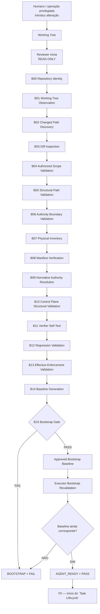
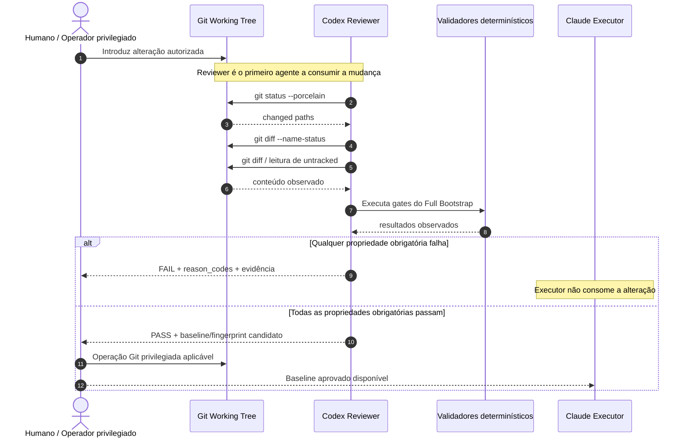

# FA. Agent Bootstrap — pré-condição do Task Lifecycle

> Status: **CANDIDATE ARCHITECTURE / NOT VERIFIED**
> O `Agent Bootstrap` acontece antes de `F0`. Ele não é uma fase da `TASK`.
> Seu objetivo é determinar se **Reviewer** e Executor estão aptos a operar sobre
> o repositório, o control plane e um baseline autorizado.

## FA.1 Objetivo

O `Agent Bootstrap` deve impedir o início do `Task Lifecycle` quando não for possível provar que:

- o agente está no repositório esperado;
- o estado Git observado é conhecido;
- os paths alterados foram descobertos a partir do repositório, e não de narrativa;
- a alteração está dentro da superfície autorizada;
- o control plane utilizado é o esperado;
- **Reviewer** e Executor não possuem autoridade de escrita sobre `.ai/control/**`;
- o manifesto foi confrontado com o inventário físico observado;
- as autoridades normativas necessárias existem e suas referências resolvem;
- schemas e validadores obrigatórios são utilizáveis;
- verificadores críticos distinguem `KNOWN_GOOD` de `KNOWN_BAD`;
- restrições críticas declaradas estão efetivamente aplicadas;
- o Executor consome exatamente o baseline aprovado pelo **Reviewer**.

O bootstrap não declara que uma `TASK` está correta e não substitui o `task_proposal`.

```text
Agent Bootstrap
        ↓
AGENT_READY = PASS
        ↓
`Task Lifecycle`
        ↓
F0
        ↓
F1
        ↓
...
        ↓
DONE_TASK
```

Formalmente:

```text
F0 ≠ AGENT_BOOTSTRAP
```

O bootstrap responde:

```text
"O agente está autorizado e tecnicamente apto
a começar o processamento de uma TASK?"
```

**A F0 responde:**

```text
"Qual é exatamente a entrada humana
que deu origem à TASK?"
```

## FA.2 Atores e autoridade

### Humano / Operador privilegiado

É a autoridade capaz de introduzir ou integrar alterações privilegiadas que os agentes não podem realizar.

### Reviewer

O **Reviewer** é o primeiro agente que deve consumir uma nova alteração pertencente ao bootstrap ou ao control plane. A revisão é read-only sobre o objeto revisado.

### Executor

O Executor somente pode iniciar após existir um bootstrap aprovado e após provar que continua consumindo o baseline aprovado.

### Validadores determinísticos

Executam verificações para propriedades que possuem oráculo computável.

## FA.3 Fronteira de autoridade do Control Plane

`.ai/control/**` pertence ao control plane.

```text
Reviewer:
READ  = ALLOWED
WRITE = FORBIDDEN

Executor:
READ  = ALLOWED
WRITE = FORBIDDEN
```

Invariante:

```text
INV-BOOT-AUTH-001

WriteAuthority(Reviewer, ".ai/control/**") = FALSE
AND
WriteAuthority(Executor, ".ai/control/**") = FALSE
```

Se um dos agentes puder alterar o próprio mecanismo que o controla ou avalia:

```text
BOOTSTRAP = FAIL
reason_code = CONTROL_PLANE_WRITE_AUTHORITY
```

Princípio:

```text
O AGENTE PODE TESTAR O ORÁCULO.
O AGENTE NÃO PODE EDITAR O ORÁCULO.
```

## FA.4 Full Bootstrap

O **Full Bootstrap** é necessário para estabelecer ou restabelecer um baseline confiável.

É obrigatório, no mínimo, quando:

- não existe baseline anteriormente aprovado;
- o control plane mudou;
- uma autoridade normativa integrante do bootstrap mudou;
- o manifesto materialmente relevante mudou;
- um schema ou validador integrante do bootstrap mudou;
- a configuração efetiva de permissões mudou;
- o mecanismo de enforcement mudou;
- o fingerprint atual não corresponde ao baseline aprovado.



## FA.5 B00 — Repository Identity

Provar, no mínimo:

```text
repo_root
remote
branch
HEAD
working_tree
```

Mecanismos candidatos:

```bash
git rev-parse --show-toplevel
git rev-parse HEAD
git branch --show-current
git status --porcelain=v1 --untracked-files=all
git remote -v
```

Gate:

```text
EXPECTED_REPOSITORY = OBSERVED_REPOSITORY
```

Falha:

```text
FAIL
reason_code = REPOSITORY_IDENTITY_MISMATCH
```

## FA.6 B01 — Working Tree Observation

O **Reviewer** observa o estado inicial do working tree antes de interpretar a alteração.

```bash
git status --porcelain=v1 --untracked-files=all
```

O resultado deve permitir distinguir, conforme aplicável:

```text
ADDED
MODIFIED
DELETED
RENAMED
UNTRACKED
```

`git status` não prova correção; apenas fornece evidência sobre o estado observado.

## FA.7 B02 — Changed Path Discovery

Construir deterministicamente:

```text
OBSERVED_CHANGED_PATHS
```

O conjunto não pode ser derivado de descrição humana, handoff do Executor, resumo de LLM ou manifesto.

## FA.8 B03 — Diff Inspection

Para cada path alterado:

```bash
git diff --name-status
git diff -- <path>
```

Para arquivos untracked, realizar leitura direta do arquivo.

```text
CLAIMED_CHANGE ≠ OBSERVED_CHANGE
```

**A revisão utiliza `OBSERVED_CHANGE`.**

## FA.9 B04 — Authorized Scope Validation

```text
ObservedChangedPaths ⊆ AuthorizedBootstrapPaths
```

Qualquer alteração fora da superfície autorizada:

```text
FAIL
reason_code = OUT_OF_SCOPE_CHANGE
```

## FA.10 B05 — Structural Path Validation

Para artefatos sujeitos a paridade:

```text
observed_relative_path = expected_relative_path
```

> A raiz absoluta do checkout pode variar; o relative path canônico não.

```text
PARITY(x) =
SameRelativePath(x)
AND SameRole(x)
AND SameMutationAuthority(x)
AND SameConsumerClass(x)
```

Falha:

```text
FAIL
reason_code = PATH_MISMATCH
```

## FA.11 B06 — Authority Boundary Validation

Distinguir pelo menos:

```text
READ
WRITE
FORBIDDEN
PRIVILEGED_HUMAN_ONLY
```

Propriedade crítica:

```text
AgentWriteAuthority(".ai/control/**") = FALSE
```

Falha:

```text
FAIL
reason_code = CONTROL_PLANE_WRITE_AUTHORITY
```

## FA.12 B07 — Physical Inventory

Construir:

```text
OBSERVED_REPOSITORY_INVENTORY
```

Ordem correta:

```text
OBSERVED REPOSITORY
        ↓
compare
        ↓
DECLARED MANIFEST
```

O manifesto não substitui descoberta física.

## FA.13 B08 — Manifest Verification

> O manifesto é catálogo declarativo, não prova autossuficiente.

Para cada entrada materialmente relevante, verificar conforme aplicável:

```text
declared path exists
declared type is compatible
declared status is permitted
required consumer is valid
references resolve
critical undeclared artifact is not silently present
```

```text
MANIFEST_CLAIM ≠ REPOSITORY_FACT
```

## FA.14 B09 — Normative Authority Resolution

Uma autoridade somente pode ser considerada utilizável quando, conforme aplicável:

```text
EXISTS
READABLE
PARSEABLE
REFERENCES_RESOLVE
```

Contradição material não resolvida:

```text
FAIL
reason_code = AUTHORITY_CONFLICT
```

## FA.15 B10 — Control Plane Structural Validation

O **Reviewer** valida o control plane sem modificá-lo.

Verificar conforme aplicável:

```text
file exists
file is readable
syntax is valid
schema is structurally valid
version is supported
references resolve
validator exists
required dependencies resolve
```

A existência de um arquivo não prova que seu mecanismo funciona.

## FA.16 B11 — Verifier Self-Test

Todo verificador crítico deve ser testado contra resultados previamente conhecidos:

```text
KNOWN_GOOD → ACCEPT
KNOWN_BAD  → REJECT
```

| Expected | Observed | Verification |
| --- | --- | --- |
| ACCEPT | ACCEPT | PASS |
| REJECT | REJECT | PASS |
| ACCEPT | REJECT | FAIL |
| REJECT | ACCEPT | FAIL |

Falhas:

```text
VERIFIER_FALSE_NEGATIVE
VERIFIER_FALSE_POSITIVE
```

## FA.17 B12 — Regression Validation

**Considerar*, quando aplicável:

```text
previous known-good
previous known-bad
new known-good
new known-bad
```

Gate:

```text
OracleMatchRate = 100%
```

Qualquer divergência:

```text
FAIL
reason_code = CONTROL_PLANE_REGRESSION
```

## FA.18 B13 — Effective Enforcement Validation

Distinguir:

```text
DECLARED_CONFIG ≠ EFFECTIVE_CONFIG
```

Para uma superfície proibida, testar vetores relevantes como:

```text
direct write
shell redirection
subprocess
wrapper
rename/move
delete
```

Também devem existir positive controls:

```text
allowed operation   → succeeds
forbidden operation → is blocked
```

Se operação proibida funcionar:

```text
FAIL
reason_code = ENFORCEMENT_BYPASS
```

## FA.19 B14 — Baseline Generation

Somente após os gates anteriores passarem pode ser formada uma representação candidata do baseline aprovado.

Papéis lógicos candidatos:

```text
approved repository identity
approved HEAD/base
approved control-plane hashes
approved manifest hash
approved normative-authority hashes
approved schema versions
approved verifier hashes
bootstrap fingerprint
review evidence references
```

A composição definitiva do fingerprint ainda deve ser especificada e testada.

## FA.20 B15 — Full Bootstrap Gate

O verdict externo possui somente `PASS` ou `FAIL`.

```text
FULL_BOOTSTRAP_PASS ⇔
RepositoryIdentity = PASS
AND WorkingTreeObservation = PASS
AND ChangedPathDiscovery = PASS
AND DiffInspection = PASS
AND AuthorizedScope = PASS
AND StructuralPathValidation = PASS
AND AuthorityBoundary = PASS
AND PhysicalInventory = PASS
AND ManifestVerification = PASS
AND AuthorityResolution = PASS
AND ControlPlaneStructuralValidation = PASS
AND VerifierSelfTest = PASS
AND RegressionValidation = PASS
AND EffectiveEnforcementValidation = PASS
AND MandatoryTestsExecuted = 100%
AND OracleMatchRate = 100%
AND MandatoryEvidenceCoverage = 100%
AND BlockingFindings = 0
```

Qualquer **termo falso:**

```text
FULL_BOOTSTRAP = FAIL
```

## FA.21 Reviewer-first rule



Invariante:

```text
INV-BOOT-REVIEW-001

ExecutorMayConsume(x)
⇔ ReviewerVerdict(x) = PASS
AND ObservedVersion(x) = ApprovedVersion(x)
```

## FA.22 Bootstrap Revalidation do Executor

O Full Bootstrap não precisa ser repetido integralmente para toda `TASK` quando o baseline continua idêntico.

### E-B00 — Repository Identity Revalidation

Confirmar `repository`, `branch/base`, `HEAD` e as premissas de working tree.

### E-B01 — Approved Baseline Match

```text
CurrentBootstrapFingerprint = ApprovedBootstrapFingerprint
```

Divergência:

```text
FAIL
reason_code = BOOTSTRAP_DRIFT
```

Drift exige novo Full Bootstrap Review.

### E-B02 — Governance Load

Carregar, em read-only, somente autoridades aplicáveis e previamente resolvidas.

### E-B03 — Role Resolution

```text
ROLE = EXECUTOR
```

### E-B04 — Task Proposal Validation

```text
Task Proposal
        ↓
supported schema version
        ↓
authorized validator
        ↓
PASS | FAIL
```

Falha implica `AGENT_READY = FAIL` e nenhuma implementação pode começar.

### E-B05 — Runbook Binding

Resolver classes de operação declaradas na `TASK` contra o catálogo normativo aplicável.

### E-B06 — Task Scope Resolution

```text
target/change
reference/read
read_only
forbidden
```

`.ai/control/**` permanece sem autoridade de escrita.

### E-B07 — Preconditions

Antes do primeiro write autorizado, verificar pré-condições obrigatórias da `TASK`, incluindo branch/base, working tree, dependências, fontes normativas, validadores e decisões humanas pendentes.

## FA.23 Gate AGENT_READY

```text
AGENT_READY(TASK) ⇔
ApprovedBootstrapExists
AND RepositoryIdentityRevalidation = PASS
AND CurrentBootstrapFingerprint = ApprovedBootstrapFingerprint
AND GovernanceLoad = PASS
AND RoleResolution = PASS
AND TaskProposalValidation = PASS
AND RunbookBinding = PASS
AND TaskScopeResolution = PASS
AND TaskPreconditions = PASS
```

Somente `AGENT_READY = PASS` autoriza `F0`.

## FA.24 Invalidação do baseline

```text
CONTROL_PLANE_CHANGED
OR BOOTSTRAP_GOVERNANCE_CHANGED
OR MATERIAL_MANIFEST_CHANGED
OR EFFECTIVE_PERMISSION_CHANGED
OR BOOTSTRAP_VALIDATOR_CHANGED
OR BOOTSTRAP_SCHEMA_CHANGED
OR BOOTSTRAP_FINGERPRINT_MISMATCH
→ FULL_BOOTSTRAP_REQUIRED
```

A definição exata de `MATERIAL_*` ainda precisa ser formalizada antes da implementação.

## FA.25 Edge cases pendentes

Devem receber tratamento explícito e testes antes de promoção para `EXECUTABLE`:

- arquivo untracked;
- arquivo deleted;
- arquivo renamed;
- arquivo binário;
- symlink;
- diferença de case;
- submodule, caso aplicável;
- ignored file material para o control plane;
- working tree já dirty antes da alteração sob revisão;
- mudança autorizada coexistindo com modificação preexistente;
- alteração após **Reviewer** produzir `PASS`;
- fingerprint divergente entre review e consumo pelo Executor;
- ferramenta obrigatória indisponível;
- teste obrigatório não executado;
- resultado de comando incompleto ou não parseável.

## FA.26 Critérios antes de declarar o Bootstrap executável

A arquitetura não pode ser promovida de `CANDIDATE` para `EXECUTABLE` enquanto não existirem:

1. contrato de entrada e saída de cada ação `Bxx`;
2. propriedades e invariantes machine-testable;
3. definição exata do bootstrap fingerprint;
4. definição exata dos eventos que invalidam o baseline;
5. localização e formato do baseline aprovado;
6. testes de enforcement das permissões efetivas;
7. positive controls;
8. negative controls;
9. known-good fixtures;
10. known-bad fixtures;
11. suíte de regressão;
12. oráculo de cada teste;
13. evidência exigida por cada propriedade;
14. Definition of Done do bootstrap;
15. self-test dos verificadores.

## FA.27 Definition of Done candidata

```text
BOOTSTRAP_DONE ⇔
RepositoryIdentity = PASS
AND WorkingTreeObservation = PASS
AND ChangedPathDiscovery = PASS
AND DiffInspection = PASS
AND AuthorizedScopeValidation = PASS
AND StructuralPathValidation = PASS
AND AuthorityBoundaryValidation = PASS
AND PhysicalInventory = PASS
AND ManifestVerification = PASS
AND NormativeAuthorityResolution = PASS
AND ControlPlaneStructuralValidation = PASS
AND VerifierSelfTest = PASS
AND RegressionValidation = PASS
AND EffectiveEnforcementValidation = PASS
AND RequiredDataCompleteness = 100%
AND MandatoryTestsExecuted = 100%
AND OracleMatchRate = 100%
AND KnownGoodAcceptance = 100%
AND KnownBadDetection = 100%
AND MandatoryEvidenceCoverage = 100%
AND BlockingFindings = 0
AND ApprovedBootstrapBaselineExists = TRUE
AND ReviewerVerdict = PASS
```

## FA.28 Estado de maturidade

**ARQUIVO** | **ESTADO ATUAL** | **PASS**
| :--- | :---: | :---: |
| DOMAIN BOUNDARY | DEFINED | YES |
| ACTORS | DEFINED  | YES |
| AUTHORITY BOUNDARY | DEFINED | YES |
| HIGH-LEVEL FLOW | DEFINED  | YES |
| PRIMARY GATES | DEFINED  | YES |
| ACTION CONTRACTS | COMPLETE | NO |
| SCHEMAS | COMPLETE | NO |
| TEST SUITE | COMPLETE | NO |
| FINGERPRINT | DEFINED  | NO |
| EXECUTABLE |  | NO |
| VERIFIED | | NO |
| APPROVED | | NO |


Esta seção documenta a arquitetura candidata do `Agent Bootstrap`, mas não constitui prova de implantação ou funcionamento.

---
