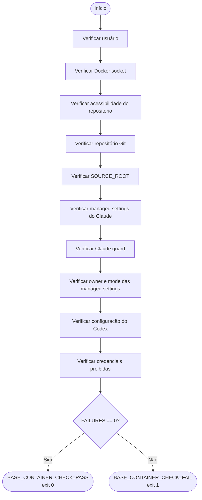
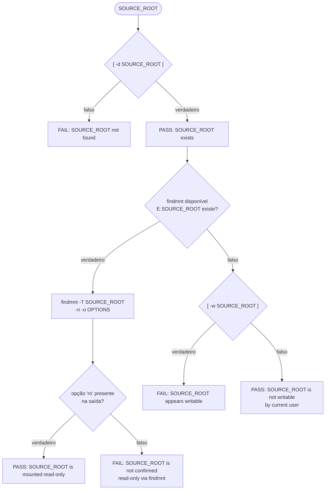
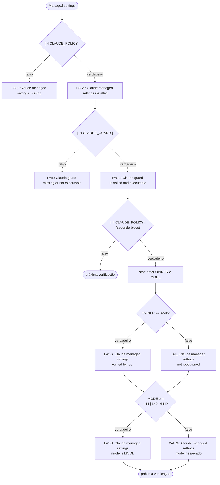
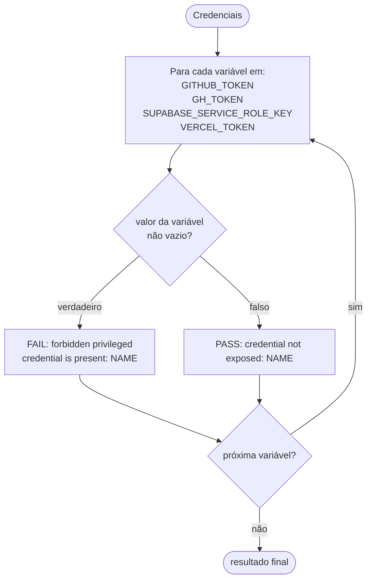

# Scripts — verificação do ambiente de agentes

## `verify-agent-environment.sh`

### Identidade

| Atributo | Valor |
| --- | --- |
| Nome | `verify-agent-environment.sh` |
| Tipo | Script bash de verificação |
| Localização | `.devcontainer/scripts/verify-agent-environment.sh` |
| Perfil verificado | BASE |
| Modo de execução | Manual ou via `postStartCommand` do devcontainer |
| Referência arquitetural | `.drive/multi-agentes/Arquivos-Human-Governed Dual-Agent SDLC Architecture.md` (seção 9) |

### Objetivo

Verificar que o container satisfaz os requisitos do perfil BASE definidos pela arquitetura
Human-Governed Dual-Agent SDLC. O script produz um resultado binário:
`BASE_CONTAINER_CHECK=PASS` ou `BASE_CONTAINER_CHECK=FAIL`.

### Papel arquitetural

O script é um verificador de pré-condições. Não é uma fronteira de segurança.

O enforcement técnico é responsabilidade de:

- container: mounts readonly, usuário não-root, sem Docker socket
- `/etc/claude-code/managed-settings.json`: managed settings root-owned
- `/usr/local/lib/cepraea-guards/pretool`: guard de operações Git
- `/etc/codex/requirements.toml`: requirements do Codex instalados pelo container

O script verifica que esses mecanismos estão presentes e configurados. Não os substitui.

### Execução

```bash
bash .devcontainer/scripts/verify-agent-environment.sh
```

O script requer que seja executado dentro do Dev Container, onde os caminhos e mounts da
arquitetura estão presentes.

---

## Caminhos verificados

| Caminho | Nível | Critério de falha |
| --- | --- | --- |
| `/workspaces/cepraea-beach-pro` | FAIL | inacessível |
| `/workspaces/cepraea-beach-pro` (git) | FAIL | não é repositório Git |
| `/workspaces/cepraea-beach-pro/.drive/CEPRAEA BEACH PRO` | FAIL | ausente ou writable |
| `/etc/claude-code/managed-settings.json` | FAIL | ausente |
| `/etc/claude-code/managed-settings.json` (owner) | FAIL | não pertence a root |
| `/etc/claude-code/managed-settings.json` (mode) | WARN | mode não é 444, 640 nem 644 |
| `/usr/local/lib/cepraea-guards/pretool` | FAIL | ausente ou não executável |
| `/workspaces/cepraea-beach-pro/.codex/config.toml` | WARN | ausente |
| `/etc/codex/requirements.toml` | FAIL | ausente |

## Variáveis de ambiente verificadas

| Variável | Nível | Critério de falha |
| --- | --- | --- |
| `GITHUB_TOKEN` | FAIL | valor não vazio |
| `GH_TOKEN` | FAIL | valor não vazio |
| `SUPABASE_SERVICE_ROLE_KEY` | FAIL | valor não vazio |
| `VERCEL_TOKEN` | FAIL | valor não vazio |

## Saídas por verificação

| Nível | Efeito no contador | Efeito no exit code |
| --- | --- | --- |
| `PASS` | nenhum | nenhum |
| `WARN` | incrementa `WARNINGS` | nenhum |
| `FAIL` | incrementa `FAILURES` | determina exit 1 |

## Resultado final

| Condição | Saída impressa | Exit code |
| --- | --- | --- |
| `FAILURES == 0` | `BASE_CONTAINER_CHECK=PASS` | `0` |
| `FAILURES >= 1` | `BASE_CONTAINER_CHECK=FAIL` | `1` |

`WARNINGS` não altera o exit code.

---

## Fluxos

### Fluxo geral



### Fluxo da verificação SOURCE_ROOT



### Fluxo da verificação das managed settings do Claude



### Fluxo da verificação de credenciais



---

## Especificação BDD

### Funcionalidade: verificação de identidade do processo

```gherkin
Funcionalidade: verificação de identidade do processo

  Cenário: processo rodando como usuário não-root
    Dado que o script é executado dentro do Dev Container
    Quando o user ID do processo for diferente de 0
    Então o script registra "PASS  container session is non-root"
    E o contador FAILURES permanece inalterado

  Cenário: processo rodando como root
    Dado que o script é executado dentro do Dev Container
    Quando o user ID do processo for igual a 0
    Então o script registra "FAIL  container session is running as root"
    E o contador FAILURES é incrementado em 1
```

### Funcionalidade: verificação do Docker socket

```gherkin
Funcionalidade: verificação do Docker socket

  Cenário: Docker socket ausente
    Dado que o script é executado dentro do Dev Container
    Quando /var/run/docker.sock não for um socket
    Então o script registra "PASS  Docker socket is not mounted"
    E o contador FAILURES permanece inalterado

  Cenário: Docker socket presente
    Dado que o script é executado dentro do Dev Container
    Quando /var/run/docker.sock existir como socket
    Então o script registra "FAIL  Docker socket is available inside the container"
    E o contador FAILURES é incrementado em 1
```

### Funcionalidade: verificação do repositório

```gherkin
Funcionalidade: verificação do repositório

  Cenário: repositório acessível
    Dado que o script é executado dentro do Dev Container
    Quando o diretório /workspaces/cepraea-beach-pro for acessível via cd
    Então o script registra "PASS  repository is accessible"
    E o contador FAILURES permanece inalterado

  Cenário: repositório inacessível
    Dado que o script é executado dentro do Dev Container
    Quando o diretório /workspaces/cepraea-beach-pro não for acessível via cd
    Então o script registra "FAIL  repository is not accessible at /workspaces/cepraea-beach-pro"
    E o contador FAILURES é incrementado em 1

  Cenário: repositório Git detectado
    Dado que o script está no diretório /workspaces/cepraea-beach-pro
    Quando git rev-parse --is-inside-work-tree retornar exit code 0
    Então o script registra "PASS  Git repository detected"
    E o contador FAILURES permanece inalterado

  Cenário: repositório Git não detectado
    Dado que o script está no diretório /workspaces/cepraea-beach-pro
    Quando git rev-parse --is-inside-work-tree retornar exit code diferente de 0
    Então o script registra "FAIL  Git repository not detected"
    E o contador FAILURES é incrementado em 1
```

### Funcionalidade: verificação do SOURCE_ROOT

```gherkin
Funcionalidade: verificação do SOURCE_ROOT

  Contexto:
    Dado que SOURCE_ROOT é "/workspaces/cepraea-beach-pro/.drive/CEPRAEA BEACH PRO"

  Cenário: SOURCE_ROOT existente
    Quando o diretório SOURCE_ROOT existir
    Então o script registra "PASS  SOURCE_ROOT exists"
    E o contador FAILURES permanece inalterado

  Cenário: SOURCE_ROOT ausente
    Quando o diretório SOURCE_ROOT não existir
    Então o script registra "FAIL  SOURCE_ROOT not found at: <SOURCE_ROOT>"
    E o contador FAILURES é incrementado em 1

  Cenário: SOURCE_ROOT montado read-only (findmnt disponível)
    Dado que findmnt está disponível no PATH
    E que o diretório SOURCE_ROOT existe
    Quando findmnt -T SOURCE_ROOT -n -o OPTIONS retornar string contendo "ro" como campo isolado
    Então o script registra "PASS  SOURCE_ROOT is mounted read-only"
    E o contador FAILURES permanece inalterado

  Cenário: SOURCE_ROOT não confirmado read-only (findmnt disponível)
    Dado que findmnt está disponível no PATH
    E que o diretório SOURCE_ROOT existe
    Quando a saída de findmnt -T SOURCE_ROOT -n -o OPTIONS não contiver "ro" como campo isolado
    Então o script registra "FAIL  SOURCE_ROOT is not confirmed read-only via findmnt"
    E o contador FAILURES é incrementado em 1

  Cenário: SOURCE_ROOT não writable (findmnt indisponível)
    Dado que findmnt não está disponível no PATH
    Quando o teste [ -w SOURCE_ROOT ] retornar falso
    Então o script registra "PASS  SOURCE_ROOT is not writable by current user"
    E o contador FAILURES permanece inalterado

  Cenário: SOURCE_ROOT writable (findmnt indisponível)
    Dado que findmnt não está disponível no PATH
    Quando o teste [ -w SOURCE_ROOT ] retornar verdadeiro
    Então o script registra "FAIL  SOURCE_ROOT appears writable"
    E o contador FAILURES é incrementado em 1
```

### Funcionalidade: verificação das managed settings do Claude

```gherkin
Funcionalidade: verificação das managed settings do Claude

  Contexto:
    Dado que CLAUDE_POLICY é "/etc/claude-code/managed-settings.json"

  Cenário: arquivo de managed settings presente
    Quando o arquivo CLAUDE_POLICY existir
    Então o script registra "PASS  Claude managed settings installed"
    E o contador FAILURES permanece inalterado

  Cenário: arquivo de managed settings ausente
    Quando o arquivo CLAUDE_POLICY não existir
    Então o script registra "FAIL  Claude managed settings missing at: /etc/claude-code/managed-settings.json"
    E o contador FAILURES é incrementado em 1
```

### Funcionalidade: verificação do Claude guard

```gherkin
Funcionalidade: verificação do Claude guard

  Contexto:
    Dado que CLAUDE_GUARD é "/usr/local/lib/cepraea-guards/pretool"

  Cenário: guard presente e executável
    Quando o arquivo CLAUDE_GUARD existir e tiver bit de execução
    Então o script registra "PASS  Claude guard installed and executable"
    E o contador FAILURES permanece inalterado

  Cenário: guard ausente ou sem bit de execução
    Quando o arquivo CLAUDE_GUARD não existir ou não tiver bit de execução
    Então o script registra "FAIL  Claude guard missing or not executable at: /usr/local/lib/cepraea-guards/pretool"
    E o contador FAILURES é incrementado em 1
```

### Funcionalidade: verificação de propriedade e permissões das managed settings

```gherkin
Funcionalidade: verificação de propriedade e permissões das managed settings

  Contexto:
    Dado que o arquivo CLAUDE_POLICY existe
    E que CLAUDE_POLICY é "/etc/claude-code/managed-settings.json"

  Cenário: managed settings pertencente a root
    Quando o owner do arquivo CLAUDE_POLICY for "root"
    Então o script registra "PASS  Claude managed settings owned by root"
    E o contador FAILURES permanece inalterado

  Cenário: managed settings não pertencente a root
    Quando o owner do arquivo CLAUDE_POLICY for diferente de "root"
    Então o script registra "FAIL  Claude managed settings are not root-owned (owner: <owner>)"
    E o contador FAILURES é incrementado em 1

  Cenário: managed settings com mode aceitável
    Quando o mode octal do arquivo CLAUDE_POLICY for 444, 640 ou 644
    Então o script registra "PASS  Claude managed settings mode is <mode> (acceptable)"
    E o contador WARNINGS permanece inalterado

  Cenário: managed settings com mode inesperado
    Quando o mode octal do arquivo CLAUDE_POLICY não for 444, 640 nem 644
    Então o script registra "WARN  Claude managed settings mode is <mode>; expected 444"
    E o contador WARNINGS é incrementado em 1
    E o contador FAILURES permanece inalterado
```

### Funcionalidade: verificação da configuração do Codex

```gherkin
Funcionalidade: verificação da configuração do Codex

  Cenário: configuração de projeto presente
    Dado que CODEX_CONFIG_PROJECT é "/workspaces/cepraea-beach-pro/.codex/config.toml"
    Quando o arquivo CODEX_CONFIG_PROJECT existir
    Então o script registra "PASS  Codex project config exists (.codex/config.toml)"
    E o contador WARNINGS permanece inalterado

  Cenário: configuração de projeto ausente
    Dado que CODEX_CONFIG_PROJECT é "/workspaces/cepraea-beach-pro/.codex/config.toml"
    Quando o arquivo CODEX_CONFIG_PROJECT não existir
    Então o script registra "WARN  Codex project config missing at: <CODEX_CONFIG_PROJECT>"
    E o contador WARNINGS é incrementado em 1
    E o contador FAILURES permanece inalterado

  Cenário: configuração de sistema presente
    Dado que CODEX_CONFIG_SYSTEM é "/etc/codex/requirements.toml"
    Quando o arquivo CODEX_CONFIG_SYSTEM existir
    Então o script registra "PASS  Codex system config exists (/etc/codex/requirements.toml)"
    E o contador FAILURES permanece inalterado

  Cenário: configuração de sistema ausente
    Dado que CODEX_CONFIG_SYSTEM é "/etc/codex/requirements.toml"
    Quando o arquivo CODEX_CONFIG_SYSTEM não existir
    Então o script registra "FAIL  Codex system config missing at: /etc/codex/requirements.toml"
    E o contador FAILURES é incrementado em 1
```

### Funcionalidade: verificação de credenciais proibidas

```gherkin
Funcionalidade: verificação de credenciais proibidas

  Contexto:
    Dado que as variáveis verificadas são: GITHUB_TOKEN, GH_TOKEN,
          SUPABASE_SERVICE_ROLE_KEY, VERCEL_TOKEN
    E que o script itera sobre cada variável individualmente

  Cenário: variável não definida ou vazia
    Quando o valor da variável NAME for vazio
    Então o script registra "PASS  credential not exposed: NAME"
    E o contador FAILURES permanece inalterado

  Cenário: variável definida com valor não vazio
    Quando o valor da variável NAME for não vazio
    Então o script registra "FAIL  forbidden privileged credential is present: NAME"
    E o contador FAILURES é incrementado em 1
```

### Funcionalidade: determinação do resultado final

```gherkin
Funcionalidade: determinação do resultado final

  Cenário: zero falhas
    Dado que todas as verificações foram executadas
    Quando o valor de FAILURES for igual a 0
    Então o script imprime "Failures: 0"
    E o script imprime "Warnings: <WARNINGS>"
    E o script imprime "BASE_CONTAINER_CHECK=PASS"
    E o script finaliza com exit code 0

  Cenário: uma ou mais falhas
    Dado que todas as verificações foram executadas
    Quando o valor de FAILURES for maior ou igual a 1
    Então o script imprime "Failures: <FAILURES>"
    E o script imprime "Warnings: <WARNINGS>"
    E o script imprime "BASE_CONTAINER_CHECK=FAIL"
    E o script finaliza com exit code 1
```
