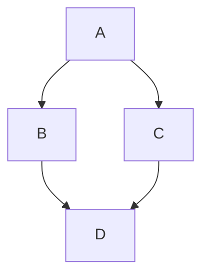

# Guia de Markdown para agentes de IA

<center><table>
<td><b>NOME</b></td><td><b>CAMINHO</b></td><td><b>VERSÃO</b></td><td><b>CLASSIFICAÇÃO</b></td><tr>
<td><a href='.inicio/davis files/normas/Guia-formatacao-markdown.md'> Guia-formatacao-markdown.md</a></td><td><b>SITUAÇÃO</b></td><td><b>SOOT</b></td><td><b>SOOT</b></td>
</table></center>

<!-- markdownlint-disable MD007 -->
- [Guia de Markdown para agentes de IA](#guia-de-markdown-para-agentes-de-ia)
  - [1. Finalidade](#1-finalidade)
  - [2. Escopo](#2-escopo)
  - [3. Convenções normativas](#3-convenções-normativas)
  - [4. Títulos](#4-títulos)
  - [5. Listas](#5-listas)
    - [5.1. Listas numeradas](#51-listas-numeradas)
  - [6. Tabelas](#6-tabelas)
    - [6.1. Criar uma tabela](#61-criar-uma-tabela)
    - [6.2. Formatar conteúdo dentro da tabela](#62-formatar-conteúdo-dentro-da-tabela)
  - [7. Ênfase](#7-ênfase)
  - [8. Citações em bloco](#8-citações-em-bloco)
  - [9. Blocos de código](#9-blocos-de-código)
  - [10. Tags de delimitação](#10-tags-de-delimitação)
  - [11. Organizando informações com seções recolhidas](#11-organizando-informações-com-seções-recolhidas)
    - [11.1 Criando uma seção recolhida](#111-criando-uma-seção-recolhida)
    - [Exemplo de uma imagem responsiva](#exemplo-de-uma-imagem-responsiva)
    - [Como a imagem fica](#como-a-imagem-fica)
  - [Adicionando uma tabela](#adicionando-uma-tabela)
    - [Exemplo de uma tabela](#exemplo-de-uma-tabela)
    - [Como a tabela fica](#como-a-tabela-fica)
  - [Adicionando uma seção recolhida](#adicionando-uma-seção-recolhida)
    - [Exemplo de uma seção recolhida](#exemplo-de-uma-seção-recolhida)
    - [Como fica a seção recolhida](#como-fica-a-seção-recolhida)
  - [Adicionando uma citação](#adicionando-uma-citação)
    - [Exemplo de uma citação](#exemplo-de-uma-citação)
    - [Como a citação se apresenta](#como-a-citação-se-apresenta)
  - [Adicionando um comentário](#adicionando-um-comentário)
    - [Exemplo de um comentário](#exemplo-de-um-comentário)
  - [Salvando seu trabalho](#salvando-seu-trabalho)
  - [Próximos passos](#próximos-passos)
- [Comunicando-se no GitHub](#comunicando-se-no-github)
  - [Introdução](#introdução)
    - [Problemas do GitHub](#problemas-do-github)
    - [Solicitações de pull](#solicitações-de-pull)
    - [Discussões do GitHub](#discussões-do-github)
    - [Cenários para problemas](#cenários-para-problemas)
      - [Exemplo de problema](#exemplo-de-problema)
    - [Cenários para solicitações de pull](#cenários-para-solicitações-de-pull)
      - [Exemplo de solicitação de pull request](#exemplo-de-solicitação-de-pull-request)
    - [Cenários para Discussões no GitHub](#cenários-para-discussões-no-github)
      - [Exemplo de Discussões do GitHub](#exemplo-de-discussões-do-github)
  - [Usando o Copilot para obter contexto](#usando-o-copilot-para-obter-contexto)
  - [Próximos passos](#próximos-passos-1)
- [Criando e destacando blocos de código](#criando-e-destacando-blocos-de-código)
  - [Blocos de código cercados](#blocos-de-código-cercados)
  - [Realce de sintaxe](#realce-de-sintaxe)
  - [Criando diagramas](#criando-diagramas)
  - [Leitura adicional](#leitura-adicional)
- [Criando diagramas](#criando-diagramas-1)
  - [Sobre a criação de diagramas](#sobre-a-criação-de-diagramas)
  - [Criando diagramas Mermaid](#criando-diagramas-mermaid)
    - [Verificando sua versão do Mermaid](#verificando-sua-versão-do-mermaid)
  - [Criando mapas GeoJSON e TopoJSON](#criando-mapas-geojson-e-topojson)
    - [Usando GeoJSON](#usando-geojson)
    - [Usando TopoJSON](#usando-topojson)
  - [Criando modelos 3D em STL](#criando-modelos-3d-em-stl)
  - [Dicionário de Dados](#dicionário-de-dados)

<!-- markdownlint-enable MD007 -->
## 1. Finalidade

Este documento define convenções para escrever instruções técnicas em Markdown
de forma legível, verificável e segura para pessoas e agentes de IA.

> As convenções organizam o conteúdo, mas não alteram a prioridade real das
instruções nem garantem obediência por um modelo. A prioridade depende do
ambiente que fornece as instruções ao agente.

## 2. Escopo

Use este guia para:

- instruções de repositório;
- especificações de tarefas;
- critérios de aceitação;
- procedimentos operacionais;
- dicionários de erros;
- exemplos técnicos destinados a agentes.

Este guia não substitui:

- controles de acesso;
- revisão humana;
- testes automatizados;
- políticas de segurança;
- documentação oficial das ferramentas utilizadas.

## 3. Convenções normativas

Os termos abaixo indicam a força de cada orientação:

- **DEVE**: requisito obrigatório para conformidade;
- **NÃO DEVE**: comportamento proibido;
- **DEVERIA**: recomendação que pode ter exceções justificadas;
- **PODE**: alternativa permitida.

## 4. Títulos

Cada documento **DEVE** conter um único título de nível 1 (`#`).

Esse título
define o assunto do arquivo.

As seções principais usam `##`; suas subseções usam `###`.

Um título **NÃO DEVE** saltar níveis.

Exemplo:

```markdown
# Título do documento

## 1. Seção

### 1.1 Subseção
```

*Não reinicie a numeração dentro do mesmo documento.*
> Numere os títulos somente quando a ordem ou a referência cruzada trouxerem valor.

## 5. Listas

Use listas com `-` para itens independentes, como regras, restrições e
requisitos sem ordem de execução.

### 5.1. Listas numeradas

Use listas numeradas apenas quando:

1. a ordem de execução for obrigatória;
2. uma etapa depender da anterior;
3. o número identificar um critério referenciado em outro ponto.

**Itens de lista não podem estar vazios.**

## 6. Tabelas

**Uso adequado** | **Toda tabela DEVE**
 :--- | :---
Matrizes de permissões e responsabilidades | Possuir cabeçalho
Comparação entre estado atual e estado desejado; | Usar uma coluna por atributo comparável
Mapeamento entre identificadores, condições e resultados | Manter células curtas e denotativas
Relação entre erros, diagnósticos e ações | Indicar unidade ou contexto quando um valor puder ser ambíguo
Comparação de opções que compartilham os mesmos atributos | Evitar colunas vazias.

- Não use tabela para representar uma sequência de execução.
- Use lista numerada
quando a ordem for obrigatória.
- Se as células exigirem parágrafos extensos, prefira subseções ou listas.
- Uma tabela organiza relações, mas não concede prioridade técnica às regras.
- A prioridade continua dependendo da origem da instrução e do ambiente do agente
- Você pode criar tabelas para organizar as informações em comentários, problemas, pull requests e wikis.
- Use tabelas quando linhas e colunas tornarem relações repetidas mais fáceis de
comparar.

### 6.1. Criar uma tabela
<!-- markdownlint-disable MD055 -->
- Criar tabelas com pipes `|` e hífens `-`. 
- Hifens são usados para criar o cabeçalho de cada coluna, enquanto as barras verticais separam cada coluna.
- Você deve incluir uma linha em branco antes da tabela para ela ser renderizada corretamente.
- Os pipes em cada extremidade da tabela são opcionais.

```markdown
 Primeiro cabeçalho | Segundo cabeçalho
 ------------- | -------------
 Célula de conteúdo | Célula de conteúdo
 Célula de conteúdo | Célula de conteúdo
```

Primeiro cabeçalho | Segundo cabeçalho
------------- | -------------
Célula de conteúdo | Célula de conteúdo
Célula de conteúdo | Célula de conteúdo

> As células podem ter largura variada e não precisam estar alinhadas perfeitamente com as colunas. Deve ter no mínimo **três hifens** em cada **coluna da linha** do cabeçalho.
<!--MD055 disabled-->

| Comando | Descrição |
| --- | --- |
| `git status` | Lista todos os arquivos novos ou modificados |
| `git diff` | Mostra as diferenças dos arquivos que ainda não foram adicionadas à área de preparação |

```markdown
| Comando | Descrição |
| --- | --- |
| `git status` | Lista todos os arquivos novos ou modificados |
| `git diff` | Mostra as diferenças dos arquivos que ainda não foram adicionadas à área de preparação |
```

> Se você editar tabelas e snippets de código com frequência, poderá se beneficiar da habilitação de uma fonte de largura fixa em todos os campos de comentário no GitHub.

### 6.2. Formatar conteúdo dentro da tabela

Você pode usar [formatação](/pt/get-started/writing-on-github/getting-started-with-writing-and-formatting-on-github/basic-writing-and-formatting-syntax), como links, blocos de código embutidos e estilo de texto na tabela:

Comando | Descrição
--- | ---
`git status` | Lista todos os arquivos *novos ou modificados*
`git diff` | Mostra as diferenças dos arquivos que **ainda não foram** adicionadas à área de preparação

> Você pode alinhar o texto à esquerda, à direita ou no centro de uma coluna incluindo dois pontos `:` à esquerda, direita ou nos dois lados dos hifens que estão dentro da linha de cabeçalho.

| Alinhado à esquerda | Centralizado | Alinhado à direita |
| :--- | :---: | ---: |
| git status | git status | git status |
| git diff | git diff | git diff |

> Para incluir uma barra vertical `|` como conteúdo dentro da célula, use `\` antes da barra vertical:

| Nome     | Caractere |
| ---      | ---       |
| Crase    | `         |
| Barra vertical | \|  |

## 7. Ênfase

Use **negrito** para termos **normativos**, **identificadores** e **entidades** que precisam ser localizadas rapidamente.

Não dependa apenas de negrito, caixa alta, emojis ou blockquotes para indicar
prioridade. Expresse a regra e sua consequência de forma explícita.

## 8. Citações em bloco

Use `>` para destacar avisos, notas ou restrições visuais em citações em bloco.

> **Aviso:** a citação em bloco melhora a apresentação, mas não concede prioridade
> técnica à instrução.

## 9. Blocos de código

Todo bloco de código DEVE:

- ter uma cerca de abertura e outra de fechamento com o mesmo caractere;
- informar a linguagem quando ela for conhecida;
- conter apenas código, dados ou texto exemplar;
- ser validado antes da publicação quando for apresentado como executável.

> Para exibir Markdown que contém cercas triplas, use quatro crases na cerca externa:

````markdown
```bash
printf '%sn' "exemplo"
```
````

## 10. Tags de delimitação

Tags como `<instructions>`, `<context>`, `<examples>` e `<input>` são delimitadores semânticos e **DEVEM** ser usadas instruções ou documentos, para ajudar a distinguir tipos de conteúdo.

- separar instruções, contexto, exemplos e entradas variáveis;
- envolver um exemplo em `<example>`;
- agrupar múltiplos exemplos em `<examples>`;
- estruturar documentos com `<document>`, `<document_content>` e `<source>`.

Ao utilizá-las:

- abrir e fechar cada tag;
- usar nomes consistentes e descritivos;
- aninhar tags sempre que existir uma hierarquia natural;
- escapar ou sanitizar conteúdo externo que possa fechar ou criar tags;
- não usar tags como substitutas obrigatórias da hierarquia Markdown;
- não atribuir às tags efeitos que a ferramenta não documenta;
- manter o conteúdo da tag coerente com o título da seção.

Exemplo:

```xml
<instructions>
Resuma cada documento usando somente o conteúdo fornecido.
</instructions>

<documents>
  <document index="1">
    <source>relatorio-a.md</source>
    <document_content>
      Conteúdo do documento.
    </document_content>
  </document>
</documents>

<input>
Quais riscos foram identificados?
</input>
```

## 11. Organizando informações com seções recolhidas

Você pode simplificar o Markdown criando uma seção recolhida com a tag <details>

### 11.1 Criando uma seção recolhida

Você pode obscurecer temporariamente seções do seu Markdown criando uma seção expandida que o leitor pode optar por expandir. Por exemplo, quando você deseja incluir detalhes técnicos em um comentário do problema que pode não ser relevante ou interessante para todos os leitores, você pode colocar esses detalhes em uma seção recolhida.

Qualquer Markdown dentro do bloco `<details>` estará recolhido até que o leitor clique em <svg version="1.1" width="16" height="16" viewBox="0 0 16 16" class="octicon octicon-triangle-right" aria-label="Ícone de triângulo apontando para a direita" role="img"><path d="m6.427 4.427 3.396 3.396a.25.25 0 0 1 0 .354l-3.396 3.396A.25.25 0 0 1 6 11.396V4.604a.25.25 0 0 1 .427-.177Z"></path></svg> para expandir os detalhes.

No bloco `<details>`, use a marca `<summary>` para que os leitores saibam o que está dentro dele. O rótulo aparece à direita de <svg version="1.1" width="16" height="16" viewBox="0 0 16 16" class="octicon octicon-triangle-right" aria-label="Ícone de triângulo apontando para a direita" role="img"><path d="m6.427 4.427 3.396 3.396a.25.25 0 0 1 0 .354l-3.396 3.396A.25.25 0 0 1 6 11.396V4.604a.25.25 0 0 1 .427-.177Z"></path></svg>.

````markdown
<details>

<summary>Dicas para seções recolhidas</summary>

### Você pode adicionar um título

Você pode adicionar texto dentro de uma seção recolhida.

Você também pode adicionar uma imagem ou um bloco de código.

```ruby
   puts "Olá, mundo!"
```

</details>
````

O Markdown no rótulo `<summary>` será recolhido por padrão:


Depois que um leitor clica em <svg version="1.1" width="16" height="16" viewBox="0 0 16 16" class="octicon octicon-triangle-right" aria-label="Ícone de triângulo apontando para a direita" role="img"><path d="m6.427 4.427 3.396 3.396a.25.25 0 0 1 0 .354l-3.396 3.396A.25.25 0 0 1 6 11.396V4.604a.25.25 0 0 1 .427-.177Z"></path></svg>, os detalhes são expandidos:

Opcionalmente, para que a seção seja exibida como aberta por padrão, adicione o atributo `open` à tag `<details>`:

```html
<details open>
```

Modelos de cores com suporte
Em issues, pull requests e discussões, você pode destacar cores dentro de uma frase usando backticks. Um modelo de cores com suporte em backticks exibirá uma visualização da cor.

The background color is `#ffffff` for light mode and `#000000` for dark mode.
Captura de tela do GitHub Markdown renderizado mostrando como os valores HEX em backticks criam pequenos círculos de cor, aqui em branco e depois em preto.

Aqui estão os modelos de cores com suporte no momento.

Cor	| Sintaxe | Example | Saída
| :---: | :---: | :---: | :---: |
| HEX | `#RRGGBB` | `#0969DA` | Captura de tela do markdown GitHub renderizado mostrando como o valor HEX #0969DA aparece com um círculo azul. | 
| RGB| `rgb(R,G,B)` |  `rgb(9, 105, 218)` | Captura de tela do GitHub Markdown renderizado mostrando como o valor RGB 9, 105, 218 aparece com um círculo azul.
HSL	`hsl(H,S,L)`	`hsl(212, 92%, 45%)`	
Captura de tela do markdown GitHub renderizado mostrando como o valor de HSL 212, 92%, 45% aparece com um círculo azul.
Observação

Um modelo de cores com suporte não pode ter espaços à esquerda ou à direita dentro dos backticks.
A visualização da cor só tem suporte em problemas, solicitações de pull e discussões.

### Exemplo de uma imagem responsiva

```html
<picture>
  <source media="(prefers-color-scheme: dark)" srcset="https://user-images.githubusercontent.com/25423296/163456776-7f95b81a-f1ed-45f7-b7ab-8fa810d529fa.png">
  <source media="(prefers-color-scheme: light)" srcset="https://user-images.githubusercontent.com/25423296/163456779-a8556205-d0a5-45e2-ac17-42d089e3c3f8.png">
  
</picture>
```

### Como a imagem fica


## Adicionando uma tabela

Você pode usar tabelas Markdown para organizar informações. Aqui, você usará uma tabela para se apresentar, classificando algo, como suas linguagens de programação ou frameworks mais usados, os assuntos que você está aprendendo ou seus hobbies favoritos. Quando uma coluna da tabela contém números, é útil alinhá-la à direita usando a sintaxe `--:` abaixo da linha de cabeçalho.

1. Retorne à aba **Editar arquivo**.

2. Para se apresentar, duas linhas abaixo da tag `</picture>`, adicione um cabeçalho `## Sobre mim` e um breve parágrafo sobre você, como o seguinte.

   ```markdown
   ## Sobre mim

   Olá, eu sou a Mona. Talvez você me reconheça como a mascote do GitHub.
   ```

3. Duas linhas abaixo deste parágrafo, insira uma tabela copiando e colando a seguinte marcação.

   ```markdown
   | Classificação | ITEM A CLASSIFICAR |
   |-----:|---------------|
   | 1| |
   | 2| |
   | 3| |
   ```

4. Na coluna à direita, substitua `ITEM A CLASSIFICAR` por "Linguagens", "Hobbies" ou qualquer outra categoria e preencha a coluna com sua lista de itens.

5. Para verificar se a tabela foi renderizada corretamente, clique na guia **Visualizar**.

Para obter mais informações, consulte [Organizando informações com tabelas](/en/get-started/writing-on-github/working-with-advanced-formatting/organizing-information-with-tables).

### Exemplo de uma tabela

```markdown
## Sobre mim

Olá, eu sou a Mona. Talvez você me reconheça como a mascote do GitHub.

| Classificação | Idiomas |
|-----:|-----------|
| 1| JavaScript|
| 2| Python |
| 3| SQL |
```

### Como a tabela fica


## Adicionando uma seção recolhida

Para manter seu conteúdo organizado, você pode usar a tag `<details>` para criar uma seção recolhida e expansível.

1. Para criar uma seção recolhida para a tabela que você criou, envolva sua tabela em tags `<details>`, como no exemplo a seguir.

   ```html
   <details>
   <summary>Minhas principais COISAS PARA CLASSIFICAR</summary>

   SUA TABELA

   </details>
   ```

2. Entre as tags `<summary>`, substitua `COISAS PARA CLASSIFICAR` pelo que você classificou na sua tabela.

3. Opcionalmente, para que a seção seja exibida como aberta por padrão, adicione o atributo `open` à tag `<details>`.

   ```html
   <details open>
   ```

4. Para verificar se a seção recolhida foi renderizada corretamente, clique na guia **Visualizar**.

### Exemplo de uma seção recolhida

```html
<details>
<summary>Meus idiomas favoritos</summary>

| Classificação | Idiomas |
|-----:|-----------|
| 1| JavaScript|
| 2| Python |
| 3| SQL |

</details>
```

### Como fica a seção recolhida


## Adicionando uma citação

O Markdown oferece muitas outras opções para formatar seu conteúdo. Aqui, você adicionará uma linha horizontal para dividir sua página e um bloco de citação para formatar sua citação favorita.

1. Na parte inferior do seu arquivo, duas linhas abaixo da tag `</details>`, adicione uma linha horizontal digitando três ou mais traços.

   ```markdown
   ---
   ```

2. Abaixo da linha `---`, adicione uma citação digitando a formatação como a seguir.

   ```markdown
   > CITAÇÃO
   ```

   Substitua `CITAÇÃO` por uma citação de sua escolha. Como alternativa, copie a citação do nosso exemplo abaixo.

3. Para verificar se tudo foi renderizado corretamente, clique na aba **Visualizar**.

### Exemplo de uma citação

```markdown
---
Se nos unirmos e nos comprometermos, podemos superar qualquer coisa.

— Mona, a Octogata
```

### Como a citação se apresenta


## Adicionando um comentário

Você pode usar a sintaxe de comentários HTML para adicionar um comentário que ficará oculto na saída. Aqui, você adicionará um comentário para se lembrar de atualizar seu arquivo README posteriormente.

1. Duas linhas abaixo do cabeçalho `## Sobre mim`, insira um comentário usando a seguinte marcação.

   ```text
   <!-- COMENTÁRIO -->
   ```

   Substitua `COMENTÁRIO` por um item da sua lista de tarefas que você se lembra de fazer mais tarde (por exemplo, adicionar mais itens à tabela).
2. Para verificar se seu comentário está oculto na saída, clique na guia **Visualizar**.

### Exemplo de um comentário

```markdown
## Sobre mim

<!-- A FAZER: adicionar mais detalhes sobre mim posteriormente -->
```

## Salvando seu trabalho

Quando estiver satisfeito com as alterações, salve o arquivo README do seu perfil clicando em **Confirmar alterações**.

Ao confirmar as alterações diretamente na branch `main`, elas ficarão visíveis para qualquer visitante do seu perfil. Se você quiser salvar seu trabalho, mas ainda não estiver pronto para torná-lo visível no seu perfil, selecione **Criar uma nova branch para esta confirmação e iniciar um pull request**.

## Próximos passos

* Continue aprendendo sobre recursos avançados de formatação. Por exemplo, veja [Criando diagramas](/en/get-started/writing-on-github/working-with-advanced-formatting/creating-diagrams) e [Criando e destacando blocos de código](/en/get-started/writing-on-github/working-with-advanced-formatting/creating-and-highlighting-code-blocks).
* Utilize suas novas habilidades ao se comunicar no GitHub, em issues, pull requests e discussões. Para mais informações, consulte [Comunicação no GitHub](/en/get-started/using-github/communicating-on-github).

# Comunicando-se no GitHub

Você pode discutir projetos e mudanças específicas, bem como ideias mais amplas ou metas da equipe, usando diferentes tipos de discussões no GitHub.

## Introdução

O GitHub oferece ferramentas de comunicação colaborativa integradas que permitem uma interação mais próxima com a sua comunidade. Este guia rápido mostrará como escolher a ferramenta certa para as suas necessidades.

Você pode criar e participar de issues, pull requests e discussões em equipe, dependendo do tipo de conversa que deseja ter.

> \[!TIP] Você também pode usar o Copilot Chat para gerar ideias, esboços ou rascunhos para discussões, com base em suas solicitações de pull e problemas. Consulte [Escrevendo discussões ou postagens de blog](/en/copilot/tutorials/copilot-cookbook/document-code/write-discussions-or-blog-posts).

### Problemas do GitHub

- São úteis para discutir detalhes específicos de um projeto, como relatórios de erros, melhorias planejadas e feedback.
- São específicos de um repositório e geralmente têm um proprietário definido.
- São frequentemente referidos como o sistema de rastreamento de bugs do GitHub

### Solicitações de pull

- Permite que você proponha alterações específicas
- Permite que você comente diretamente sobre as alterações propostas por outros usuários.
- São específicos de um repositório

### Discussões do GitHub

- São como um fórum e são mais adequados para ideias e discussões abertas, onde a colaboração é importante.
- Pode abranger vários repositórios
- Proporcionar uma experiência colaborativa fora do código-fonte, permitindo o brainstorming de ideias e a criação de uma base de conhecimento da comunidade.
- Frequentemente não têm um dono definido.
- Frequentemente não resultam em uma tarefa acionável

Qual ferramenta de discussão devo usar?

### Cenários para problemas

- Quero manter um registro de tarefas, melhorias e erros.
- Quero enviar um relatório de erro.
- Gostaria de compartilhar minha opinião sobre uma funcionalidade específica.
- Gostaria de fazer uma pergunta sobre arquivos no repositório.

#### Exemplo de problema

Este exemplo ilustra como um usuário do GitHub criou uma solicitação (issue) em nosso repositório de documentação de código aberto para nos alertar sobre um bug e discutir uma correção.


- Um usuário notou que a cor azul do banner no topo da página na versão chinesa da documentação do GitHub torna o texto do banner ilegível.
- O usuário criou uma solicitação no repositório, descrevendo o problema e sugerindo uma solução (que é usar uma cor de fundo diferente para o banner).
Segue-se uma discussão e, eventualmente, chega-se a um consenso sobre a solução a ser aplicada.
- Um colaborador pode então criar uma solicitação de pull request com a correção.

### Cenários para solicitações de pull

- Quero corrigir um erro de digitação em um repositório.
- Quero fazer alterações em um repositório.
- Quero fazer alterações para corrigir um problema.
- Gostaria de comentar as alterações sugeridas por outros.

#### Exemplo de solicitação de pull request

Este exemplo ilustra como um usuário do GitHub criou uma solicitação de pull request em nosso repositório de código aberto de documentação para corrigir um erro de digitação.

Na aba **Conversa** da solicitação de pull request, o autor explica o motivo da criação da solicitação.


A aba **Arquivos alterados** da solicitação de pull mostra a correção implementada.


- Este colaborador identificou um erro de digitação no repositório.
- O usuário cria uma solicitação de pull request com a correção.
- Um dos responsáveis ​​pela manutenção do repositório analisa a solicitação de pull request, comenta sobre ela e a mescla.

### Cenários para Discussões no GitHub

- Tenho uma pergunta que não está necessariamente relacionada a arquivos específicos no repositório.
- Quero compartilhar novidades com meus colaboradores ou minha equipe.
- Quero iniciar ou participar de uma conversa aberta.
- Gostaria de fazer um anúncio à minha comunidade.

#### Exemplo de Discussões do GitHub

Este exemplo mostra a postagem de boas-vindas da seção de Discussões do GitHub para o repositório de código aberto do GitHub Docs e ilustra como a equipe deseja colaborar com sua comunidade.


Este membro da comunidade iniciou uma discussão para dar as boas-vindas à comunidade e pedir que os membros se apresentassem. Esta publicação promove um ambiente acolhedor para visitantes e colaboradores. A publicação também esclarece que a equipe está à disposição para ajudar com contribuições para o repositório.

## Usando o Copilot para obter contexto

> \[!NOTE] Você precisará de acesso ao GitHub Copilot. Para obter mais informações, consulte [O que é o GitHub Copilot?](/en/copilot/get-started/what-is-github-copilot#get-access).

Se precisar de mais contexto ou esclarecimentos sobre um assunto ou discussão específica, você pode usar o GitHub Copilot para obter respostas às suas perguntas. Isso permite que você compreenda rapidamente tópicos complexos e se mantenha alinhado com os objetivos do projeto, promovendo a colaboração e o compartilhamento de conhecimento dentro da comunidade.

Para fazer uma pergunta sobre um assunto ou discussão:

1. Em qualquer lugar no GitHub, clique em **<svg version="1.1" width="16" height="16" viewBox="0 0 16 16" class="octicon octicon-copilot" aria-label="Copilot" role="img"><path d="M7.998 15.035c-4.562 0-7.873-2.914-7.998-3.749V9.338c.085-.628.677-1.686 1.588-2.065.013-.07.024-.143.036-.218.029-.183.06-.384.126-.612-.201-.508-.254-1.084-.254-1.656 0-.87.128-1.769.693-2.484.579-.733 1.494-1.124 2.724-1.261 1.206-.134 2.262.034 2.944.765.05.053.096.108.139.165.044-.057.094-.112.143-.165.682-.731 1.738-.899 2.944-.765 1.23.137 2.145.528 2.724 1.261.566.715.693 1.614.693 2.484 0 .572-.053 1.148-.254 1.656.066.228.098.429.126.612.012.076.024.148.037.218.924.385 1.522 1.471 1.591 2.095v1.872c0 .766-3.351 3.795-8.002 3.795Zm0-1.485c2.28 0 4.584-1.11 5.002-1.433V7.862l-.023-.116c-.49.21-1.075.291-1.727.291-1.146 0-2.059-.327-2.71-.991A3.222 3.222 0 0 1 8 6.303a3.24 3,24 0 0 1-.544.743c-.65.664-1.563.991-2.71.991-.652 0-1.236-.081-1.727-.291l-.023.116v4.255c.419.323 2.722 1.433 5.002 1.433ZM6.762 2,83c-.193-.206-.637-.413-1.682-.297-1.019.113-1.479.404-1.713.7-.247.312-.369.789-.369 1.554 0 .793.129 1.171.308 1.371.162.181.519.379 1.442.379.853 0 1.339-0,235 1.638-.54.315-.322.527-.827.617-1.553.117-.935-.037-1.395-.241-1.614Zm4.155-.297c-1.044-.116-1.488.091-1.681.297-.204.219-.359.679-.242 1.614.091.726.303 1.231.618 1.553.299.305.784.54 1.638.54.922 0 1.28-.198 1.442-.379.179-.2.308-.578.308-1.371 0-.765-.123-1.242-.37-1.554-.233-.296-.693-.587-1.713-.7Z"></path><path d="M6.25 9.037a.75.75 0 0 1 .75.75v1.501a.75.75 0 0 1-1.5 0V9.787a.75.75 0 0 1 .75-.75Zm4.25.75v1.501a.75.75 0 0 1-1.5 0V9.787a.75.75 0 0 1 1.5 ** ícone ao lado da barra de pesquisa no canto superior direito da página.

   

2. Na caixa "Pergunte ao Copiloto", digite uma pergunta e inclua o URL relevante na sua mensagem. Por exemplo, você poderia perguntar:

   - `Explicar https://github.com/monalisa/octokit/issues/1`
   - `Resumir https://github.com/monalisa/octokit/discussions/4`
   - `Recomendar próximos passos para https://github.com/monalisa/octokit/issues/2`
   - `Quais são os critérios de aceitação para a URL da ISSUE?`
   - `Quais são os principais pontos levantados por PESSOA na URL DA DISCUSSÃO?`

   Se você estiver conversando com o GitHub Copilot a partir de um problema ou discussão específica, não precisa incluir o URL na sua pergunta.

3. Opcionalmente, após enviar uma pergunta, você pode clicar em <svg version="1.1" width="16" height="16" viewBox="0 0 16 16" class="octicon octicon-square-fill" aria-label="Interromper" role="img"><path d="M5.75 4h4.5c.966 0 1.75.784 1.75 1.75v4.5A1.75 1.75 0 0 1 10.25 12h-4.5A1.75 1.75 0 0 1 4 10.25v-4.5C4 4.784 4.784 4 5.75 4Z"></path></svg> na caixa de texto para interromper a resposta.

## Próximos passos

Esses exemplos mostraram como decidir qual é a melhor ferramenta para suas conversas no GitHub. Mas isso é apenas o começo; há muito mais que você pode fazer para adaptar essas ferramentas às suas necessidades.

Por exemplo, para problemas, você pode adicionar etiquetas para facilitar a busca e criar modelos de problemas para ajudar os colaboradores a abrir problemas relevantes. Para mais informações, consulte [Sobre problemas](/en/issues/tracking-your-work-with-issues/learning-about-issues/about-issues) e [Sobre modelos de problemas e solicitações de pull](/en/communities/using-templates-to-encourage-useful-issues-and-pull-requests/about-issue-and-pull-request-templates).

Para solicitações de pull request, você pode criar rascunhos se as alterações propostas ainda estiverem em desenvolvimento. Os rascunhos de pull request não podem ser mesclados até serem marcados como prontos para revisão. Para mais informações, consulte [Pull requests](/en/pull-requests/collaborating-with-pull-requests/proposing-changes-to-your-work-with-pull-requests/about-pull-requests#draft-pull-requests).

Para o GitHub Discussions, você pode definir um código de conduta e fixar discussões que contenham informações importantes para sua comunidade. Para mais informações, consulte [Sobre discussões](/en/discussions/collaborating-with-your-community-using-discussions/about-discussions).

Para aprender alguns recursos avançados de formatação que o ajudarão a se comunicar, consulte [Guia rápido para escrever no GitHub](/en/get-started/writing-on-github/getting-started-with-writing-and-formatting-on-github/quickstart-for-writing-on-github).

# Criando e destacando blocos de código

Compartilhe exemplos de código com blocos cercados e habilite o realce de sintaxe.

## Blocos de código cercados

Você pode criar blocos de código cercados colocando três crases <code>\`\`\`</code> antes e depois do bloco. Recomendamos inserir uma linha em branco antes e depois dos blocos de código para facilitar a leitura da formatação original.

````text
```
function test() {
  console.log("percebeu a linha em branco antes desta função?");
}
```
````


> \[!TIP]
> Para preservar a formatação dentro de uma lista, recue os blocos de código não cercados com oito espaços.

Para exibir três crases em um bloco de código cercado, envolva-as com quatro crases.

`````text
````
```
Veja! Minhas crases estão visíveis.
```
````
`````


Se você edita trechos de código e tabelas com frequência, pode ser útil habilitar uma fonte de largura fixa em todos os campos de comentário no GitHub. Para obter mais informações, consulte [Sobre escrita e formatação no GitHub](/en/get-started/writing-on-github/getting-started-with-writing-and-formatting-on-github/about-writing-and-formatting-on-github#enabling-fixed-width-fonts-in-the-editor).

## Realce de sintaxe

<!-- Se você alterar este recurso, verifique se alguma mudança afeta as linguagens listadas em /get-started/learning-about-github/github-language-support. Nesse caso, atualize também o artigo sobre suporte a linguagens. -->

Você pode adicionar um identificador opcional de linguagem para habilitar o realce de sintaxe no bloco de código cercado.

O realce de sintaxe altera a cor e o estilo do código-fonte para facilitar a leitura.

Por exemplo, para realçar a sintaxe de um código Ruby:

````text
```ruby
require 'redcarpet'
markdown = Redcarpet.new("Olá, mundo!")
puts markdown.to_html
```
````

Isso exibirá o bloco de código com realce de sintaxe:


> \[!TIP]
> Ao criar um bloco de código cercado que também deve ter realce de sintaxe em um site do GitHub Pages, use identificadores de linguagem em letras minúsculas. Para obter mais informações, consulte [Sobre o GitHub Pages e o Jekyll](/en/pages/setting-up-a-github-pages-site-with-jekyll/about-github-pages-and-jekyll#syntax-highlighting).

Usamos o [Linguist](https://github.com/github-linguist/linguist) para detectar a linguagem e selecionar [gramáticas de terceiros](https://github.com/github-linguist/linguist/blob/main/vendor/README.md) para o realce de sintaxe. Você pode consultar quais palavras-chave são válidas no [arquivo YAML de linguagens](https://github.com/github-linguist/linguist/blob/main/lib/linguist/languages.yml).

## Criando diagramas

Você também pode usar blocos de código para criar diagramas em Markdown. O GitHub oferece suporte às sintaxes Mermaid, GeoJSON, TopoJSON e ASCII STL. Para obter mais informações, consulte [Criando diagramas](/en/get-started/writing-on-github/working-with-advanced-formatting/creating-diagrams).

## Leitura adicional

- [Especificação do GitHub Flavored Markdown](https://github.github.com/gfm/)
- [Sintaxe básica de escrita e formatação](/en/get-started/writing-on-github/getting-started-with-writing-and-formatting-on-github/basic-writing-and-formatting-syntax)

# Criando diagramas

Crie diagramas para transmitir informações por meio de quadros e gráficos.

## Sobre a criação de diagramas

Você pode criar diagramas em Markdown usando quatro sintaxes diferentes: Mermaid, GeoJSON, TopoJSON e ASCII STL. A renderização de diagramas está disponível em issues, GitHub Discussions, pull requests, wikis e arquivos Markdown.

## Criando diagramas Mermaid

Mermaid é uma ferramenta inspirada em Markdown que transforma texto em diagramas. Por exemplo, o Mermaid pode renderizar fluxogramas, diagramas de sequência, gráficos de pizza e outros formatos. Para obter mais informações, consulte a [documentação do Mermaid](https://mermaid-js.github.io/mermaid/#/).

Para criar um diagrama Mermaid, adicione a sintaxe Mermaid dentro de um bloco de código cercado com o identificador de linguagem `mermaid`. Para obter mais informações sobre a criação de blocos de código, consulte [Criando e destacando blocos de código](/en/get-started/writing-on-github/working-with-advanced-formatting/creating-and-highlighting-code-blocks).

Por exemplo, você pode criar um fluxograma especificando valores e setas.

````text
Este é um fluxograma simples:


````


> \[!NOTE]
> Você pode encontrar erros se executar um plugin Mermaid de terceiros ao usar a sintaxe Mermaid no GitHub.

### Verificando sua versão do Mermaid

Para garantir que o GitHub ofereça suporte à sua sintaxe Mermaid, verifique a versão do Mermaid em uso.

````text
```mermaid
  info
```
````

## Criando mapas GeoJSON e TopoJSON

Você pode usar as sintaxes GeoJSON ou TopoJSON para criar mapas interativos. Para criar um mapa, adicione GeoJSON ou TopoJSON dentro de um bloco de código cercado com o identificador de sintaxe `geojson` ou `topojson`. Para obter mais informações, consulte [Criando e destacando blocos de código](/en/get-started/writing-on-github/working-with-advanced-formatting/creating-and-highlighting-code-blocks).

### Usando GeoJSON

Por exemplo, você pode criar um mapa especificando coordenadas.

````text
```geojson
{
  "type": "FeatureCollection",
  "features": [
    {
      "type": "Feature",
      "id": 1,
      "properties": {
        "ID": 0
      },
      "geometry": {
        "type": "Polygon",
        "coordinates": [
          [
              [-90,35],
              [-90,30],
              [-85,30],
              [-85,35],
              [-90,35]
          ]
        ]
      }
    }
  ]
}
```
````


### Usando TopoJSON

Por exemplo, você pode criar um mapa TopoJSON especificando coordenadas e formas.

````text
```topojson
{
  "type": "Topology",
  "transform": {
    "scale": [0.0005000500050005, 0.00010001000100010001],
    "translate": [100, 0]
  },
  "objects": {
    "example": {
      "type": "GeometryCollection",
      "geometries": [
        {
          "type": "Point",
          "properties": {"prop0": "value0"},
          "coordinates": [4000, 5000]
        },
        {
          "type": "LineString",
          "properties": {"prop0": "value0", "prop1": 0},
          "arcs": [0]
        },
        {
          "type": "Polygon",
          "properties": {"prop0": "value0",
            "prop1": {"this": "that"}
          },
          "arcs": [[1]]
        }
      ]
    }
  },
  "arcs": [[[4000, 0], [1999, 9999], [2000, -9999], [2000, 9999]],[[0, 0], [0, 9999], [2000, 0], [0, -9999], [-2000, 0]]]
}
```
````


Para obter mais informações sobre como trabalhar com arquivos `.geojson` e `.topojson`, consulte [Trabalhando com arquivos que não contêm código](/en/repositories/working-with-files/using-files/working-with-non-code-files#mapping-geojsontopojson-files-on-github).

## Criando modelos 3D em STL

Você pode usar a sintaxe ASCII STL diretamente no Markdown para criar modelos 3D interativos. Para exibir um modelo, adicione a sintaxe ASCII STL dentro de um bloco de código cercado com o identificador de sintaxe `stl`. Para obter mais informações, consulte [Criando e destacando blocos de código](/en/get-started/writing-on-github/working-with-advanced-formatting/creating-and-highlighting-code-blocks).

Por exemplo, você pode criar um modelo 3D simples:

````text
```stl
solid cube_corner
  facet normal 0.0 -1.0 0.0
    outer loop
      vertex 0.0 0.0 0.0
      vertex 1.0 0.0 0.0
      vertex 0.0 0.0 1.0
    endloop
  endfacet
  facet normal 0.0 0.0 -1.0
    outer loop
      vertex 0.0 0.0 0.0
      vertex 0.0 1.0 0.0
      vertex 1.0 0.0 0.0
    endloop
  endfacet
  facet normal -1.0 0.0 0.0
    outer loop
      vertex 0.0 0.0 0.0
      vertex 0.0 0.0 1.0
      vertex 0.0 1.0 0.0
    endloop
  endfacet
  facet normal 0.577 0.577 0.577
    outer loop
      vertex 1.0 0.0 0.0
      vertex 0.0 1.0 0.0
      vertex 0.0 0.0 1.0
    endloop
  endfacet
endsolid
```
````


<!-- [DIC-DADOS-001]: Extraia todos os campos formatados em `snake_case` deste documento. Apresente o resultado, criando logo abaixo, um Dicionário de Dados em formato de tabela com as seguintes colunas: 'Nome do Campo', 'Significado/Definição' e 'Papel/Função'. -->

## Dicionário de Dados

| Nome do Campo | Significado/Definição | Papel/Função |
| --- | --- | --- |
| — | O documento não contém campos de dados nomeados em `snake_case`. | Registra que as ocorrências encontradas são nomes de tag, método, sólido ou segmento de caminho, e não campos de dados. |
