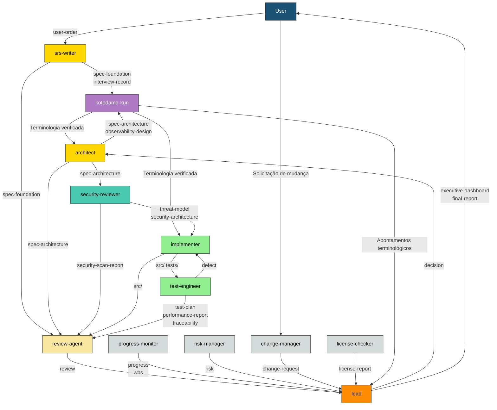

# Lista de agentes

> **Posicionamento deste documento:** lista de todos os agentes registrados no framework full-auto-dev (Single Source of Truth). Atualizar este documento quando um agente for adicionado, alterado ou removido.
> **Derivado de:** [Regras do processo](full-auto-dev-process-rules-ja.md) §2-4, §7, §9 / [Regras de gerenciamento de documentos](full-auto-dev-document-rules-ja.md) §7, §7.1, §11
> **Documentos relacionados:** [Convenção de estrutura de prompts](prompt-structure-ja.md), prompts de cada agente (`.claude/agents/*.md`)

***

- [Lista de agentes](#lista-de-agentes)
    - [1. Lista de agentes](#1-lista-de-agentes)
    - [2. Matriz de ownership de file\_type](#2-matriz-de-ownership-de-file_type)
        - [lead](#lead)
        - [srs-writer](#srs-writer)
        - [architect](#architect)
        - [security-reviewer](#security-reviewer)
        - [implementer](#implementer)
        - [test-engineer](#test-engineer)
        - [review-agent](#review-agent)
        - [progress-monitor](#progress-monitor)
        - [change-manager](#change-manager)
        - [risk-manager](#risk-manager)
        - [license-checker](#license-checker)
        - [kotodama-kun](#kotodama-kun)
    - [3. Fluxo de dados entre agentes](#3-fluxo-de-dados-entre-agentes)
    - [4. Mapa de ativação por fase](#4-mapa-de-ativação-por-fase)
    - [5. Procedimento para adicionar um novo agente](#5-procedimento-para-adicionar-um-novo-agente)

## 1. Lista de agentes

| # | name | Função | model | Fase principal |
| :-: | ------ | -------- | :-----: | ---------------- |
| 1 | lead | Orquestração de todo o projeto, controle das transições de fase e registro das decisões | opus | Todas as fases |
| 2 | srs-writer | Estruturação do conceito do usuário, entrevistas e criação dos capítulos Ch1-2 da especificação | opus | planning |
| 3 | architect | Detalhamento dos capítulos Ch3-6 da especificação e projeto dos requisitos de OpenAPI, observabilidade e dependências externas | opus | design |
| 4 | security-reviewer | Modelagem de ameaças, projeto de segurança e varredura de vulnerabilidades | opus | design, implementation |
| 5 | implementer | Implementação do código-fonte e criação de testes unitários | opus | implementation |
| 6 | test-engineer | Planejamento e execução de testes, medição de cobertura e testes de desempenho | sonnet | testing |
| 7 | review-agent | Revisão de qualidade segundo as perspectivas R1-R6 e decisão dos gates de qualidade | opus | Todas as fases (nos gates) |
| 8 | progress-monitor | Gerenciamento da WBS, acompanhamento do progresso, monitoramento de métricas de qualidade e detecção de anomalias | sonnet | A partir de design |
| 9 | change-manager | Recebimento, análise de impacto e registro das solicitações de mudança iniciadas pelo usuário | sonnet | A partir de planning (após a aprovação da especificação) |
| 10 | risk-manager | Identificação, avaliação e monitoramento de riscos e gerenciamento do registro de riscos | sonnet | A partir de planning |
| 11 | license-checker | Verificação de compatibilidade de licenças OSS e gerenciamento dos avisos de atribuição | haiku | implementation, delivery |
| 12 | kotodama-kun | Verificação da consistência de terminologia e nomenclatura (glossário do framework + glossário do projeto) | haiku | Todas as fases (ao gerar um Out) |

***

## 2. Matriz de ownership de file_type

Derivada das Regras de gerenciamento de documentos §11. **Cada file_type possui exatamente um owner.**

### lead

| file_type | Diretório | Único/Múltiplo | Fase principal |
| ----------- | ----------- | :--------------: | ---------------- |
| pipeline-state | project-management/ | Único | Todas as fases |
| executive-dashboard | Raiz | Único | A partir de setup |
| final-report | Raiz | Único | delivery |
| decision | project-records/decisions/ | Múltiplo | Todas as fases |
| handoff | project-management/handoff/ | Múltiplo | Todas as fases |
| user-manual | docs/ | Único | delivery |
| runbook | docs/operations/ | Único | delivery |
| incident-report | project-records/incidents/ | Múltiplo | operation |
| stakeholder-register | project-management/ | Único | setup |

### srs-writer

| file_type | Diretório | Único/Múltiplo | Fase principal |
| ----------- | ----------- | :--------------: | ---------------- |
| user-order | Raiz | Único | planning (validação) |
| interview-record | project-management/ | Único | planning |
| spec-foundation | docs/spec/ | Único | planning |

### architect

| file_type | Diretório | Único/Múltiplo | Fase principal |
| ----------- | ----------- | :--------------: | ---------------- |
| spec-architecture | docs/spec/ | Único | design |
| observability-design | docs/observability/ | Único | design |
| hw-requirement-spec | docs/hardware/ | Único | design (condicional) |
| ai-requirement-spec | docs/ai/ | Único | design (condicional) |
| framework-requirement-spec | docs/framework/ | Único | design (condicional) |
| disaster-recovery-plan | docs/operations/ | Único | design |

### security-reviewer

| file_type | Diretório | Único/Múltiplo | Fase principal |
| ----------- | ----------- | :--------------: | ---------------- |
| threat-model | docs/security/ | Único | design |
| security-architecture | docs/security/ | Único | design |
| security-scan-report | project-records/security/ | Múltiplo | A partir de implementation |

### implementer

| file_type | Diretório | Único/Múltiplo | Fase principal |
| ----------- | ----------- | :--------------: | ---------------- |
| (código-fonte) | src/ | — | implementation |
| (testes unitários) | tests/ | — | implementation |

> O implementer gera código (`src/`, `tests/`), mas esses arquivos não são gerenciados pelo Common Block. A rastreabilidade é gerenciada por traceability-matrix.

### test-engineer

| file_type | Diretório | Único/Múltiplo | Fase principal |
| ----------- | ----------- | :--------------: | ---------------- |
| test-plan | project-management/ | Único | design |
| defect | project-records/defects/ | Múltiplo | testing |
| traceability | project-records/traceability/ | Único | A partir de implementation |
| performance-report | project-records/performance/ | Múltiplo | testing |

### review-agent

| file_type | Diretório | Único/Múltiplo | Fase principal |
| ----------- | ----------- | :--------------: | ---------------- |
| review | project-records/reviews/ | Múltiplo | Todas as fases (nos gates) |

### progress-monitor

| file_type | Diretório | Único/Múltiplo | Fase principal |
| ----------- | ----------- | :--------------: | ---------------- |
| progress | project-management/progress/ | Múltiplo | A partir de design |
| wbs | project-management/progress/ | Único | A partir de design |

### change-manager

| file_type | Diretório | Único/Múltiplo | Fase principal |
| ----------- | ----------- | :--------------: | ---------------- |
| change-request | project-records/change-requests/ | Múltiplo | A partir de planning (após a aprovação da especificação) |

### risk-manager

| file_type | Diretório | Único/Múltiplo | Fase principal |
| ----------- | ----------- | :--------------: | ---------------- |
| risk | project-records/risks/ | Múltiplo | A partir de planning |

### license-checker

| file_type | Diretório | Único/Múltiplo | Fase principal |
| ----------- | ----------- | :--------------: | ---------------- |
| license-report | project-records/licenses/ | Único | implementation, delivery |

### kotodama-kun

> O kotodama-kun não possui nenhum file_type. Quando os apontamentos da verificação forem de menor gravidade, serão informados verbalmente ao lead; quando forem graves, serão registrados como review em project-records/reviews/ (tomando emprestado o file_type do review-agent).

| Entrada | Fornecido por | Finalidade |
| --------- | --------------- | ------------ |
| (artefato a ser verificado) | Cada agente | Objeto da verificação de terminologia e nomenclatura |
| glossary-ja.md | framework | Comparação com o glossário do framework |
| spec-foundation (Ch1.8 Glossary) | srs-writer | Comparação com o glossário do projeto |
| full-auto-dev-document-rules-ja.md §7 | framework | Definição oficial dos nomes de file_type e namespaces |

***

## 3. Fluxo de dados entre agentes

Mostra as dependências entre os agentes por meio do fluxo dos file_type.

**Fluxo de dados entre agentes:**

O diagrama acima mostra o fluxo de dados entre agentes derivado das regras do processo. Os rótulos das setas são os file_type transferidos. As cores correspondem à progressão das fases: laranja (todas as fases) → dourado (planning/design) → verde (implementation/testing) → cinza (gerenciamento do processo).

***

## 4. Mapa de ativação por fase

Indica quais agentes são ativados em cada fase.

| Fase | Agentes ativados | Gate de qualidade |
| ------ | ------------------ | ------------------- |
| setup | lead | Aprovação do CLAUDE.md |
| planning | lead, srs-writer, kotodama-kun, review-agent | R1 PASS → aprovação da especificação |
| dependency-selection | lead, architect, kotodama-kun, license-checker | Aprovação da seleção pelo usuário |
| design | lead, architect, security-reviewer, kotodama-kun, progress-monitor, risk-manager, review-agent | R2/R4/R5 PASS |
| implementation | lead, implementer, test-engineer(unitário), security-reviewer(SCA), kotodama-kun, license-checker, review-agent, progress-monitor | R2/R3/R4/R5 PASS, SCA aprovada |
| testing | lead, test-engineer, kotodama-kun, review-agent, progress-monitor | R6 PASS, todos os testes PASS |
| delivery | lead, kotodama-kun, review-agent, license-checker | Todos R1-R6 PASS, aceite do usuário |
| operation | lead, security-reviewer(patch), progress-monitor | SLA atingido |

***

## 5. Procedimento para adicionar um novo agente

1. Adicionar o agente ao §1 desta lista
2. Adicionar ao §2 o file_type pelo qual será responsável (confirmar que não há sobreposição com agentes existentes)
3. Atualizar o diagrama de fluxo de dados do §3
4. Atualizar o mapa de ativação do §4
5. Criar `.claude/agents/{name}.md` de acordo com a [Convenção de estrutura de prompts](prompt-structure-ja.md)
6. Atualizar as Regras de gerenciamento de documentos §7 (tabela de file_type), §7.1 (tabela de referência de workflow) e §11 (modelo de ownership)
