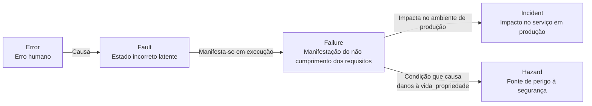
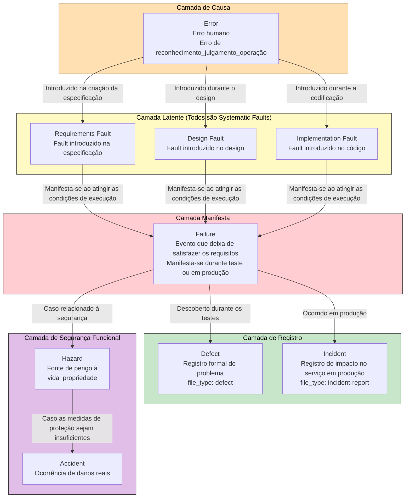
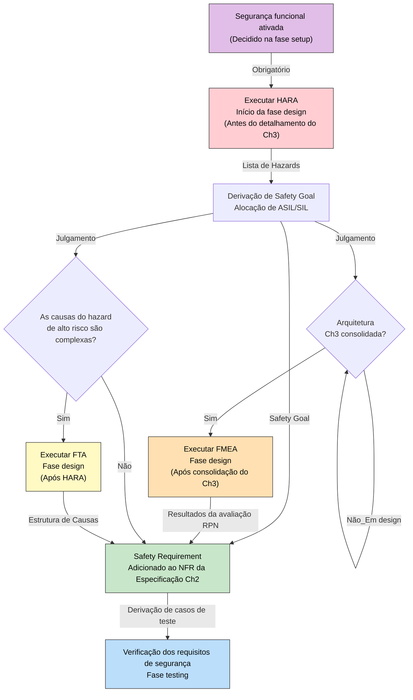
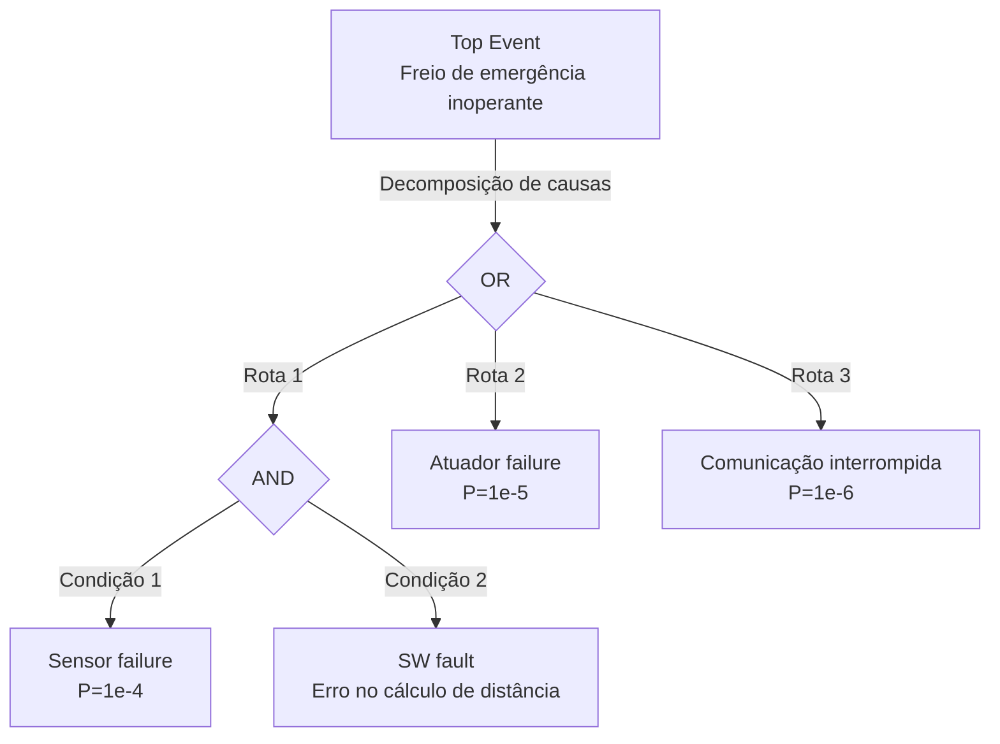

# Taxonomia de Defeitos — Sistematização da Terminologia de Defeitos

## 1. Contexto e Objetivos

No desenvolvimento de software, existem inúmeros termos para representar "defeitos", e seus significados variam dependendo do contexto. 
Este documento faz referência às normas IEEE 1044, IEC 61508, ISO 26262 e ITIL para definir de forma unívoca a terminologia relacionada a defeitos utilizada no framework full-auto-dev.

**Princípio de Design:** Como os equivalentes locais para termos como "falha", "defeito" e "pane" são polissêmicos e ambíguos, este framework **utiliza as palavras em inglês como estão** para eliminar qualquer ambiguidade.

---

## 2. Modelo de Cadeia Causal (IEEE 1044 / IEC 61508)

**Cadeia Causal:**

```mermaid
flowchart LR
    Error["Error<br/>Erro humano"]
    Fault["Fault<br/>Estado incorreto latente"]
    Failure["Failure<br/>Manifestação do não cumprimento dos requisitos"]
    Incident["Incident<br/>Impacto no serviço em produção"]
    Hazard["Hazard<br/>Fonte de perigo à segurança"]

    Error -->|"Causa"| Fault
    Fault -->|"Manifesta-se em execução"| Failure
    Failure -->|"Impacta no ambiente de produção"| Incident
    Failure -->|"Condição que causa<br/>danos à vida_propriedade"| Hazard```txt
# Defect Taxonomy — Sistematização da Terminologia de Defeitos
```

## 1. Contexto e Objetivos

No desenvolvimento de software, existem inúmeros termos para representar "defeito", e seus significados variam dependendo do contexto. Este documento faz referência às normas IEEE 1044, IEC 61508, ISO 26262 e ITIL para definir de forma unívoca a terminologia relacionada a defeitos utilizada no framework full-auto-dev.

**Princípio de Design:** Como os equivalentes locais para termos como "falha", "defeito" e "pane" (em japonês, "障害", "不具合", "故障") são polissêmicos e ambíguos, este framework **utiliza as palavras em inglês como estão** para eliminar qualquer ambiguidade.

---***

## 2. Modelo de Cadeia Causal (IEEE 1044 / IEC 61508)

**Cadeia Causal:**



Um Error gera um Fault, o Fault se manifesta tornando-se um Failure, e quando o Failure afeta o serviço em produção, torna-se um Incident. Quando o Failure possui condições para causar danos à vida ou propriedade, ele é chamado de Hazard (no contexto de segurança funcional).

***

## 3. Definições de Termos

### 3.1 Termos na Cadeia Causal (Conceitos Técnicos)

| Termo | Norma de Referência | Definição | Exemplo Específico |
| --- | --- | --- | --- |
| **Error** | IEEE 1044 | Erro humano de reconhecimento, julgamento ou operação. É a causa do Fault. | Interpretou incorretamente a condição de limite de um array e escreveu um código *off-by-one*. |
| **Fault** | IEEE 1044, IEC 61508 | Estado incorreto incorporado ao código, design ou especificação como resultado de um Error. É latente e não se manifesta até que condições específicas de execução sejam atendidas. | O erro na condição de limite `if (i <= array.length)` (existe no código, mas ainda não foi executado). |
| **Failure** | IEEE 1044, IEC 61508 | Evento no qual um Fault se manifesta em tempo de execução, fazendo com que o sistema deixe de satisfazer os requisitos (funcionais ou não funcionais). | O código *off-by-one* acima foi executado, gerando uma `ArrayIndexOutOfBoundsException`. |

### 3.2 Fault Origin (Classificação por Fase de Introdução)

Os Faults são classificados em três tipos de acordo com a fase em que foram introduzidos. Identificar a origem do fault (fault origin) na *root cause analysis* de um Defect determina o alvo a ser corrigido (especificação, design ou código).

| Termo | Norma de Referência | Definição | Exemplo Específico |
| --- | --- | --- | --- |
| **Requirements Fault** | IEEE 1044 | Fault introduzido nos requisitos/especificação. A própria especificação está incorreta ou insuficiente. | O requisito é "bloquear o login após 3 falhas", mas isso não consta no documento de especificação, ou foi erroneamente escrito como "5 falhas". |
| **Design Fault** | IEEE 1044 | Fault introduzido no design. A especificação está correta, mas o design está incorreto. | A especificação está correta, mas no diagrama de sequência, a verificação de bloqueio foi colocada na camada de UI em vez da camada de DB. |
| **Implementation Fault** | IEEE 1044 | Fault introduzido na implementação (= coding fault). O design está correto, mas o código está incorreto. | O design está correto, mas escreveu-se `failCount > 3` em vez de `failCount >= 3`. |

**Correspondência entre Fault Origin e Alvo de Correção:**

| Fault Origin | Alvo de Correção | Escopo de Impacto |
| --- | --- | --- |
| Requirements Fault | Especificação Ch1-2 (`spec-foundation`) | Repercute no design, implementação e testes. Tem o custo mais alto. |
| Design Fault | Especificação Ch3-4 (`spec-architecture`) | Repercute na implementação e testes. |
| Implementation Fault | Código-fonte (`src/`) | Repercute nos testes. Tem o custo mais baixo. |

### 3.3 Systematic Fault vs Random Hardware Fault (IEC 61508)

A IEC 61508 divide os faults em determinísticos e probabilísticos.

| Termo | Norma de Referência | Definição | Existe no SW? |
| --- | --- | --- | --- |
| **Systematic Fault** | IEC 61508 | Fault determinístico causado por um error humano. Inclui requirements, design e implementation. Reproduz-se invariavelmente sob as mesmas condições. | Sim |
| **Random Hardware Fault** | IEC 61508 | Fault probabilístico causado por degradação física do HW (envelhecimento, radiação, etc.). Manifesta-se apenas de forma probabilística. | Não (Não é um conceito inerente a SW) |

**Todos os faults em SW são systematic faults.** Como o SW não se degrada fisicamente, não existem *random hardware faults*. Em outras palavras, um fault de SW é sempre decorrente de um error humano e será invariavelmente reproduzido com a mesma entrada e estado. Isso significa que "um failure de SW que não pode ser reproduzido é apenas uma falha na especificação adequada das condições".

### 3.4 Termos de Registro e Gerenciamento (Conceitos de Processo)

| Termo | Norma de Referência | Definição | file_type | Fase |
| --- | --- | --- | --- | --- |
| **Defect** | IEEE 1044 | Registro formal de um Failure (ou Fault) descoberto durante testes ou operação. Inclui passos de reprodução, gravidade, causa raiz e detalhes da correção. | `defect` | testing, implementation |
| **Incident** | ITIL, ISO 20000 | Interrupção não planejada do serviço ou evento de degradação da qualidade que ocorreu no ambiente de produção. Registra a sequência: detecção → investigação → mitigação → resolução → análise pós-incidente. | `incident-report` | operation |

### 3.5 Termos Específicos de Segurança Funcional

| Termo | Norma de Referência | Definição | Pré-condições |
| --- | --- | --- | --- |
| **Hazard** | IEC 61508, ISO 26262 | Fonte de perigo onde um Failure pode causar danos à vida humana, corpo, propriedade ou meio ambiente. O Hazard em si ainda não é um acidente (Accident). | Somente se o processo condicional "Segurança Funcional (HARA/FMEA)" estiver ativado |
| **Risk (Segurança)** | IEC 61508 | Probabilidade de ocorrência do Hazard × Exposição × Capacidade de Controle. É um conceito diferente do risco do projeto (file_type: risk). | Idem |
| **ASIL** | ISO 26262 | Automotive Safety Integrity Level. Nível de integridade de segurança (A a D) baseado na avaliação do Risk. Fora do setor automotivo, utiliza-se SIL (IEC 61508). | Idem |
| **HARA** | ISO 26262 | Hazard Analysis and Risk Assessment. Método analítico para identificação de Hazard e avaliação de Risk. | Idem |
| **FMEA** | IEC 60812 | Failure Mode and Effects Analysis. Método para analisar sistematicamente os modos de ocorrência de Fault e seus impactos. | Idem |

---

## 4. Diagrama Detalhado da Cadeia Causal

**Cadeia causal completa desde Error até Accident (com classificação de fault origin):**



A cadeia causal é composta por 5 camadas. Laranja (Causa) → Amarelo (Latente) → Vermelho (Manifesta) → Verde (Registro) → Roxo (Segurança). Todos os faults na camada latente são systematic faults (faults determinísticos causados por errors humanos) e são classificados em três tipos de acordo com a origem: requirements, design e implementation. No desenvolvimento de software normal, lida-se da camada de causa até a camada de registro; a camada de segurança só é adicionada se a segurança funcional estiver ativada.

---

## 5. Distinção de Pares Confusos

### 5.1 Fault vs Defect

| Aspecto | Fault | Defect |
| --- | --- | --- |
| Natureza | Estado técnico (Latente) | Registro administrativo (Documento) |
| Localização | Dentro do código ou design | project-records/defects/ |
| Visibilidade | Invisível até ser descoberto nos testes | Visível assim que é emitido |
| Relação | Quando um Fault é descoberto e registrado... | → Torna-se um Defect |

### 5.2 Failure vs Incident

| Aspecto | Failure | Incident |
| --- | --- | --- |
| Escopo | Evento técnico (Seja em teste ou em produção) | Evento operacional (Apenas no ambiente de produção) |
| Local de Ocorrência | Ambiente de testes, ambiente de desenvolvimento, ambiente de produção | Apenas no ambiente de produção |
| Destino do Registro | Durante testes → Defect, Em produção → Incident | file_type: incident-report |
| Relação | Todo Incident é um Failure, mas... | Um Failure durante os testes não é um Incident |

### 5.3 Defect vs Incident

| Aspecto | Defect | Incident |
| --- | --- | --- |
| Fase | implementation, testing | operation |
| Owner | test-engineer | lead |
| Propósito | Correção do Fault e prevenção de recorrência | Recuperação do serviço e análise pós-incidente |
| file_type | `defect` (DEF-NNN) | `incident-report` (INC-NNN) |
| Relação | Durante a investigação da causa raiz de um Incident, um novo Defect pode ser emitido |  |

### 5.4 Hazard vs Risk (Projeto)

| Aspecto | Hazard | Risk (file_type: risk) |
| --- | --- | --- |
| Norma de Referência | IEC 61508, ISO 26262 | PMBOK, CMMI-RSKM |
| Alvo | Danos à vida humana, propriedade ou meio ambiente | Impacto nas metas do projeto (cronograma, custo, qualidade) |
| Fórmula de Avaliação | Probabilidade de ocorrência × Exposição × Capacidade de Controle | Probabilidade de ocorrência × Grau de impacto (Pontuação 1-9) |
| Condição de Aplicação | Somente quando o processo condicional "Segurança Funcional" está ativado | Todos os projetos (Processo obrigatório) |
| Destino do Registro | project-records/safety/ | project-records/risks/ |

---

## 6. Regras de Uso de Termos no Framework

### 6.1 Regras Básicas

1. **Utilizar as palavras em inglês como estão.** Termos como Error, Fault, Failure, Defect, Incident e Hazard não devem ser traduzidos para equivalentes ambíguos.
2. **Não utilizar termos locais ambíguos (como "falha", "pane", "bug", "problema").** Eliminar palavras polissêmicas e apontar inequivocamente através da palavra em inglês.
3. **O significado é determinado pelo termo, não pelo contexto.** Não é "Tratamento de falhas" mas "Resposta a Incident"; não é "Ticket de bug" mas "Ticket de Defect".

### 6.2 Correspondência com file_type

| Termo | file_type | Formato do ID | Destino do Registro |
| --- | --- | --- | --- |
| Defect | `defect` | DEF-NNN | project-records/defects/ |
| Incident | `incident-report` | INC-NNN | project-records/incidents/ |
| Hazard | (Registrado em project-records/safety/ como resultado da análise HARA/FMEA) | — | project-records/safety/ |

### 6.3 Termos Usados na Análise de Causa Raiz de Defeitos

Ao descrever a causa raiz (Root Cause) no Detail Block de um Defect, estruture utilizando a terminologia da cadeia causal.

```markdown
## Root Cause Analysis

- **Failure**: É retornado um erro 500 durante o login.
- **Fault**: Verificação de nulo (null check) ausente em `auth-service.ts:42`.
- **Fault Origin**: implementation fault (O design continha instruções para o guard de nulo. Omissão durante a codificação).
- **Error**: O desenvolvedor deixou passar o campo nullable na resposta OAuth.
- **Correção**: Adicionar verificação de nulo e retornar 401 caso não autenticado.
- **Prevenção de Recorrência**: Adicionar uma regra de linting que aplica *strict null check* para tipos de resposta OAuth.

```

Descrevendo na ordem: Failure (O que aconteceu) → Fault (O que está errado no código) → Fault Origin (Onde foi introduzido: especificação/design/implementação) → Error (Por que isso aconteceu), como mostrado acima, aumenta a precisão da identificação do alvo a ser corrigido e das medidas de prevenção.

**Julgamento de Correção por Fault Origin:**

| Fault Origin | Artefato a ser Corrigido | Ponto de vista do review-agent |
| --- | --- | --- |
| Requirements Fault | spec-foundation (Ch1-2) → Repercute em todos os artefatos subsequentes | R1 (Qualidade dos requisitos) |
| Design Fault | spec-architecture (Ch3-4) → Repercute na implementação e testes | R2 (Princípios de design) |
| Implementation Fault | src/ (Código-fonte) → Repercute nos testes | R3 (Qualidade de codificação) |

---

## 7. Métodos de Análise de Segurança Funcional (HARA / FMEA / FTA)

Se o processo condicional "Segurança Funcional" estiver ativado, definem-se três métodos de análise a serem utilizados.

### 7.1 Visão Geral e Aplicação dos Métodos

| Método | Norma de Referência | Propósito | Abordagem |
| --- | --- | --- | --- |
| **HARA** | ISO 26262 | Identificar hazards no nível do sistema e derivar os safety goals | Top-down: Função → failure mode → hazard → avaliação de risk → Alocação de ASIL/SIL |
| **FMEA** | IEC 60812 | Analisar exaustivamente os modos de fault e seus impactos no nível do componente | Bottom-up: Cada peça/módulo → failure mode → impacto → RPN (Gravidade × Ocorrência × Detecção) |
| **FTA** | IEC 61025 | Fazer uma busca reversa das causas a partir de um evento indesejável específico (top event) | Top-down: top event → decomposição lógica das causas com portas AND/OR → cálculo de probabilidade do evento básico |

### 7.2 Critérios de Adoção e Momento de Execução

**Fluxo de Execução da Análise de Segurança:**



A análise de segurança inicia-se pelo HARA, sendo o FMEA e o FTA métodos que aprofundam os resultados do HARA. O HARA é obrigatório, enquanto FMEA e FTA são executados condicionalmente.

**Critérios de Adoção:**

| Método | Critérios de Adoção | Momento de Decisão | Responsável |
| --- | --- | --- | --- |
| **HARA** | **Obrigatório para todos os projetos** onde a segurança funcional está ativada | Fase setup (Consolidado no momento da ativação da segurança funcional) | architect (com apoio do security-reviewer) |
| **FMEA** | Executado quando o HARA estiver ativo **E** a arquitetura (Ch3) estiver consolidada. O SW-FMEA perde o sentido se a divisão de módulos não for definida | Fase design (Após consolidação do Ch3) | architect |
| **FTA** | Quando aplicável a qualquer um dos seguintes: (a) Análise das causas de um hazard de **ASIL C ou superior** (ou SIL 3 ou superior) identificado no HARA, (b) Necessidade de visualização de padrões onde **vários faults independentes combinam-se com condições AND** levando a um hazard, (c) Quando a complexidade causal de uma **análise de causa raiz de um incident severo** na fase operation não puder ser suprida apenas pelo RCA de um defect | Fase design (Após HARA) ou Fase operation (Na ocorrência de um incident) | architect (design), lead (operation) |

### 7.3 Detalhes do HARA

**Propósito:** Identificar todos os hazards que o sistema pode causar e alocar um safety goal para cada hazard.

**Entradas:** spec-foundation (Ch1-2: Requisitos Funcionais e Não Funcionais), interview-record (Conhecimento do domínio)

**Saídas:** Lista de Hazards, Lista de Safety Goals, Alocação de ASIL/SIL, Safety Requirement (adicionado ao NFR em spec-foundation Ch2)

**Passos:**

1. Listar as funções do sistema (a partir da lista de FRs em spec-foundation Ch2)
2. Identificar os failure modes de cada função ("O que acontece se esta função apresentar mal funcionamento/parada/comportamento não intencional?")
3. Identificar o hazard provocado por cada failure mode ("Qual é o impacto sobre vidas humanas, propriedade ou meio ambiente?")
4. Avaliar o risk de cada hazard (Probabilidade de ocorrência × Exposição × Capacidade de controle)
5. Alocar o nível de integridade de segurança (ISO 26262: ASIL A a D, IEC 61508: SIL 1 a 4)
6. Derivar o safety goal para cada hazard
7. Derivar safety requirements a partir dos safety goals e adicioná-los aos NFRs em spec-foundation Ch2

**Destino do Registro:** `project-records/safety/hara-{YYYYMMDD}.md`

### 7.4 Detalhes do FMEA

**Propósito:** Analisar exaustivamente os modos de fault e seus impactos para cada componente da arquitetura e descobrir os pontos fracos no design.

**Entradas:** spec-architecture (Ch3: Design de componentes), Resultados do HARA (safety goals)

**Saídas:** Tabela de FMEA (Componente × failure mode × impacto × Gravidade × Ocorrência × Detecção × RPN), Recomendações de melhoria de design

**Passos:**

1. Listar todos os componentes/módulos da arquitetura
2. Identificar os failure modes para cada componente
3. Avaliar o impacto (local/sistema global/segurança) de cada failure mode
4. Calcular o RPN (Risk Priority Number) = Gravidade (S) × Ocorrência (O) × Detecção (D)
5. Propor medidas de melhoria no design para os que ultrapassarem os limites aceitáveis do RPN
6. Refletir as medidas de melhoria no documento spec-architecture

**Referência para Limites de RPN:**

| Faixa do RPN | Nível de Risco | Ação |
| --- | --- | --- |
| 1-50 | Low | Manter como está. Apenas registrar |
| 51-100 | Medium | Considerar melhorias. Abordar na próxima iteração de design |
| 101-200 | High | Melhoria obrigatória. Abordar durante a fase de design atual |
| 201+ | Critical | Abordagem imediata. Considerar um re-design da arquitetura |

**Destino do Registro:** `project-records/safety/fmea-{YYYYMMDD}.md`

### 7.5 Detalhes do FTA

**Propósito:** A partir de um evento indesejável específico (top event), buscar reversamente por suas causas através de uma estrutura lógica AND/OR, identificando as causas raiz e a probabilidade de ocorrência.

**Entradas:** Resultados do HARA (hazards de alto risco) ou incident-report (incidents graves)

**Saídas:** Diagrama de Fault Tree (Mermaid), Lista e probabilidades dos eventos básicos, Análise do conjunto de corte (Cut set)

**Passos:**

1. Definir o Top event (Ex: "O freio de emergência não foi ativado")
2. Decompor as causas diretas do Top event usando portas AND/OR
3. Decompor iterativamente as causas até chegar aos eventos básicos (causas que não podem ser decompostas ainda mais)
4. Estimar a probabilidade de ocorrência para cada evento básico
5. Identificar o conjunto de corte mínimo (a menor combinação de eventos básicos que causará o top event)
6. Refletir os resultados em melhorias de design ou medidas para prevenir a recorrência do incident

**Exemplo de Diagrama de Fault Tree (Mermaid):**



O Top event é estruturado com portas OR (ocorre em qualquer uma das rotas) e portas AND (ocorre se todas as condições forem simultaneamente verdadeiras). As rotas de portas AND podem reduzir a probabilidade de ocorrência por meio de redundância no design.

**Destino do Registro:** `project-records/safety/fta-{top-event}-{YYYYMMDD}.md`

### 7.6 Termos Específicos de Segurança Funcional

| Termo | Definição | Cenário de Uso |
| --- | --- | --- |
| **Safety Goal** | Requisito de segurança de nível mais alto referente ao Hazard. Uma violação resulta em um Accident | Saída do HARA |
| **Safety Requirement** | Exigência concreta para alcançar o Safety Goal. Adicionado aos NFRs da Especificação Ch2 | Especificações / Design |
| **Safe State** | Um estado do sistema no qual os Hazards não existem ou encontram-se em um nível de Risk tolerável | Design / Teste |
| **FTTI** | Fault Tolerant Time Interval. Tempo permitido desde a ocorrência do Fault até que se atinja o Hazard | Design |
| **RPN** | Risk Priority Number (Gravidade × Ocorrência × Detecção). O FMEA quantifica as prioridades de risco dos faults | FMEA |
| **Cut Set** | Conjunto de corte. A combinação de eventos básicos que causam o top event na Fault Tree. O menor cut set é o foco do design de segurança | FTA |
| **ASIL** | Automotive Safety Integrity Level (ISO 26262). De A (mais baixo) a D (mais alto) em 4 níveis | HARA |
| **SIL** | Safety Integrity Level (IEC 61508). De 1 (mais baixo) a 4 (mais alto) em 4 níveis. Utilizado fora da indústria automotiva | HARA |

---

## 8. Reflexo no Glossário ([glossary-ja.md](https://www.google.com/search?q=glossary-ja.md))

O conteúdo deste capítulo já foi refletido no arquivo [glossary-ja.md](https://www.google.com/search?q=glossary-ja.md).

* §1 inclui agora: error, fault, failure, defect (atualizado), incident, hazard e fault origin.
* §4 inclui agora os comparativos: fault vs defect, failure vs incident, defect vs incident, e hazard vs risk.

---

## 9. Propagação para Todos os Documentos do Framework

A substituição necessária de traduções antigas/variadas → pelas palavras em inglês, afeta os seguintes arquivos:

| Expressão Anterior | Substituição | Arquivos Afetados |
| --- | --- | --- |
| 障害票 | Ticket de defect | process-rules, document-rules, CLAUDE.md |
| 障害カーブ | Curva de defect (defect curve) | process-rules, document-rules, full-auto-dev.md |
| 障害修正 | Correção de defect | CLAUDE.md |
| 障害対応手順 | Procedimento de resposta a incident | document-rules (runbook) |
| 障害オープン数 | Número de defects abertos | process-rules |
| 障害の重大度 | defect severity | document-rules |
| 障害ステータス | defect status | document-rules |
| 障害報告 | Relato de defect | document-rules |
| 障害検出 | Detecção de defect | process-rules |
| インシデント記録 | incident report | document-rules, README |
| インシデント管理 | incident management | full-auto-dev.md |

```

```