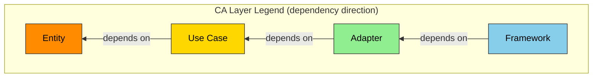

# ANMS v0.33 — Template de Especificação Mínima Nativo para IA

## Princípios de Design da Especificação: STFB (Stable Top, Flexible Bottom) — Topo Rígido, Base Flexível

Estrutura de capítulos inspirada no Princípio das Dependências Estáveis (Stable Dependencies Principle) de Robert C. Martin. Os capítulos superiores são rígidos (estáveis e com baixa frequência de mudanças), enquanto os capítulos inferiores são flexíveis (específicos e com alta frequência de mudanças). Quando um capítulo superior muda, os capítulos inferiores precisam ser revisados, mas mudanças nos capítulos inferiores não afetam os capítulos superiores.


```txt
Capítulo 1 Fundação	    ← Rígido: Mais estável / Mais abstrato
Capítulo 2 Requisitos
Capítulo 3 Arquitetura
Capítulo 4 Especificação    ← Flexível: Mais variável / Mais específico
```

Este template foi projetado como o primeiro estágio (ANMS) do sistema de especificação de três níveis (ANMS / ANPS / ANGS). Para escalas que cabem em uma única janela de contexto, ele é usado como um arquivo único. Caso não caiba, o arquivo é dividido por capítulos como ANPS (AI-Native Plural Spec):

- **spec-foundation** (Ch1-2: Foundation・Requirements) — Proprietário: srs-writer
- **spec-architecture** (Ch3-6: Architecture・Specification・Test Strategy・Design Principles) — Proprietário: architect

No ANPS, um Common Block + Form Block é adicionado a cada arquivo (seguindo as regras de gerenciamento de documentos). A estrutura STFB é mantida mesmo se os arquivos forem divididos.

**3 Responsabilidades Lideradas por Humanos:**

Mesmo no desenvolvimento totalmente automatizado, os 3 itens a seguir são liderados por humanos (consulte as Regras de Processo §1.1):

1. **Apresentação do Conceito** (Entrada do Ch1 Foundation) — O que se deseja criar, por que é necessário
2. **Decisões Importantes** (Julgamento do Ch3 Architecture Decisions) — Escolha de tecnologias, diretrizes de arquitetura
3. **Testes de Aceitação** (Avaliação de Result do Ch4 Specification) — Se o produto final atende aos requisitos de negócios

---

## Estrutura de Capítulos (Chapter Structure)

| #   | Inglês (English)                 | Português           | Notação Principal                   | Estabilidade             |
| --- | -------------------------------- | ------------------- | ----------------------------------- | ------------------------ |
| 1   | **Foundation**                   | Fundamentos         | Linguagem Natural + Tabelas         | Mais estável             |
| 2   | **Requirements**                 | Requisitos          | EARS + Fórmulas + Tabelas + Diagramas | Estável                  |
| 3   | **Architecture**                 | Arquitetura         | Mermaid + Tabelas                   | Razoavelmente estável    |
| 4   | **Specification**                | Especificação       | Gherkin + Tabelas + Blocos de Código| Muda frequentemente      |
| 5   | **Test Strategy**                | Estratégia de Teste | Tabelas                             | Muda frequentemente      |
| 6   | **Design Principles Compliance** | Conformidade com Princípios de Design | Tabelas                             | Variável (Atualizado na revisão) |
| A   | **Appendix**                     | Apêndice            | Formato Livre                       | —                        |

---

## Estrutura das Seções (Section Structure)

### Chapter 1. Foundation (Fundamentos)

A "Estrela Guia" do projeto. Premissa para todos os capítulos subsequentes. A camada mais estável e menos propensa a mudanças.

| Seção   | Inglês (English) | Português | Detalhes da Descrição                                      |
| ------- | ----------- | -------- | ---------------------------------------------------------- |
| 1.1     | Background  | Contexto | Por que este SW é necessário. O estado atual do domínio.   |
| 1.2     | Issues      | Problemas| Problemas concretos da situação atual.                     |
| 1.3     | Goals       | Objetivos| Definição de sucesso. O estado a ser alcançado.            |
| 1.4     | Approach    | Abordagem| Stack tecnológico, diretrizes de arquitetura.              |
| 1.5     | Scope       | Escopo   | O que será feito neste projeto (In-scope) e o que não será feito (Out-of-scope). |
| 1.6     | Constraints | Restrições| Regras absolutas que o projeto não pode quebrar (tecnológicas, legais, éticas, patentes, etc.). |
| 1.7     | Limitations | Limitações| Pontos de concessão conhecidos e aceitáveis que não satisfazem totalmente os requisitos. |
| 1.8     | Glossary    | Glossário| Definição de termos específicos do projeto. Alinha a interpretação do vocabulário entre a IA e os humanos. |
| 1.9     | Notation    | Regras de Notação | Compatível com RFC 2119/8174. Ex. de palavras-chave principais: SHALL/MUST=Obrigatório, SHOULD=Recomendado, MAY=Opcional. O `shall` do EARS é sinônimo de SHALL. |

### Chapter 2. Requirements (Requisitos)

Requisitos que o sistema deve satisfazer. Descritos no formato mais adequado para os requisitos, como sintaxe EARS, fórmulas matemáticas, tabelas, diagramas, etc.

| Seção   | Inglês (English)            | Português          | Detalhes da Descrição              |
| ------- | --------------------------- | ------------------ | ---------------------------------- |
| 2.1     | Functional Requirements     | Requisitos Funcionais | Requisitos das funções fornecidas pelo sistema. |
| 2.2     | Non-Functional Requirements | Requisitos Não-Funcionais | Requisitos de desempenho, segurança, disponibilidade, etc. |

Padrões de Sintaxe EARS:

| Padrão            | Sintaxe                                                                       | Caso de Uso                  |
| ----------------- | ----------------------------------------------------------------------------- | ---------------------------- |
| Ubiquitous        | O [Sistema] deve [Resposta].                                                  | Requisitos sempre válidos    |
| Event-driven      | **Quando** [Gatilho], o [Sistema] deve [Resposta].                            | Requisitos baseados em eventos|
| State-driven      | **Enquanto** [No Estado], o [Sistema] deve [Resposta].                        | Requisitos dependentes de estado|
| Unwanted Behavior | **Se** [Gatilho], então o [Sistema] deve [Resposta].                          | Fluxos de exceção/anomalias  |
| Optional Feature  | **Onde** [Funcionalidade estiver incluída], o [Sistema] deve [Resposta].      | Funcionalidades opcionais/condicionais |
| Complex           | **Quando** [Gatilho], **enquanto** [No Estado], o [Sistema] deve [Resposta].  | Requisitos com condições compostas |

※ O "deve" (shall) na sintaxe EARS é sinônimo de SHALL definido no Chapter 1.9 Notation.

### Chapter 3. Architecture (Arquitetura)

Estrutura do SW e decisões de design. Define a estrutura técnica para realizar os requisitos do Chapter 2.

| Seção   | Inglês (English)     | Português            | Detalhes da Descrição                                                                                    |
| ------- | -------------------- | -------------------- | -------------------------------------------------------------------------------------------------------- |
| 3.1     | Architecture Concept | Conceito de Arquitetura | Tipo de arquitetura adotada (CA, Hexagonal, Layered, etc.) e definição de legendas.                      |
| 3.2     | Components           | Componentes          | Divisão de partes e responsabilidades. Diagrama de componentes (colorido conforme legenda 3.1). Caso haja integração com IA/LLM, definir também a localização dos templates de prompt (ex: `src/prompts/`), esquemas de entrada/saída, estratégia de testes e medidas contra alucinações. |
| 3.3     | File Structure       | Estrutura de Arquivos | Estrutura de diretórios. Correspondência entre componentes e pastas.                                     |
| 3.4     | Domain Model         | Modelo de Domínio    | Definição de estrutura, relacionamentos e estados. Diagrama de classes (colorido conforme 3.1), diagrama ER, diagrama de transição de estados. |
| 3.5     | Behavior             | Comportamento        | Fluxo de processamento e interações. Diagrama de sequência, diagrama de atividades.                      |
| 3.6     | Decisions            | Decisões de Design   | ADR (Architecture Decision Records). Motivos da decisão, alternativas, tomador da decisão. O formato ADR de Michael Nygard (Status / Context / Decision / Consequences) é recomendado para os registros. |

A coloração baseada nas camadas de arquitetura é obrigatória nos diagramas de componentes e de classes. O padrão utiliza as 4 camadas da Clean Architecture (legenda abaixo). Se for adotada outra arquitetura, a legenda correspondente a essa arquitetura deve ser definida na seção 3.1.

**Legenda Padrão: Camadas da Clean Architecture (Comum para Diagramas de Componentes e de Classes):**



| Camada CA | Papel | Cor | Hex |
| --- | --- | --- | --- |
| Entity | Dados de domínio・Lógica core | Laranja | `#FF8C00` |
| Use Case | Coordenação da lógica de negócios | Ouro | `#FFD700` |
| Adapter | Adaptação de IF externas | Verde | `#90EE90` |
| Framework | UI・Dispositivos・Serviços externos | Azul | `#87CEEB` |

### Chapter 4. Specification (Especificação)

A camada concreta e que muda frequentemente. Definições em um nível que a IA pode converter diretamente em código.

A seção 4.1 possui Scenarios (Gherkin) fixados, e a partir da 4.2 os itens são selecionados ou descartados de acordo com a natureza do projeto.

#### 4.1 Scenarios (Cenários)

Critérios de aceitação para UAT (User Acceptance Testing) no formato Gherkin. Materializa os requisitos do Chapter 2 em cenários testáveis. O resultado do teste é registrado logo abaixo de cada cenário. Para garantir a rastreabilidade, o ID do requisito correspondente à linha Scenario de cada cenário é anexado no formato `(traces: FR-xxx)`.

Definição dos status de Result (exclua os não aplicáveis ao usar):

| Status | Significado |
| --- | --- |
| PASS | Atende aos critérios de aceitação |
| CONDITIONAL | Basicamente OK, mas com condições. Melhorias anotadas em Remark |
| FAIL | Não atende aos critérios de aceitação. Correção obrigatória |
| SKIP | Não testado / Não aplicável. Motivo anotado em Remark |

Template Gherkin:

```
```gherkin
Feature: [Nome da Funcionalidade]

  Background:
    Given [Pré-condição comum a todos os cenários]

  Rule: [Nome da Regra de Negócios]

    Scenario: SC-001 [Nome do Cenário] (traces: FR-xxx)
      Given [Pré-condição]
      And [Pré-condição adicional]
      When [Ação/Evento]
      Then [Resultado Esperado]
      And [Resultado Esperado adicional]
      But [O que não deve acontecer]
```

**Result:** PASS  CONDITIONAL  FAIL  SKIP
**Remark:**

---

```gherkin
Scenario: SC-002 [Nome do Cenário] (traces: FR-xxx)
  Given [Pré-condição]
  When [Ação/Evento]
  Then [Resultado Esperado]
```

**Result:** PASS  CONDITIONAL  FAIL  SKIP
**Remark:**

```

#### Candidatos a Seções a partir de 4.2

Selecione ou descarte conforme o projeto:

| Candidato a Seção | Inglês (English) | Português | Cenário de Aplicação |
| --- | --- | --- | --- |
| 4.x | UI Elements Map | Mapa de Elementos de UI | Apps com Interface de Usuário (UI) |
| 4.x | Configuration | Definição de Configurações | Apps com objetos de configuração |
| 4.x | API Definition | Definição de API | Apps que fornecem/consomem APIs |
| 4.x | Data Schema | Esquema de Dados | Apps que utilizam Banco de Dados (DB) |
| 4.x | State Management | Gerenciamento de Estado | Apps com transições de estado complexas |
| 4.x | Algorithm | Algoritmo | Lógica de cálculo matemático, criptografia, etc. |
| 4.x | Error Handling | Tratamento de Erros | Apps que exigem definição de sistema de erros |

### Chapter 5. Test Strategy (Estratégia de Teste)

Diretrizes por nível de teste. Os detalhes dos casos de teste individuais são delegados à IA, e aqui define-se "o que testar em qual nível".

Matriz de testes (Exemplo de template. Adicione ou remova linhas conforme o projeto):

| Nível de Teste | Alvo | Diretriz | Ferramenta/Framework | Critério de Aceitação |
| --- | --- | --- | --- | --- |
| Teste Unitário | Toda a lógica de negócios | IA gera automaticamente. Meta de cobertura: [X]% | [Ex: Vitest] | Taxa de aprovação [X]% ou superior |
| Teste de Integração | [Listar pontos de integração] | [Diretriz] | [Ex: Vitest] | Taxa de aprovação 100% |
| Teste de Desempenho | [API/Processamento alvo] | Baseado nas metas numéricas do NFR no Chapter 2 | [Ex: k6] | [Valor Alvo] |
| Teste E2E | [Fluxo principal do usuário] | Corresponde aos cenários Gherkin do Chapter 4.1 | [Ex: Playwright] | Todos os cenários PASS |

### Chapter 6. Design Principles Compliance (Conformidade com Princípios de Design de SW)

Verifica se a arquitetura e a implementação estão em conformidade com os princípios de design de SW. Esta é uma camada de garantia de qualidade, com um nível meta diferente da "Definição, Design e Validação" dos Capítulos 1 a 5.

Você pode adicionar ou remover os princípios a serem verificados de acordo com a natureza do projeto.

| Categoria | Identificador | Nome Oficial | Ponto de Verificação |
| --- | --- | --- | --- |
| Nomenclatura | Naming | — | A nomenclatura transmite a intenção? Está alinhada com o vocabulário de domínio (Chapter 1.8)? |
| Dependência | Dependency Direction | — | A direção da dependência segue as camadas de arquitetura da Seção 3.1? |
| Dependência | SDP | Stable Dependencies Principle | A dependência aponta para um módulo mais estável (com menor frequência de mudanças) do que ele mesmo? |
| Simplicidade | KISS | Keep It Simple, Stupid | Está escolhendo a solução funcional mais simples? |
| Simplicidade | YAGNI | You Aren't Gonna Need It | Está construindo recursos que não são necessários agora? Há over-engineering? |
| Simplicidade | DRY | Don't Repeat Yourself | Há duplicação no código, lógica ou definições? |
| Separação | SoC | Separation of Concerns | Os interesses estão devidamente separados? |
| Separação | SRP | Single Responsibility Principle | Cada classe/módulo possui uma única responsabilidade? |
| Separação | SLAP | Single Level of Abstraction Principle | O nível de abstração dentro de uma função está unificado? |
| SOLID | OCP | Open-Closed Principle | Está aberto para extensão e fechado para modificação? |
| SOLID | LSP | Liskov Substitution Principle | Funciona corretamente mesmo se a classe pai for substituída pela classe filha? |
| SOLID | ISP | Interface Segregation Principle | As interfaces estão devidamente segmentadas? |
| SOLID | DIP | Dependency Inversion Principle | Depende de abstrações em vez de implementações concretas? |
| Acoplamento | LoD | Law of Demeter | Está acessando profundamente a estrutura interna de um objeto? (Usar apenas colaboradores diretos) |
| Acoplamento | CQS | Command-Query Separation | Os comandos e as consultas estão separados? |
| Legibilidade | POLA | Principle of Least Astonishment | O comportamento ocorre conforme o esperado pelo leitor? |
| Legibilidade | PIE | Program Intently and Expressively | O código transmite claramente sua intenção? |
| Teste | Testability | — | É fácil realizar testes unitários? O design facilita a injeção de Mocks/Stubs? |
| Pureza | Pure/Impure | — | Funções puras e funções com efeitos colaterais estão separadas e organizadas? |
| Transição de Estado | State Transition | — | A obtenção das condições de transição de estado e a execução da transição estão separadas? |
| Concorrência | Concurrency Safety | — | Ocorrem deadlocks, race conditions ou glitches? |
| Erro | Error Propagation | — | Os erros não são silenciados e são propagados e tratados adequadamente? |
| Recursos | Resource Lifecycle | — | A aquisição e a liberação de recursos (conexões, arquivos, memória) estão emparelhadas? |
| Imutabilidade | Immutability | — | Valores que não precisam ser alterados são imutáveis (immutable)? |
| Eficiência | Resource Efficiency | — | Carga de CPU, uso de memória, desgaste de armazenamento, etc., estão dentro de limites aceitáveis? |

### Appendix (Apêndice)

| Seção | Inglês (English) | Português | Detalhes da Descrição |
| --- | --- | --- | --- |
| A.1 | References | Referências | Links para normas e materiais externos |
| A.2 | Licenses | Licenças | Informações de licença das bibliotecas dependentes |
| A.3 | Changelog | Histórico de Alterações | Histórico de versões deste documento |
| A.x | (Outros) | (Outros) | Materiais suplementares específicos do projeto |

---

> As seções "Design Rationale" e "References" abaixo são os fundamentos de design e as referências deste próprio template. Você pode excluí-las ao criar o documento de especificação do projeto.

## Design Rationale (Fundamentos de Design desta Configuração)

| Decisão | Fundamento |
| --- | --- |
| STFB / Topo Rígido, Base Flexível (Aplicação do SDP) | A ordem dos capítulos segue o Stable Dependencies Principle. Superior = Estável/Abstrato, Inferior = Variável/Concreto. |
| Integração SRS/SWS → Documento Único | Para colocar todas as informações na janela de contexto da IA. Referências fragmentadas tendem a induzir alucinações na IA. |
| EARS 5 padrões + Complex | When/While/If/Where + Ubiquitous + Padrão composto. Cobre todos os padrões. |
| Híbrido EARS + Fórmulas Matemáticas | Apenas EARS não consegue expressar especificações matemáticas. Uso adequado conforme o domínio. |
| Coloração de camadas obrigatória no Mermaid | Mermaid tem fraco controle de layout. Sem coloração, os limites das responsabilidades são visualmente indistinguíveis. |
| CA como legenda padrão substituível | Se adotar outra arquitetura além da CA (Hexagonal, Layered, etc.), define-se uma legenda exclusiva na seção 3.1. |
| Cores padrão baseadas no grsmd_gen2_spec | Entity (Laranja #FF8C00), UseCase (Ouro #FFD700), Adapter (Verde #90EE90), Framework (Azul #87CEEB). |
| Architecture Concept criado em 3.1 | O ponto de partida da coloração é a escolha do conceito de arquitetura. Estrutura a ordem: Escolha → Design → Visualização de Cores. |
| File Structure isolada em Ch3.3 | Alteração na estrutura de pastas = Alteração de arquitetura. Seção importante que explicita a correspondência entre componentes e pastas. |
| ADR colocado dentro do Capítulo de Architecture | O design e sua justificativa podem ser lidos juntos. Empurrá-los para o Appendix quebra a referência. |
| Gherkin fixado no Ch4.1 | Gherkin são os critérios de aceitação do UAT = Materialização das especificações. Mais instável que EARS → Colocado em capítulos inferiores devido ao SDP. |
| Todos os pronomes Gherkin cobertos | Feature, Background, Rule, Scenario, Given/And/When/Then/And/But. O template apresenta todas as sintaxes. |
| Result/Remark logo abaixo do cenário | Cenário e resultado são adjacentes. Mais fácil para a IA preencher e para humanos revisarem. |
| Rastreabilidade de ID de requisito no cenário | O ID do requisito é vinculado no formato `(traces: FR-xxx)`, garantindo a rastreabilidade. |
| Result 4 opções PASS/CONDITIONAL/FAIL/SKIP | Explicita aprovações com condições. Operação mediante exclusão do que não se aplica. Delimitado por espaço para evitar conflitos de delimitadores. |
| Capítulo Specification com seções candidatas | Para ser aplicável ao desenvolvimento de qualquer SW. Seleciona-se e descarta-se de acordo com o campo. |
| Test Strategy isolado no Ch5 | Os detalhes dos casos de teste são delegados à IA. Aqui define-se apenas a diretriz e a matriz. |
| Design Principles Compliance isolado no Ch6 | Uma camada de garantia de qualidade com um nível meta diferente da "Definição, Design e Validação" do Ch1 ao 5. |
| Princípios Ch6 cobertos por categorias | Naming → Dependência → Simplicidade → Separação → SOLID → Acoplamento → Legibilidade. Nomenclatura e direção da dependência têm prioridade máxima. Adicionada coluna de nomes oficiais para complementar a intenção de princípios que não são claros apenas pela abreviação. |
| Inclusão do SDP no Ch6 | É o princípio fundamental do STFB, devendo-se verificar a estabilidade das dependências também no nível de código. Possui uma perspectiva diferente do Dependency Direction (Direção vs Estabilidade). |
| Adição de Limitations | Explicita o "ponto de concessão" que existe entre o Scope (o que não será feito) e Constraints (o que não pode ser quebrado). |
| Adição de Glossary | Sincronização de vocabulário com a IA. Eficácia comprovada no grsmd_gen2_spec. |
| Notation colocado no Ch1.9 | As regras de notação aplicáveis a todo o documento pertencem à camada Foundation. Compatível com RFC 2119/8174. Relacionamento com o 'shall' do EARS fica explícito. |

***

## Referencias

1. Martin, R.C. "[The Clean Architecture](https://blog.cleancoder.com/uncle-bob/2012/08/13/the-clean-architecture.html)" — Stable Dependencies Principle (SDP), Stable Abstractions Principle (SAP)
2. Mavin, A., et al. "[EARS: Easy Approach to Requirements Syntax](https://ieeexplore.ieee.org/document/5328509)" — IEEE, 2009
3. Cucumber. "[Gherkin Reference](https://cucumber.io/docs/gherkin/reference/)"
4. Starke, G. "[arc42 Architecture Template](https://arc42.org/)"
5. ISO/IEC/IEEE. "[29148:2018 — Requirements Engineering](https://www.iso.org/standard/72089.html)"
6. Bradner, S. "[RFC 2119 — Key words for use in RFCs to Indicate Requirement Levels](https://datatracker.ietf.org/doc/html/rfc2119)" — IETF, 1997
7. Leiba, B. "[RFC 8174 — Ambiguity of Uppercase vs Lowercase in RFC 2119 Key Words](https://datatracker.ietf.org/doc/html/rfc8174)" — IETF, 2017
8. Nygard, M. "[Documenting Architecture Decisions](https://cognitect.com/blog/2011/11/15/documenting-architecture-decisions)" — ADR format reference

```
