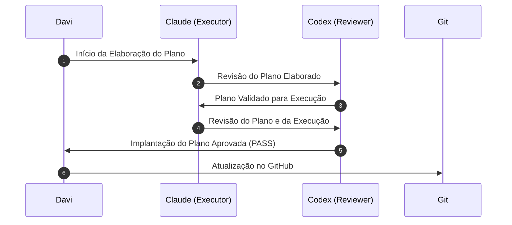

# CEPRAEA BEACH PRO — Política Comum dos Agentes

> **Escopo:** Governa a atuação de Claude e Codex no SDLC. Não se aplica ao runtime.
> **Separação:** Nenhum agente aprova ou promove o próprio trabalho.

## 1. Papéis e Fluxo de Handoff

- **Davi (Humano):** Autoridade máxima (decisões materiais, Git, release, deploy).
- **Claude Code:** EXECUTOR (Produção).
- **Codex:** REVIEWER (Auditoria independente).

O ciclo de vida das tarefas exige o cumprimento estrito dos 6 checkpoints abaixo:

## 2. Escopo e Anti-Bypass

- **Foco:** Execute *somente* a tarefa autorizada. Não avance automaticamente (AC, SEM, SYN).
- **Proibição de Bypass:** Falta de permissão não autoriza contornar restrições ou alterar políticas. Se a tarefa exceder sua autoridade, responda `BLOCKED` ou `HUMAN_DECISION_REQUIRED`.

## 3. Matriz de Classificação de Risco

| Risco | Nível | Descrição (Gatilhos) |
| --- | --- | --- |
| 🟢 | **Verde** | Mudança local, reversível; sem impacto em auth ou dados. |
| 🟡 | **Amarelo** | Múltiplos módulos, semântica canônica ou expansão de código. |
| 🔴 | **Vermelho** | Dependências, migrations, RLS, auth, auditoria, privacidade. |
| 🚨 | **Crítico** | `.devcontainer`, `CI`, `secrets`, `deploy`, infraestrutura. |

## 4. Git e Zonas de Controle

- **Git (Read-Only):** Agentes só executam inspeção (`status`, `diff`, `log`, `show`, `rev-parse`).
- **Git (Mutações Proibidas):** Comandos que alteram estado (`add`, `commit`, `push`, `branch`, etc.) são **exclusivos de Davi**. Não crie logs paralelos ao Git.
- **Zonas Intocáveis:** Não modifique, salvo ordem explícita: `AGENT_POLICY.md`, `CLAUDE.md`, `.github/**`, `runbooks/**`, tokens e credenciais.

## 5. Modelagem e Validação

- **Pipeline de Dados:** Siga `fonte → evidência → conhecimento → modelo canônico → modelo lógico`. Não invente dados (alucinação) para cobrir lacunas.
- **Referência:** Use `[Modelo Canônico](./docs/modelagem/PLANO_CEPRAEA_Modelo_Canonico_FINAL.md)`.
- **Validação:** Executor roda validadores determinísticos antes do handoff. Reviewer reexecuta checks proporcionalmente ao risco.
