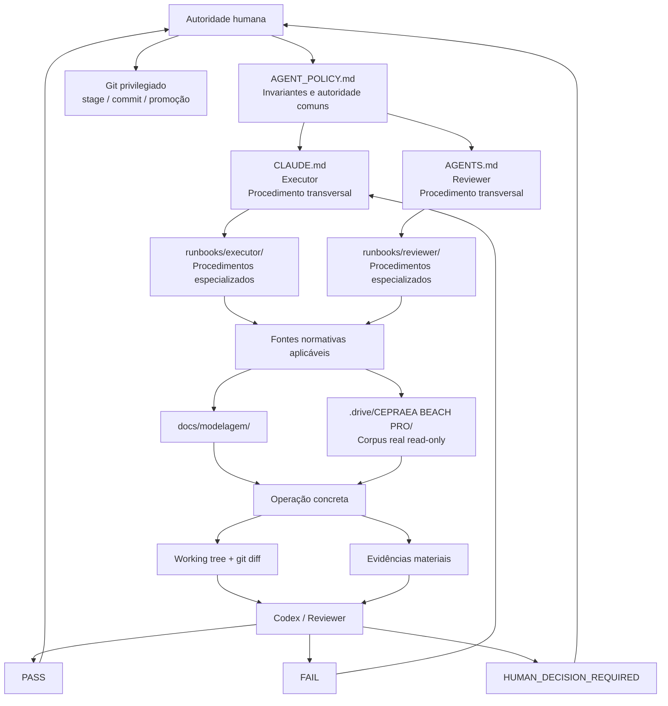
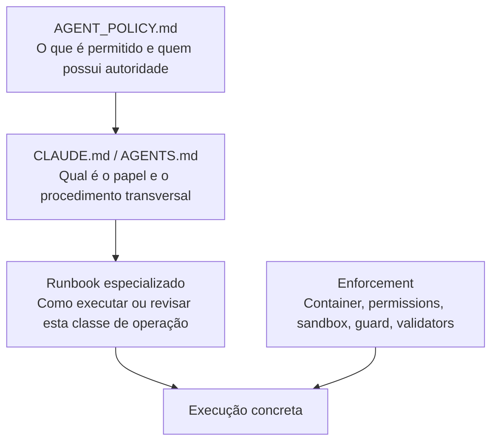
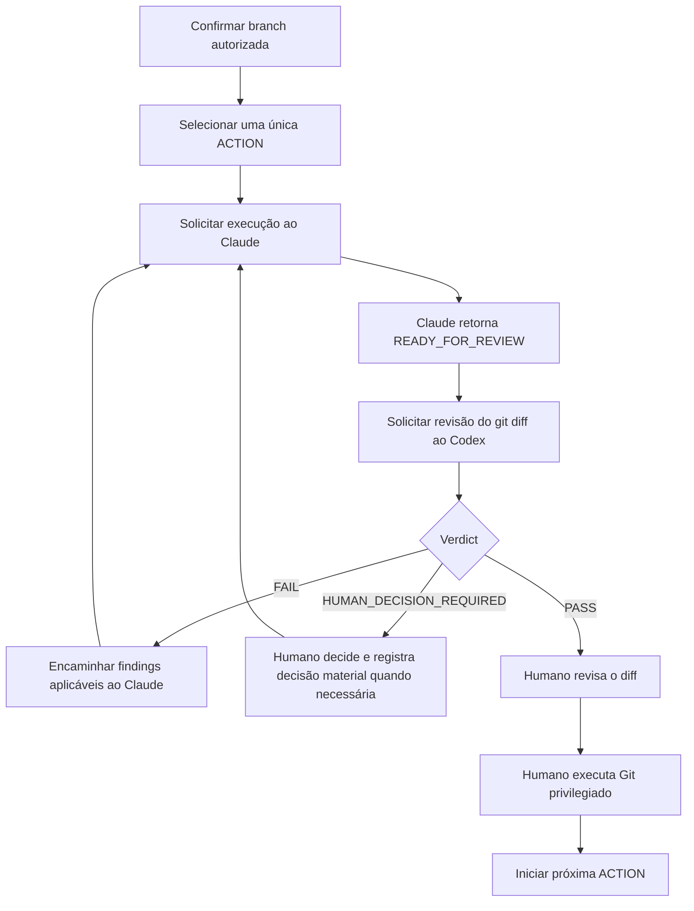
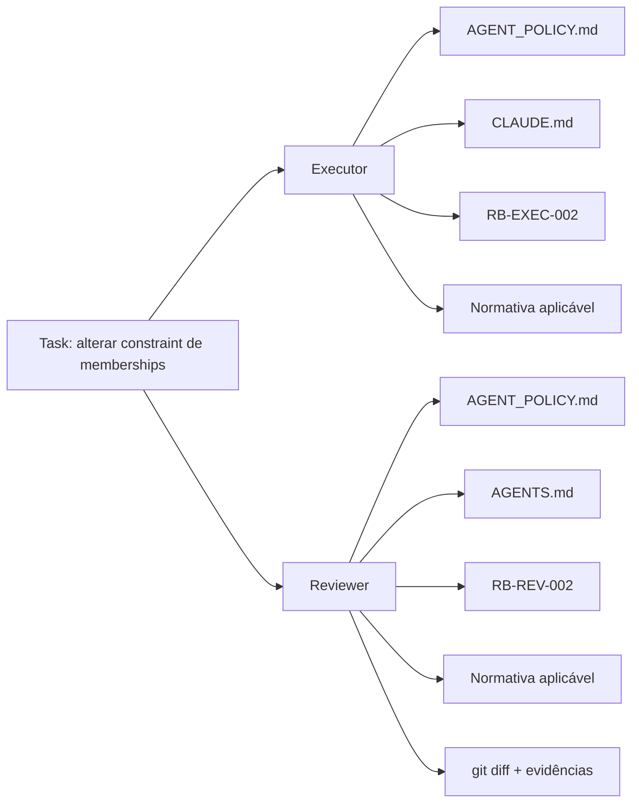
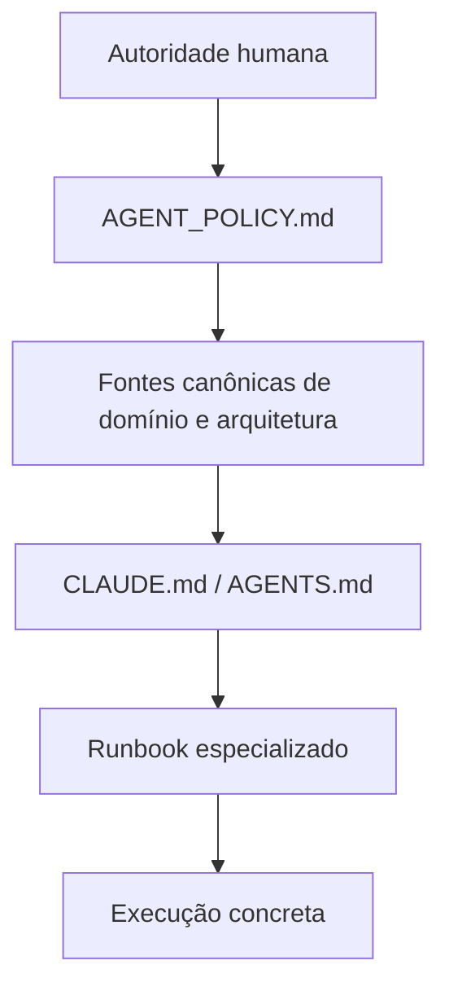
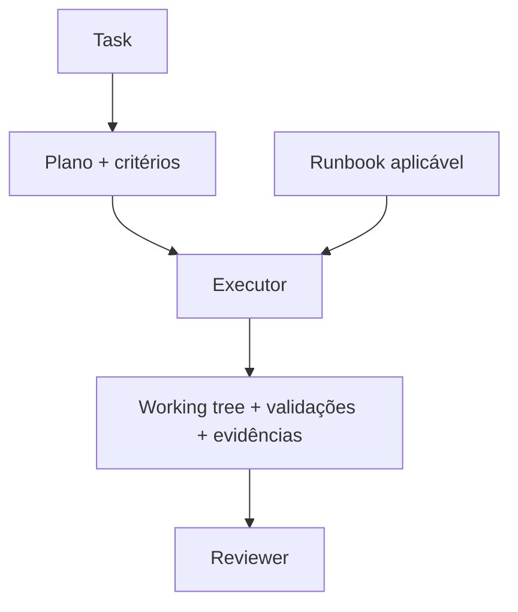
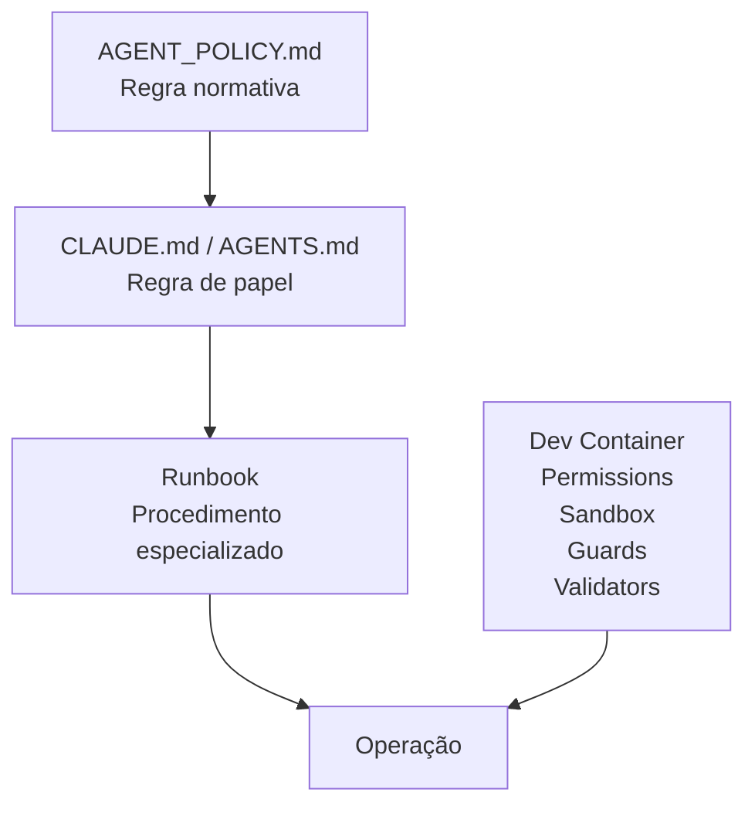
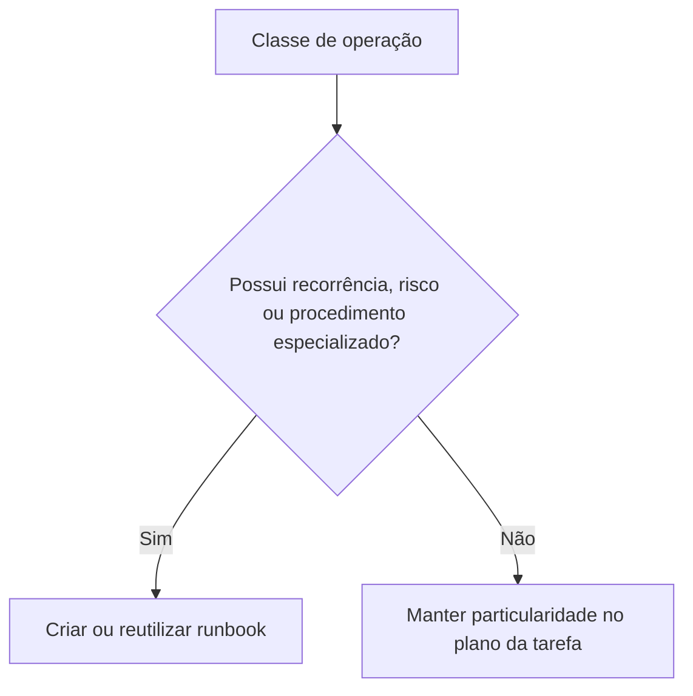
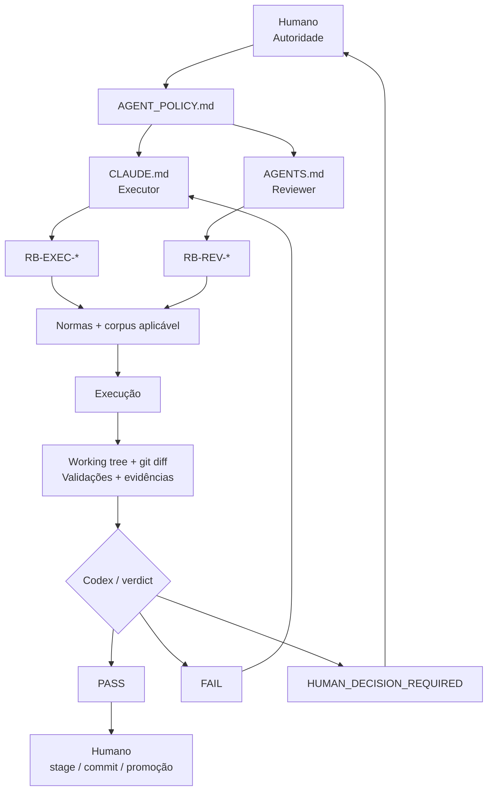

# Arquitetura de runbooks do CEPRAEA BEACH PRO

## Objetivo

Este documento define a arquitetura de runbooks adotada para o fluxo **Human-Governed Dual-Agent SDLC** do CEPRAEA BEACH PRO.

A arquitetura adota a **proposta B**:

- manter um runbook humano para condução do fluxo;
- manter uma biblioteca especializada de runbooks;
- separar procedimentos especializados do Executor e do Reviewer;
- compartilhar procedimentos somente quando forem efetivamente comuns aos dois papéis;
- manter Git como state machine operacional;
- manter `CLAUDE.md` e `AGENTS.md` como adaptadores permanentes dos respectivos papéis;
- utilizar runbooks para procedimentos específicos de uma classe de operação.

A biblioteca de runbooks DEVE aumentar repetibilidade, previsibilidade e verificabilidade sem criar uma state machine paralela ao Git.

## Estado da decisão

A adoção da proposta B está **DECIDIDA**.

A implantação permanece **PENDENTE DE EVIDÊNCIA** até que:

- os arquivos sejam materializados no repositório;
- as referências entre os arquivos sejam integradas;
- Claude Code e Codex carreguem os runbooks aplicáveis;
- o fluxo real seja executado;
- as validações pertinentes produzam evidência verificável.

A existência de uma decisão arquitetural DEVE ser tratada separadamente da evidência de implantação.

## Princípios

A arquitetura DEVE preservar os seguintes princípios:

- autoridade humana sobre domínio, decisões materiais, Git privilegiado, promoção e release;
- separação entre produção, revisão e aprovação;
- Claude Code como Executor;
- Codex como Reviewer independente;
- deterministic first;
- least privilege por papel;
- Git como state machine e handoff operacional;
- persistência proporcional de evidências materiais;
- runbooks reutilizáveis por classe de operação;
- ausência de uma infraestrutura paralela de workflow.

## Visão arquitetural



O fluxo acima representa a relação de responsabilidades. Os mecanismos de enforcement permanecem externos aos runbooks e materializam tecnicamente as restrições aplicáveis.

## Estrutura do repositório

A biblioteca DEVE utilizar uma estrutura semelhante à seguinte:

```text
cepraea-beach-pro/
│
├── AGENT_POLICY.md
│
├── CLAUDE.md
│
├── AGENTS.md
│
├── runbooks/
│   ├── README.md
│   │
│   ├── shared/
│   │   ├── RB-SHARED-001-repository-baseline.md
│   │   ├── RB-SHARED-002-evidence.md
│   │   └── RB-SHARED-003-failure-states.md
│   │
│   ├── executor/
│   │   ├── RB-EXEC-001-code-change.md
│   │   ├── RB-EXEC-002-database-change.md
│   │   ├── RB-EXEC-003-documentation-change.md
│   │   └── RB-EXEC-004-dependency-change.md
│   │
│   └── reviewer/
│       ├── RB-REV-001-code-review.md
│       ├── RB-REV-002-database-review.md
│       ├── RB-REV-003-documentation-review.md
│       └── RB-REV-004-evidence-review.md
│
├── docs/
│   ├── operacao/
│   │   └── agent-workflow.md
│   │
│   └── modelagem/
│       └── PLANO_CEPRAEA_Modelo_Canonico_FINAL.md
│
├── .codex/
│   └── config.toml
│
├── .devcontainer/
│   ├── devcontainer.json
│   ├── Dockerfile
│   ├── security/
│   │   ├── claude-managed-settings.json
│   │   └── claude-guard
│   └── scripts/
│       └── verify-agent-environment.sh
│
└── .drive/
    └── CEPRAEA BEACH PRO/
```

## Responsabilidades das camadas

| Artefato                          | Responsabilidade                                                             |
| --------------------------------- | ---------------------------------------------------------------------------- |
| `AGENT_POLICY.md`                 | Definir invariantes comuns, autoridade e separação de funções                |
| `CLAUDE.md`                       | Definir papel e procedimento transversal permanente do Executor              |
| `AGENTS.md`                       | Definir papel e procedimento transversal permanente do Reviewer              |
| `runbooks/shared/`                | Definir procedimentos realmente comuns às classes de operação                |
| `runbooks/executor/`              | Especializar a execução por classe de mudança                                |
| `runbooks/reviewer/`              | Especializar a revisão independente por classe de mudança                    |
| `docs/operacao/agent-workflow.md` | Orientar o operador humano durante o ciclo completo                          |
| `docs/modelagem/`                 | Fornecer normativa aplicável à modelagem                                     |
| `.drive/CEPRAEA BEACH PRO/`       | Fornecer corpus operacional real em modo read-only                           |
| `.codex/`                         | Aplicar limites técnicos específicos do Reviewer                             |
| `.devcontainer/`                  | Aplicar a fronteira operacional e controles comuns                           |
| Git                               | Representar estado operacional, diff de handoff, histórico e promoção humana |

## Relação entre política, papel, runbook e enforcement



Cada camada possui uma responsabilidade diferente.

O `AGENT_POLICY.md` DEVE permanecer relativamente estável.

`CLAUDE.md` e `AGENTS.md` DEVEM definir os procedimentos transversais que se aplicam continuamente aos respectivos papéis.

Os runbooks DEVEM acrescentar exclusivamente o comportamento especializado da classe de operação correspondente.

O enforcement DEVE materializar tecnicamente propriedades que possam ser verificadas ou restringidas pelo ambiente.

## `AGENT_POLICY.md`

`AGENT_POLICY.md` DEVE permanecer como constituição comum do fluxo.

Ele define, entre outros aspectos:

- autoridade humana;
- separação de funções;
- autoridade sobre Git;
- proteção de fontes operacionais;
- proteção do control plane;
- deterministic first;
- tratamento de ausência de permissão;
- política de evidência;
- escalonamento.

Os runbooks DEVEM operar dentro da autoridade estabelecida por essa política.

## `CLAUDE.md`

`CLAUDE.md` DEVE permanecer como adaptador permanente do Executor.

Seu procedimento transversal inclui:

1. identificar a tarefa solicitada;
2. carregar os documentos normativos necessários;
3. verificar a branch;
4. inspecionar `git status`;
5. identificar as validações exigidas;
6. produzir exclusivamente as alterações pertencentes à tarefa corrente;
7. executar os validadores determinísticos aplicáveis;
8. executar `git diff --check`;
9. inspecionar `git diff`;
10. inspecionar `git status`;
11. fornecer handoff factual;
12. finalizar com `READY_FOR_REVIEW` ou `BLOCKED`.

Os runbooks do Executor DEVEM acrescentar somente procedimentos específicos da operação.

## `AGENTS.md`

`AGENTS.md` DEVE permanecer como adaptador permanente do Reviewer.

Seu procedimento transversal inclui:

1. identificar a tarefa sob revisão;
2. inspecionar `git status`;
3. inspecionar o `git diff` completo;
4. consultar os artefatos relacionados;
5. identificar os critérios de aceite aplicáveis;
6. executar verificações independentes proporcionais ao risco;
7. procurar regressões;
8. tentar refutar conclusões materiais;
9. verificar evidências e rastreabilidade;
10. verificar se as inferências são compatíveis com as evidências;
11. verificar a preservação das fontes protegidas;
12. verificar a preservação da autoridade humana;
13. emitir `PASS`, `FAIL` ou `HUMAN_DECISION_REQUIRED`.

Os runbooks do Reviewer DEVEM acrescentar somente verificações específicas da classe de alteração.

## Runbooks compartilhados

### `RB-SHARED-001-repository-baseline.md`

Este runbook DEVERIA conter verificações de baseline reutilizáveis somente quando a operação especializada depender delas.

Pode incluir:

- identificação do repositório;
- identificação do `HEAD`;
- identificação da branch;
- inspeção do estado inicial;
- identificação da área afetada;
- identificação das fontes normativas necessárias.

O carregamento DEVE ocorrer somente nas tarefas em que essas informações sejam necessárias.

### `RB-SHARED-002-evidence.md`

Este runbook DEVE definir critérios compartilhados para evidências materiais.

Pode incluir:

- `git diff`;
- `git diff --check`;
- lista dos arquivos modificados;
- exit codes relevantes;
- resultados de validadores;
- relatórios produzidos pela tarefa;
- evidência específica exigida pelos critérios de aceite.

A persistência DEVE ser proporcional ao valor probatório da evidência.

Git DEVE permanecer como mecanismo primário de estado, handoff e histórico.

### `RB-SHARED-003-failure-states.md`

Este runbook DEVE padronizar a interpretação dos estados utilizados pelos runbooks especializados.

Para o Executor, utilize exclusivamente:

```text
READY_FOR_REVIEW
BLOCKED
```

Para o Reviewer, utilize exclusivamente:

```text
PASS
FAIL
HUMAN_DECISION_REQUIRED
```

Cada runbook especializado DEVE utilizar somente estados compatíveis com o papel correspondente.

## Runbooks do Executor

### `RB-EXEC-001-code-change.md`

Aplicabilidade:

- implementação;
- correção;
- refatoração autorizada;
- alteração de comportamento de código.

O procedimento especializado DEVERIA:

1. identificar os componentes afetados;
2. identificar contratos públicos relacionados;
3. localizar os testes existentes;
4. implementar exclusivamente a alteração requerida;
5. atualizar os testes necessários;
6. executar os validadores aplicáveis;
7. verificar regressões diretamente relacionadas à mudança.

### `RB-EXEC-002-database-change.md`

Aplicabilidade:

- schema;
- migration;
- constraint;
- índice;
- persistência.

O procedimento especializado DEVE, quando aplicável:

1. identificar a definição autoritativa;
2. identificar o estado atual das migrations;
3. identificar migrations previamente aplicadas;
4. verificar dados incompatíveis com a alteração;
5. produzir exclusivamente uma nova migration quando a evolução do schema exigir nova migration;
6. implementar a alteração autorizada;
7. executar a validação da migration;
8. executar testes de integridade;
9. produzir as evidências materiais exigidas.

### `RB-EXEC-003-documentation-change.md`

Aplicabilidade:

- criação de documentação Markdown;
- alteração de documentação Markdown.

O procedimento DEVE:

1. localizar o guia canônico de documentação;
2. identificar as fontes técnicas aplicáveis;
3. preservar as decisões existentes;
4. restringir a alteração estritamente ao escopo documental autorizado;
5. aplicar as regras de autoria;
6. verificar links e referências afetados;
7. executar as validações documentais disponíveis;
8. revisar o diff documental.

### `RB-EXEC-004-dependency-change.md`

Aplicabilidade:

- inclusão de dependência;
- remoção de dependência;
- atualização de versão;
- alteração de lockfile.

O procedimento especializado DEVE:

1. identificar a necessidade da dependência;
2. identificar os manifests afetados;
3. identificar os requisitos de compatibilidade;
4. restringir a alteração exclusivamente aos artefatos relacionados;
5. atualizar lockfiles pela ferramenta canônica;
6. executar build, typecheck e testes aplicáveis;
7. registrar impactos materiais quando existirem.

## Runbooks do Reviewer

### `RB-REV-001-code-review.md`

Aplicabilidade:

revisão de alterações normais de código.

O Reviewer DEVE:

1. comparar o diff com o objetivo da tarefa;
2. verificar o comportamento observável;
3. procurar regressões;
4. verificar os testes afetados;
5. executar verificações independentes proporcionais ao risco;
6. verificar alterações inesperadas;
7. emitir o verdict correspondente.

### `RB-REV-002-database-review.md`

Aplicabilidade:

revisão de alterações de schema, migration ou integridade persistente.

O Reviewer DEVE:

1. identificar a norma aplicável;
2. inspecionar a migration;
3. verificar a semântica da alteração;
4. verificar a preservação das migrations históricas aplicáveis;
5. executar teste adversarial quando apropriado;
6. executar teste positivo quando apropriado;
7. verificar a integridade resultante;
8. confrontar as evidências do Executor com fatos observáveis;
9. emitir o verdict correspondente.

### `RB-REV-003-documentation-review.md`

Aplicabilidade:

revisão de documentação.

O Reviewer DEVE:

1. identificar as fontes técnicas aplicáveis;
2. verificar a preservação do significado;
3. verificar aderência ao guia de autoria;
4. identificar afirmações cuja evidência seja insuficiente;
5. verificar links e referências afetados;
6. verificar exemplos e comandos;
7. avaliar separadamente a forma e a correção técnica;
8. emitir o verdict correspondente.

### `RB-REV-004-evidence-review.md`

Aplicabilidade:

operações em que a suficiência da evidência seja material para a aceitação.

O Reviewer DEVE:

1. identificar as alegações materiais;
2. identificar a evidência correspondente;
3. comparar cada alegação com o estado observável;
4. reproduzir verificações críticas quando proporcional;
5. classificar insuficiência material de evidência;
6. emitir o verdict correspondente.

## Runbook humano

O arquivo `docs/operacao/agent-workflow.md` DEVE permanecer como runbook do operador humano.

Seu fluxo DEVE permanecer curto e operacional.



Git DEVE permanecer como state machine operacional desse fluxo.

## Seleção de runbooks

Uma tarefa DEVE carregar exclusivamente os runbooks aplicáveis à sua classe de operação.

O número de agentes não determina o número de runbooks.

A classe da operação determina quais procedimentos especializados são necessários.

### Exemplo de seleção

Para uma tarefa que altere uma constraint de `memberships`:

**Executor:**

- `AGENT_POLICY.md`;
- `CLAUDE.md`;
- `runbooks/executor/RB-EXEC-002-database-change.md`;
- runbook compartilhado aplicável, quando necessário;
- normativa pertinente de `docs/modelagem/`;
- fontes necessárias de `.drive/CEPRAEA BEACH PRO/`.

**Reviewer:**

- `AGENT_POLICY.md`;
- `AGENTS.md`;
- `runbooks/reviewer/RB-REV-002-database-review.md`;
- runbook compartilhado aplicável, quando necessário;
- normativa pertinente de `docs/modelagem/`;
- `git diff`;
- evidências materiais aplicáveis.



## Precedência

Os runbooks DEVEM respeitar a autoridade das camadas superiores.



Uma instrução de runbook possui validade somente dentro da autoridade concedida pelas fontes superiores.

Quando uma contradição material impedir execução inequívoca:

- o Executor DEVE finalizar com `BLOCKED`;
- o Reviewer DEVE emitir `HUMAN_DECISION_REQUIRED`.

## Relação com o plano da tarefa

O plano da tarefa e o runbook possuem responsabilidades diferentes.

O plano define:

- objetivo específico;
- escopo específico;
- entregáveis;
- sequência particular da tarefa;
- critérios de aceitação.

O runbook define:

- procedimento da classe de operação;
- verificações operacionais aplicáveis;
- evidências relevantes;
- estados de saída.



O runbook DEVE preservar o escopo e os critérios estabelecidos pela tarefa.

## Relação com o enforcement

Runbook e enforcement possuem responsabilidades diferentes.



Os runbooks especificam o procedimento esperado.

Os mecanismos técnicos DEVEM aplicar as restrições e verificações que possam ser materializadas deterministicamente.

## Relação com Git

Git DEVE permanecer como:

- estado operacional;
- mecanismo de handoff;
- representação concreta da alteração;
- histórico persistente;
- identidade final das mudanças por commit.


A biblioteca de runbooks DEVE operar sobre esse modelo.

Um execution record separado PODE existir quando uma operação específica possuir necessidade probatória própria.

A arquitetura DEVE utilizar Git como única state machine operacional e manter registros adicionais somente quando tiverem valor material próprio.

## Relação com o `CONTAINER_RUNBOOK`

O `CONTAINER_RUNBOOK` fornecido é um exemplo de uma classe diferente de runbook.

Ele demonstra como um procedimento de infraestrutura pode reunir:

- baseline;
- estado comprovado;
- decisões;
- testes;
- evidências;
- rollback;
- histórico de mudanças.

Seu conteúdo DEVE ser utilizado exclusivamente como referência estrutural e conceitual neste contexto.

A determinação do estado real da arquitetura DEVE utilizar os documentos reais da Human-Governed Dual-Agent SDLC Architecture e evidências específicas de implantação.

## Estrutura mínima de um runbook especializado

Cada runbook especializado DEVERIA possuir uma estrutura compatível com seu objetivo.

### Objetivo

Defina a classe de operação governada.

### Aplicabilidade

Defina condições objetivas de seleção do runbook.

### Entradas

Liste exclusivamente as entradas necessárias.

### Fontes de autoridade

Identifique as fontes que governam a operação.

### Pré-condições

Defina o estado necessário para iniciar o procedimento.

### Escopo operacional

Defina positivamente os caminhos, recursos e ações autorizados.

**Correto:**

Restrinja todas as alterações exclusivamente aos caminhos e artefatos autorizados pela tarefa corrente.

### Procedimento

Utilize lista numerada quando a ordem das ações for obrigatória.

### Pontos de decisão

Defina condições observáveis para cada desvio de fluxo.

### Validações

Liste os checks determinísticos aplicáveis.

### Evidências

Defina somente as evidências necessárias para demonstrar propriedades materiais.

### Handoff

Defina a saída destinada ao próximo papel.

### Estados de saída

Utilize exclusivamente os estados pertencentes ao papel correspondente.

### Referências

Utilize caminhos relativos para arquivos do repositório quando adequado.

## Critério para criação de novos runbooks

Um novo runbook DEVERIA ser criado quando uma classe de operação possuir uma ou mais destas características:

- recorrência;
- risco material;
- procedimento especializado;
- decisões condicionais recorrentes;
- validações específicas;
- requisitos próprios de evidência;
- necessidade observável de consistência entre execuções.

Uma variação específica de uma única tarefa DEVERIA permanecer no plano dessa tarefa.



A biblioteca DEVE favorecer a relação:

```text
um runbook
→ várias tarefas da mesma classe
```

em vez de:

```text
uma tarefa
→ um runbook exclusivo
```

## Resultado arquitetural

Com a proposta B, a arquitetura consolidada mantém o fluxo Human-Governed Dual-Agent SDLC e acrescenta uma camada procedural especializada.



A biblioteca de runbooks deve acrescentar especialização procedural sem duplicar as responsabilidades permanentes de `CLAUDE.md` e `AGENTS.md`, sem redefinir as fontes normativas e sem substituir o enforcement determinístico.

Git permanece como state machine operacional, o Executor permanece responsável pela produção, o Reviewer permanece responsável pela assurance independente e a autoridade final permanece humana.
