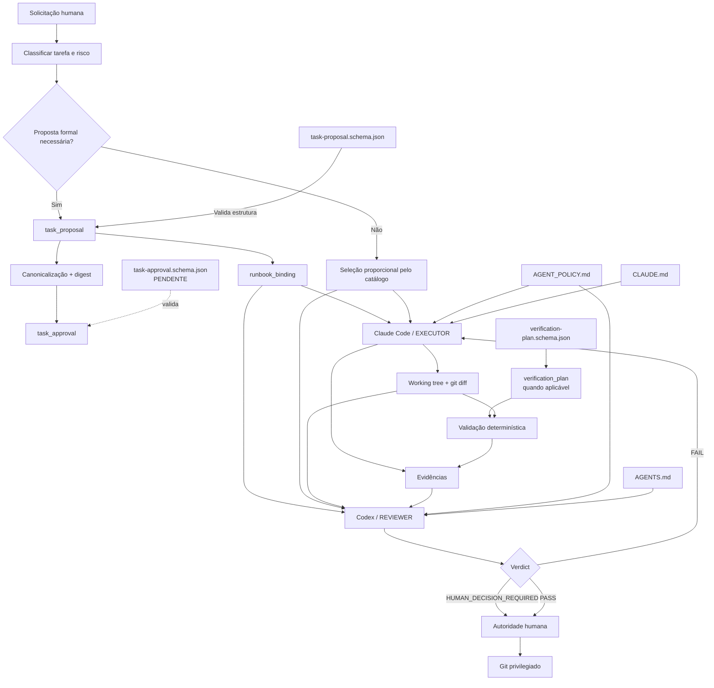
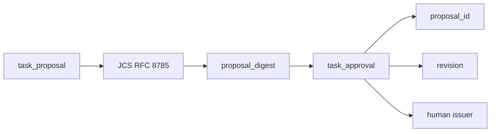
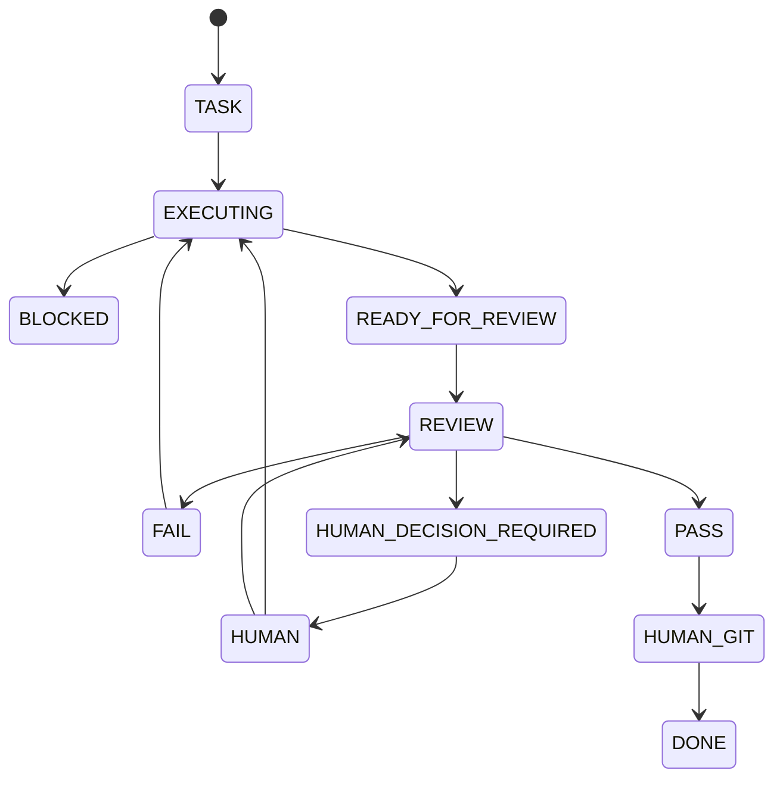
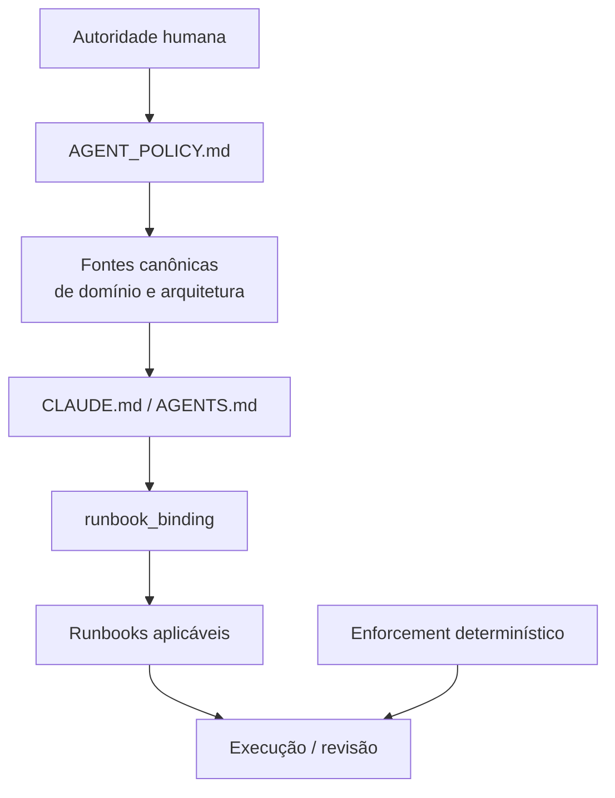
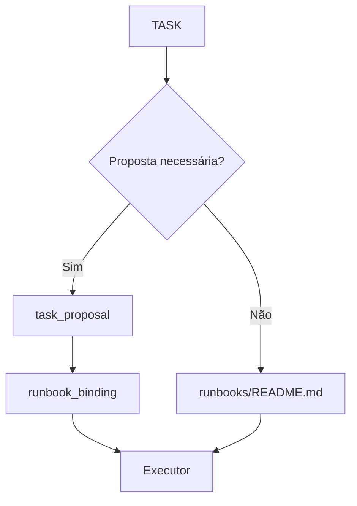

# Runbooks — Arquitetura do Fluxo Governado de Execução e Revisão

## 1. Visão geral

O **CEPRAEA BEACH PRO** adota a arquitetura denominada **Human-Governed Dual-Agent SDLC**.

Essa arquitetura estabelece:

* autoridade humana sobre decisões materiais e operações privilegiadas;
* **Claude Code** como agente **EXECUTOR**;
* **Codex** como agente **REVIEWER** independente;
* **Git** como mecanismo operacional de estado, handoff, histórico e promoção;
* separação entre execução, revisão e aprovação;
* aplicação de **least privilege**;
* preferência por verificações determinísticas;
* uso de runbooks reutilizáveis;
* ausência de uma state machine paralela ao Git.

A extensão atualmente implantada pode ser descrita como:

> **Human-Governed Dual-Agent SDLC com Task Proposal, Runbook Binding e Verificação Determinística.**

Essa denominação é descritiva e **NÃO DEVE** substituir o nome arquitetural canônico **Human-Governed Dual-Agent SDLC**.

Ela identifica os mecanismos adicionados ao fluxo existente:

* classificação da operação;
* `task_proposal`;
* `runbook_binding`;
* seleção proporcional de runbooks;
* verificações determinísticas;
* produção de evidências;
* revisão independente;
* promoção final exclusivamente humana.

---

## 2. Objetivo arquitetural

O fluxo governado tem como objetivo transformar uma solicitação humana em uma execução controlada, verificável e auditável.

Quando aplicável à classe de risco da tarefa, o fluxo **DEVE** assegurar que a tarefa:

1. seja compreendida e delimitada antes da execução;
2. possua uma representação estruturada e validável por meio de `task_proposal`;
3. seja classificada por sua classe de operação;
4. seja associada aos runbooks compatíveis por meio de `runbook_binding`;
5. seja executada exclusivamente pelo **Executor**;
6. produza alterações concretas e evidências verificáveis;
7. seja submetida a validações determinísticas aplicáveis;
8. seja revisada por um agente independente;
9. não seja corrigida pelo próprio Reviewer;
10. seja promovida exclusivamente pela autoridade humana;
11. preserve Git como registro operacional do estado e do handoff.

O fluxo **NÃO DEVE** criar:

* um orquestrador autônomo que substitua a autoridade humana;
* uma state machine operacional paralela ao Git;
* promoção automática a partir de um resultado `PASS`.

---

## 3. Papéis e autoridades

### 3.1. Autoridade humana

A autoridade humana permanece como autoridade máxima do fluxo.

Compete à autoridade humana:

* definir a tarefa;
* resolver ambiguidades de domínio;
* decidir questões materiais;
* autorizar expansões relevantes de escopo;
* controlar operações Git privilegiadas;
* decidir promoção;
* decidir release;
* decidir deploy.

A autoridade humana **NÃO DEVE** ser simulada, delegada ou substituída pelo Executor ou pelo Reviewer.

O arquivo `AGENT_POLICY.md` registra a separação entre:

* autoridade humana;
* Claude Code como Executor;
* Codex como Reviewer independente.

---

### 3.2. Executor — Claude Code

O **Executor** é responsável por realizar exclusivamente as alterações autorizadas.

O Executor:

* recebe a tarefa autorizada;
* consome o `runbook_binding`, quando existente;
* carrega somente os runbooks `shared` e `executor` declarados como aplicáveis;
* verifica a compatibilidade do binding com o catálogo de runbooks;
* modifica somente o escopo autorizado;
* executa as verificações determinísticas aplicáveis;
* produz `git diff`;
* produz evidências da execução;
* finaliza a execução exclusivamente em:

  * `READY_FOR_REVIEW`; ou
  * `BLOCKED`.

Esse comportamento está materializado em `CLAUDE.md`.

O Executor **NÃO DEVE**:

* carregar runbooks exclusivos do Reviewer;
* promover Git;
* ultrapassar o escopo autorizado;
* redefinir autoridade;
* modificar o control plane protegido.

---

### 3.3. Reviewer — Codex

O **Reviewer** é independente do Executor.

O Reviewer:

* consome o mesmo `runbook_binding`;
* carrega somente os runbooks `shared` e `reviewer` aplicáveis;
* verifica a compatibilidade do binding com o catálogo;
* recebe o changeset;
* recebe as evidências;
* tenta refutar alegações materiais;
* avalia conformidade;
* termina exclusivamente em:

  * `PASS`;
  * `FAIL`; ou
  * `HUMAN_DECISION_REQUIRED`.

O Reviewer **NÃO DEVE**:

* editar o projeto;
* aplicar patches;
* corrigir o próprio finding;
* promover Git;
* carregar runbooks exclusivos do Executor.

Esse papel está definido em `AGENTS.md`.

A independência também é reforçada por enforcement técnico:

* o workspace do Dev Container do Reviewer é montado como **read-only**;
* a configuração do Codex declara o projeto como **read-only**;
* escrita efêmera permanece disponível em `/tmp`;
* o review normal ocorre sem acesso de rede.

---

## 4. Fluxo arquitetural



---

## 5. Artefatos arquiteturais

| Artefato                                    | Responsabilidade                                                       | Natureza                  |
| ------------------------------------------- | ---------------------------------------------------------------------- | ------------------------- |
| `AGENT_POLICY.md`                           | Definir autoridade, invariantes comuns, limites e separação de funções | Política                  |
| `CLAUDE.md`                                 | Adaptar o comportamento permanente do Executor ao projeto              | Role adapter              |
| `AGENTS.md`                                 | Adaptar o comportamento permanente do Reviewer ao projeto              | Role adapter              |
| `runbooks/README.md`                        | Definir o catálogo normativo e a matriz `operation_class → runbooks`   | Registry / dispatcher     |
| `runbooks/shared/**`                        | Procedimentos reutilizáveis comuns aos dois papéis                     | Procedimento              |
| `runbooks/executor/**`                      | Procedimentos especializados de execução                               | Procedimento              |
| `runbooks/reviewer/**`                      | Procedimentos especializados de revisão                                | Procedimento              |
| `.ai/task-proposal.example.json`            | Demonstrar uma instância de proposta                                   | Exemplo / fixture         |
| `.ai/control/task-proposal.schema.json`     | Validar a estrutura da proposta e do `runbook_binding`                 | Contrato executável       |
| `.ai/task-approval.example.json`            | Demonstrar aprovação humana vinculada a uma proposta específica        | Exemplo                   |
| `.ai/control/task-approval.schema.json`     | Validar a estrutura da aprovação humana                                | **Pendente**              |
| `.ai/control/verification-plan.schema.json` | Definir um plano FVR de verificação determinística                     | Contrato de verificação   |
| `.devcontainer/devcontainer.json`           | Materializar limites físicos do Executor                               | Enforcement               |
| `.devcontainer/reviewer/devcontainer.json`  | Materializar workspace read-only do Reviewer                           | Enforcement               |
| `.devcontainer/guards/pretool`              | Bloquear operações proibidas antes da execução                         | Enforcement               |
| `.codex/config.toml`                        | Configurar limites específicos do Reviewer                             | Enforcement               |
| `docs/operacao/agent-workflow.md`           | Orientar o operador humano durante o ciclo                             | Runbook humano            |
| Git                                         | Representar estado, diff, handoff, histórico e promoção humana         | State machine operacional |

A arquitetura separa explicitamente:

```text
POLÍTICA
    ↓
ROLE ADAPTER
    ↓
RUNBOOK
    ↓
EXECUÇÃO
```

de:

```text
ENFORCEMENT
    ↓
restrições técnicas e verificações determinísticas
```

---

## 6. `AGENT_POLICY.md`

## 6.1. Responsabilidade

`AGENT_POLICY.md` funciona como a constituição comum dos agentes.

O documento responde à seguinte questão:

> Quem possui autoridade e quais invariantes nenhum papel pode violar?

Ele define, entre outros:

* autoridade humana;
* Claude Code como Executor;
* Codex como Reviewer;
* Git privilegiado sob controle humano;
* classificação de risco;
* proteção do control plane;
* tratamento de fontes;
* política de validação;
* ausência de bypass;
* política de evidências;
* regras de escalonamento.

`AGENT_POLICY.md` **NÃO DEVE** conter procedimentos especializados para classes específicas, como:

* `database_change`;
* `dependency_change`;
* outras classes operacionais.

Esses procedimentos pertencem aos runbooks especializados.

## 6.2. Correções documentais pendentes

Existe uma correção de formatação pendente.

A entrada:

```text
-- `runbooks/**`
```

deve ser corrigida para:

```text
- `runbooks/**`
```

Além disso, como `.ai/control/**` contém schemas que governam o comportamento do fluxo, essa área **DEVERIA** ser explicitamente classificada como parte do control plane.

---

## 7. `task_proposal`

## 7.1. Responsabilidade

`task_proposal` representa **o trabalho proposto para execução**.

Seu domínio inclui:

* identidade da proposta;
* objetivo;
* escopo de arquivos;
* itens fora de escopo;
* risco;
* `runbook_binding`;
* critérios de aceite.

A proposta **NÃO É** a aprovação.

A proposta constitui o objeto versionado cuja revisão concreta pode posteriormente receber aprovação humana.

---

# 8. `task-proposal.schema.json`

## 8.1. Responsabilidade

O schema deve responder:

> A representação de `task_proposal` é estruturalmente válida?

Para os runbooks, também deve responder:

> O `runbook_binding` corresponde às `operation_classes` declaradas?

O schema atual contém `$defs.runbookBinding` e materializa a relação entre classes de operação e runbooks principais.

A matriz documentada é:

```text
code_change
├── RB-EXEC-001
└── RB-REV-001

database_change
├── RB-EXEC-002
└── RB-REV-002

documentation_change
├── RB-EXEC-003
└── RB-REV-003

dependency_change
├── RB-EXEC-004
└── RB-REV-005
```

Os condicionais `if / then / else` também impedem a associação de um runbook principal a uma classe que não tenha sido declarada.

A separação conceitual é:

```text
runbooks/README.md
    = regra normativa e catálogo legível

task-proposal.schema.json
    = contrato executável da mesma matriz
```

---

# 9. `runbook_binding`

## 9.1. Responsabilidade

`runbook_binding` registra a seleção concreta dos procedimentos aplicáveis a uma tarefa.

Ele possui duas dimensões:

```text
operation_classes
        ↓
classes da alteração

applicable_runbooks
        ↓
procedimentos que governam execução e revisão
```

Exemplo:

```json
{
  "runbook_binding": {
    "operation_classes": [
      "database_change"
    ],
    "applicable_runbooks": {
      "shared": [
        "runbooks/shared/RB-SHARED-002-evidence.md",
        "runbooks/shared/RB-SHARED-003-failure-states.md"
      ],
      "executor": [
        "runbooks/executor/RB-EXEC-002-database-change.md"
      ],
      "reviewer": [
        "runbooks/reviewer/RB-REV-002-database-review.md"
      ]
    }
  }
}
```

Uma tarefa **DEVE** carregar somente os runbooks aplicáveis às classes declaradas no binding.

O `runbook_binding` **NÃO CRIA** autoridade.

Ele apenas seleciona procedimentos cuja validade permanece subordinada às políticas, fontes canônicas e role adapters superiores.

---

# 10. `runbooks/README.md`

## 10.1. Responsabilidade

`runbooks/README.md` não representa uma tarefa específica.

Ele funciona como registro normativo da biblioteca e responde:

> Para uma determinada `operation_class`, quais runbooks principais são compatíveis?

A matriz atualmente documentada é:

| `operation_class`      | Executor      | Reviewer     |
| ---------------------- | ------------- | ------------ |
| `code_change`          | `RB-EXEC-001` | `RB-REV-001` |
| `database_change`      | `RB-EXEC-002` | `RB-REV-002` |
| `documentation_change` | `RB-EXEC-003` | `RB-REV-003` |
| `dependency_change`    | `RB-EXEC-004` | `RB-REV-005` |

`RB-REV-004-evidence-review.md` é complementar e **NÃO** constitui uma `operation_class` principal.

A relação correta é:

```text
runbooks/README.md
        ↓
regra geral

task_proposal.runbook_binding
        ↓
seleção concreta

CLAUDE.md / AGENTS.md
        ↓
consumo da seleção
```

---

# 11. Runbooks compartilhados

Os runbooks `shared` representam comportamentos realmente comuns ao Executor e ao Reviewer.

Atualmente:

```text
RB-SHARED-001
Repository baseline

RB-SHARED-002
Evidências materiais

RB-SHARED-003
Estados de saída
```

Eles **NÃO DEVEM** ser carregados indiscriminadamente.

A seleção deve permanecer proporcional à operação, e os runbooks compartilhados aplicáveis devem estar explicitamente registrados no binding quando ele existir.

---

# 12. Runbooks do Executor

A relação atualmente documentada é:

```text
RB-EXEC-001 → code_change
RB-EXEC-002 → database_change
RB-EXEC-003 → documentation_change
RB-EXEC-004 → dependency_change
```

Os runbooks do Executor respondem:

> Como o Executor deve realizar esta classe específica de operação?

Eles **NÃO DEVEM** definir autoridade global.

A precedência é:

```text
AGENT_POLICY.md
        ↓
CLAUDE.md
        ↓
runbook especializado
```

---

# 13. Runbooks do Reviewer

A relação atualmente documentada é:

```text
RB-REV-001 → code_change
RB-REV-002 → database_change
RB-REV-003 → documentation_change
RB-REV-005 → dependency_change

RB-REV-004 → revisão complementar de evidências
```

Os runbooks do Reviewer respondem:

> Como um Reviewer independente deve tentar refutar, verificar e decidir sobre esta classe específica de alteração?

`RB-REV-005`, anteriormente vazio, encontra-se materializado e cobre:

* alteração de dependências;
* lockfile;
* compatibilidade;
* mudanças transitivas;
* evidências;
* estados de saída.

---

# 14. `task_approval`

## 14.1. Responsabilidade

`task_approval` representa:

> A aprovação humana de uma revisão específica e imutável de uma proposta.

Ele **NÃO DEVE** redefinir:

* objetivo;
* arquivos;
* risco;
* `runbook_binding`;
* critérios de aceite.

Essas informações pertencem a `task_proposal`.

A relação conceitual é:



O exemplo existente possui `proposal_binding` com:

* `proposal_id`;
* `revision`;
* `proposal_digest`;
* `canonicalization`.

Entretanto:

> **Estado atual:** `.ai/control/task-approval.schema.json` ainda não existe.

O diretório `.ai/control/` contém atualmente:

* `task-proposal.schema.json`;
* `verification-plan.schema.json`.

---

# 15. `verification-plan.schema.json`

## 15.1. Responsabilidade

Esse schema pertence à camada de verificação determinística.

Ele responde:

> Qual estrutura é permitida para um plano que executará verificações objetivas sobre a alteração?

O verification plan:

* **NÃO** seleciona runbooks;
* **NÃO** aprova tarefas;
* **NÃO** funciona como role adapter.

O schema FVR atual governa:

* metadata do plano;
* identidade do contract;
* hashes de controle;
* workspace;
* política fail-closed;
* network;
* lifecycle de container;
* ambiente;
* steps;
* assertions;
* artifacts;
* timeouts;
* ferramentas permitidas.

As assertions utilizam IDs:

```text
AC-###
INV-###
```

e o schema possui regras semânticas que relacionam essas assertions ao contract FVR.

A distinção é:

```text
RUNBOOK
    = COMO o agente deve executar ou revisar

VERIFICATION PLAN
    = COMO uma propriedade será verificada deterministicamente
```

As duas funções são complementares.

---

# 16. Gap entre `task_proposal` e `verification_plan`

Existe atualmente uma fronteira ainda não formalmente integrada.

`task_proposal` utiliza:

```text
proposal_id
revision
runbook_binding
criterios_de_aceite
```

O verification plan utiliza:

```text
contract_id
contract_version
expected_contract_sha256
assertions AC-### / INV-###
```

A relação atual é:

```text
task_proposal
        │
        │ binding formal ausente
        ▼
verification_plan
```

O verification plan participa da arquitetura, mas ainda não possui binding formal com a nova proposta.

> **Integração pendente:** o fluxo **NÃO DEVE** ser documentado como se esse vínculo já estivesse implementado.

---

# 17. Handoff do Executor

O Executor finaliza exclusivamente em:

```text
READY_FOR_REVIEW
```

ou:

```text
BLOCKED
```

Antes de produzir `READY_FOR_REVIEW`, `CLAUDE.md` exige:

* execução dos validadores determinísticos aplicáveis;
* correção dos erros mecânicos introduzidos;
* execução de `git diff --check`;
* inspeção de `git diff`;
* inspeção de `git status`;
* confirmação de ausência de alterações fora do escopo.

O objeto conceitualmente entregue ao Reviewer é:

```text
TASK
+
runbook_binding
+
working tree
+
git diff
+
evidências
```

---

# 18. Handoff do Reviewer

O Reviewer produz exatamente um dos seguintes estados:

```text
PASS
FAIL
HUMAN_DECISION_REQUIRED
```

## `FAIL`

Indica a existência de uma correção obrigatória que permanece dentro da autoridade do Executor.

## `HUMAN_DECISION_REQUIRED`

Indica que a conclusão depende de decisão pertencente à autoridade humana.

## `PASS`

Indica que o Reviewer não encontrou correção obrigatória.

`PASS` **NÃO DEVE** produzir:

* commit automático;
* merge automático;
* release automático;
* deploy automático;
* qualquer outra forma de promoção automática.

---

# 19. Git como state machine operacional

Git permanece responsável por:

* estado operacional;
* diff de handoff;
* histórico;
* promoção humana.

O runbook humano determina que somente depois de `PASS` a autoridade humana revisa o diff e executa Git privilegiado.

Uma nova `ACTION` só deve começar após a conclusão da anterior.



O fluxo **NÃO DEVE** introduzir outra state machine operacional concorrente.

---

# 20. Enforcement

Os runbooks definem comportamento esperado, mas **NÃO SÃO** responsáveis por impor tecnicamente todas as restrições.

Essa responsabilidade pertence à camada de enforcement.

A distinção é:

```text
RUNBOOK
define o comportamento esperado
        ↓
ENFORCEMENT
impede ou detecta violações verificáveis
```

## 20.1. Executor

O Dev Container principal monta como read-only, entre outros:

* `.git`;
* `.devcontainer`;
* `.github/workflows`;
* `.claude`;
* `.codex`;
* `CLAUDE.md`;
* `AGENTS.md`;
* `AGENT_POLICY.md`;
* `scripts/ci`;
* `runbooks/`.

O `PreToolUse` também bloqueia operações mutáveis sobre:

```text
runbooks/**
```

## 20.2. Reviewer

O workspace do Reviewer é globalmente **read-only**.

A diferença arquitetural é:

```text
Executor
    → workspace parcialmente writable
    → control plane protegido

Reviewer
    → workspace globalmente read-only
```

---

# 21. Precedência de autoridade

A precedência consolidada é:



O `runbook_binding` **NÃO DEVE** ser interpretado como nova fonte de autoridade.

Ele apenas seleciona procedimentos subordinados às camadas superiores.

---

# 22. Regra de proporcionalidade

O fluxo **NÃO DEVE** transformar toda alteração trivial em uma proposta formal.

Segundo o comportamento atualmente documentado em `CLAUDE.md`, uma proposta é exigida quando:

* há mais de um arquivo alvo;
* o risco não é verde;
* a autoridade humana solicita explicitamente uma proposta.

Uma alteração verde, local, reversível e com um único alvo pode seguir o fluxo proporcional sem `task_proposal`.

Existem, portanto, dois caminhos válidos:



Quando existe `task_proposal`, o binding concreto deve prevalecer, com `runbooks/README.md` funcionando como cross-check.

Quando uma proposta formal não é necessária, a classe aplicável pode ser derivada diretamente do catálogo.

---

# 23. Invariantes do fluxo

A documentação arquitetural **DEVE** registrar explicitamente os seguintes invariantes:

1. a autoridade humana não pode ser simulada por um agente;
2. Executor e Reviewer são papéis independentes;
3. o Reviewer não corrige findings;
4. nenhum agente executa Git privilegiado;
5. `runbook_binding` não substitui `AGENT_POLICY.md`;
6. um runbook não redefine autoridade;
7. somente runbooks aplicáveis são carregados;
8. o Executor não carrega runbooks exclusivos do Reviewer;
9. o Reviewer não carrega runbooks exclusivos do Executor;
10. `PASS` não gera commit automaticamente;
11. ausência de evidência não deve ser interpretada como sucesso;
12. enforcement técnico permanece separado da instrução documental;
13. Git permanece a state machine operacional;
14. o fluxo não cria uma state machine paralela;
15. `verification_plan` não seleciona runbooks;
16. `task_approval` não duplica `task_proposal`.

---

# 24. Estado atual da implantação

| Capacidade                                       | Estado documentado             |
| ------------------------------------------------ | ------------------------------ |
| Arquitetura Human-Governed Dual-Agent            | **DECIDIDA**                   |
| Biblioteca de runbooks                           | **MATERIALIZADA**              |
| Matriz de classes                                | **MATERIALIZADA**              |
| `RB-REV-005`                                     | **MATERIALIZADO**              |
| `runbook_binding`                                | **MATERIALIZADO**              |
| `task-proposal.schema.json`                      | **MATERIALIZADO**              |
| Binding classe ↔ runbook no schema               | **MATERIALIZADO**              |
| Claude consome binding                           | **MATERIALIZADO**              |
| Codex consome binding                            | **MATERIALIZADO**              |
| Runbooks read-only no Executor                   | **MATERIALIZADO**              |
| Reviewer workspace read-only                     | **MATERIALIZADO**              |
| `task-approval.schema.json`                      | **PENDENTE**                   |
| Validador canônico da `task_proposal`            | **PENDENTE / NÃO EVIDENCIADO** |
| Fixture válida para `task-proposal.example.json` | **PENDENTE**                   |
| Binding formal Proposal ↔ Verification Plan      | **PENDENTE**                   |
| Teste E2E completo dos runbooks                  | **PENDENTE DE EVIDÊNCIA**      |

Essa classificação distingue deliberadamente:

```text
DECISÃO ARQUITETURAL
≠
ARTEFATO MATERIALIZADO
≠
COMPORTAMENTO VALIDADO
≠
COMPORTAMENTO COM EVIDÊNCIA E2E
```

---

# 25. Documentação canônica a atualizar

Existem documentos que ainda não refletem integralmente o fluxo descrito.

## 25.1. `docs/arquiteturas/multi-agentes/Runbooks.md`

O documento representa uma versão anterior à introdução formal de:

* `task_proposal`;
* `task-proposal.schema.json`;
* `runbook_binding`;
* `task_approval`;
* `RB-REV-005`.

A árvore do Reviewer ainda termina em:

```text
RB-REV-004
```

e deve ser atualizada para refletir `RB-REV-005`.

## 25.2. `docs/operacao/agent-workflow.md`

O fluxo atualmente salta diretamente de:

```text
Selecionar ACTION
        ↓
Solicitar execução ao Claude
```

sem representar explicitamente:

* classificação da operação;
* regra proporcional;
* `task_proposal`;
* `runbook_binding`;
* validação da proposta.

As referências desse documento para `CLAUDE.md` e `AGENTS.md` também foram registradas como contendo paths relativos incorretos.

Esses documentos devem evoluir para representar o fluxo vigente.

---

# 26. Definição arquitetural resumida

O fluxo de desenvolvimento governado do **CEPRAEA BEACH PRO** é um **Human-Governed Dual-Agent SDLC** no qual a autoridade humana define, decide e promove o trabalho; Claude Code atua exclusivamente como Executor; e Codex atua como Reviewer independente.

Tarefas que exigem proposta formal são representadas por uma `task_proposal` validável. Suas `operation_classes` determinam um `runbook_binding` explícito entre a tarefa e os procedimentos especializados aplicáveis.

O Executor produz o changeset e as evidências. Verificações determinísticas são executadas quando aplicáveis. O Reviewer tenta refutar a implementação e suas evidências em um ambiente read-only. A promoção final permanece exclusivamente sob autoridade humana.

Runbooks, schemas, políticas e role adapters definem comportamento e contratos. Dev Containers, guards, schemas, validadores e outros controles materializam o enforcement técnico.

Git permanece como a única state machine operacional do fluxo.

---

# 27. Arquitetura conceitual dos runbooks

## 27.1. Função do runbook

Um runbook define o procedimento operacional esperado para uma classe reutilizável de operação.

Ele não representa:

* uma tarefa concreta;
* o histórico de uma execução;
* uma evidência;
* um changeset;
* uma aprovação;
* uma autoridade superior.

A separação conceitual é:

```text
POLÍTICAS / AGENT_POLICY.md
        ↓
regras gerais e autoridade

FONTES CANÔNICAS DE DOMÍNIO
        ↓
invariantes do sistema

TASK
        ↓
solicitação concreta

TASK PROPOSAL / PLAN
        ↓
representação específica da tarefa

RUNBOOK
        ↓
procedimento reutilizável da classe de operação

EXECUTION LOG
        ↓
registro factual do que ocorreu

EVIDENCE
        ↓
evidência de fatos observáveis

CHANGESET
        ↓
alterações concretas

CHANGELOG
        ↓
descrição semântica da mudança

VERIFICATION
        ↓
avaliação de conformidade
```

---

# 28. O que um runbook garante

Um runbook garante principalmente a existência de uma **prescrição operacional explícita e padronizada**.

Ele pode definir:

* pré-condições;
* ações permitidas;
* ações proibidas;
* ordem operacional;
* pontos de decisão;
* condições de parada;
* tratamento de falhas;
* rollback;
* pós-condições;
* evidências obrigatórias;
* critérios de sucesso;
* critérios de falha;
* critérios de bloqueio.

Entretanto, um runbook documental, isoladamente, **NÃO GARANTE**:

* que o Executor efetivamente siga o procedimento;
* que os comandos tenham sido executados;
* que o resultado esteja correto;
* que nenhuma operação proibida tenha ocorrido;
* que a evidência apresentada corresponda aos fatos;
* que o sistema tenha terminado no estado esperado.

Essas garantias exigem outras camadas:

```text
RUNBOOK
"define o que deve acontecer"
        ↓
EXECUTOR
"executa"
        ↓
EXECUTION LOG
"registra o ocorrido"
        ↓
EVIDENCE
"sustenta alegações"
        ↓
ENFORCEMENT / VALIDADORES
"impedem ou detectam violações"
        ↓
REVIEW / VERIFICATION
"avalia conformidade"
```

Uma formulação arquitetural adequada é:

> **Runbook define prescrição e padronização. Enforcement materializa restrições. Execution log registra fatos. Evidências sustentam alegações. Reviewer verifica conformidade.**

---

# 29. Níveis de garantia de um runbook

| Nível                                | Garantia                                                   |
| ------------------------------------ | ---------------------------------------------------------- |
| Runbook documental                   | O procedimento esperado está explicitamente definido       |
| Runbook estruturado                  | O procedimento pode ser interpretado com menor ambiguidade |
| Runbook + validação                  | Violações observáveis podem ser detectadas                 |
| Runbook + enforcement determinístico | Determinadas violações podem ser tecnicamente impedidas    |

Exemplo:

Regra documental:

```text
Não modificar arquivos fora do escopo.
```

Representação verificável:

```text
allowed_paths:
  - src/**
  - tests/**
```

Enforcement:

```text
changed_path ∉ allowed_paths
        ↓
FAIL
```

---

# 30. Estrutura recomendada de um runbook

Um runbook robusto pode possuir a seguinte estrutura:

```text
RUNBOOK
├── identity
├── version
├── status
├── purpose
├── applicability
├── authority
├── prerequisites
├── inputs
├── invariants
├── allowed_operations
├── prohibited_operations
├── procedure
├── decision_points
├── stop_conditions
├── failure_handling
├── rollback
├── postconditions
├── required_evidence
├── completion_criteria
├── execution_log_requirements
├── verification
└── references
```

## Identidade

Deve registrar, quando aplicável:

* `runbook_id`;
* nome;
* versão;
* status;
* proprietário;
* autoridade;
* data de vigência;
* histórico de versões.

## Objetivo

Deve explicar:

* qual classe de operação governa;
* qual resultado pretende assegurar;
* qual problema operacional resolve.

## Aplicabilidade e escopo

Deve definir:

* quando o runbook se aplica;
* quais classes de tarefas cobre;
* quais componentes pode afetar;
* quais áreas permanecem fora de escopo.

## Autoridade

Deve distinguir:

* quem autoriza;
* quem executa;
* quem revisa;
* quais decisões exigem autoridade humana;
* quais decisões podem ser tomadas pelo agente.

## Inputs

Podem incluir:

* tarefa autorizada;
* `task_proposal`;
* `runbook_binding`;
* commit ou branch base;
* ambiente;
* arquivos de referência;
* parâmetros da operação.

## Pré-condições

Devem representar condições verdadeiras antes da execução.

Exemplos:

```text
workspace válido
working tree em estado permitido
dependências disponíveis
autorizações existentes
fontes canônicas acessíveis
```

## Invariantes

Representam condições que devem permanecer verdadeiras durante toda a operação.

Exemplo:

```text
migration aplicada não pode ser modificada
```

## Ações permitidas e proibidas

O runbook deve distinguir explicitamente:

* operações autorizadas;
* operações condicionais;
* operações proibidas.

## Procedimento

Os passos devem ser explícitos, reproduzíveis e, quando possível, acompanhados de verificações.

Exemplo:

```text
STEP 1
    executar operação

VERIFY
    condição objetiva

STEP 2
    executar operação

VERIFY
    condição objetiva
```

## Decision points

As decisões devem preferencialmente utilizar condições objetivas:

```text
if tests == PASS:
    continue

if tests == FAIL:
    stop

if result == UNKNOWN:
    BLOCKED
```

## Stop conditions

Devem indicar situações que obrigam o Executor a interromper a operação.

Exemplos:

* pré-condição ausente;
* resultado inconclusivo;
* alteração fora do escopo;
* teste crítico falhou;
* autorização humana necessária.

## Failure handling

Deve esclarecer:

* se retry é permitido;
* limites de retry;
* quando bloquear;
* quando escalar;
* como preservar evidências da falha.

## Rollback

Quando aplicável, deve definir:

* condição que exige rollback;
* procedimento de reversão;
* validação da recuperação.

## Pós-condições

Exemplos:

```text
tests = PASS
lint = PASS
build = PASS
unexpected_changes = 0
required_artifacts = PRESENT
```

## Evidências obrigatórias

Podem incluir:

* `git diff`;
* arquivos modificados;
* hashes;
* stdout relevante;
* stderr relevante;
* exit codes;
* resultados de testes;
* relatórios;
* timestamps;
* identificadores de execução.

## Critérios de conclusão

Devem permitir uma conclusão inequívoca, por exemplo:

```text
SUCCESS
FAIL
BLOCKED
ABORTED
```

quando esses estados fizerem parte do contrato daquele runbook.

---

# 31. Reutilização dos runbooks

Um runbook deve representar uma **classe reutilizável de operação**, e não uma tarefa específica.

Deve ser evitado o modelo:

```text
TASK-001 → RUNBOOK-001
TASK-002 → RUNBOOK-002
TASK-003 → RUNBOOK-003
```

quando cada runbook apenas repete a lógica de sua tarefa correspondente.

A relação desejada é:

```text
                     ┌── TASK-001
                     ├── TASK-014
RB-DATABASE ─────────┼── TASK-027
                     └── TASK-042
```

Uma única tarefa também pode exigir múltiplos runbooks.

Exemplo conceitual:

```yaml
task_id: TASK-042

applicable_runbooks:
  - RB-REPOSITORY-01
  - RB-DATABASE-03
  - RB-CODE-CHANGE-02
  - RB-TESTING-04
```

No CEPRAEA BEACH PRO, essa seleção é representada pelo `runbook_binding`.

---

# 32. Momento de criação de um runbook

Um runbook deve ser criado quando uma classe de operação deixa de ser adequadamente governada por conhecimento implícito ou decisão ad hoc e passa a exigir:

* repetibilidade;
* controle;
* auditabilidade;
* padronização;
* redução de risco;
* execução por agentes com autonomia limitada.

O fluxo conceitual é:

```text
NECESSIDADE OPERACIONAL
        ↓
identificação da classe de operação
        ↓
avaliação de risco e repetibilidade
        ↓
projeto do runbook
        ↓
revisão
        ↓
aprovação
        ↓
versionamento
        ↓
uso em execuções futuras
```

O runbook deve preferencialmente existir **antes** da tarefa concreta que dependerá dele.

O Executor não deve ser a única autoridade responsável por criar as regras que governarão sua própria execução.

---

# 33. Evolução dos runbooks

Não é necessário que todos os runbooks existam desde o início do projeto.

Eles podem ser introduzidos progressivamente.

Exemplo:

```text
alterações de código recorrentes
        ↓
RB-CODE-CHANGE

operações de banco introduzidas
        ↓
RB-DATABASE

gestão de dependências automatizada
        ↓
RB-DEPENDENCY

pipeline de release introduzido
        ↓
RB-RELEASE
```

Também é legítimo criar ou revisar um runbook após:

* incidente;
* falha;
* comportamento ambíguo;
* descoberta de ausência de procedimento;
* alteração arquitetural;
* mudança relevante de risco.

Um execution log anterior pode servir como evidência para projetar ou corrigir o runbook, mas **NÃO DEVE** ser convertido automaticamente em procedimento normativo.

---

# 34. Ciclo de vida de um runbook

Um modelo conceitual possível é:

```text
DRAFT
  ↓
REVIEWED
  ↓
APPROVED
  ↓
ACTIVE
  ↓
REVISED
  ↓
SUPERSEDED / RETIRED
```

> **Informação necessária:** confirmar se esses estados fazem parte formalmente do modelo do CEPRAEA BEACH PRO antes de adotá-los como contrato normativo do repositório.

---

# 35. Princípios de qualidade dos runbooks

Um runbook de boa qualidade **DEVERIA**:

* evitar expressões vagas;
* usar condições objetivas quando disponíveis;
* separar procedimento reutilizável de informação específica de uma task;
* separar obrigações normativas de enforcement;
* tornar stop conditions explícitas;
* definir evidências necessárias;
* permitir revisão independente;
* ser versionável;
* ser reutilizável.

Expressões como:

```text
verifique cuidadosamente
se necessário
quando apropriado
caso faça sentido
```

devem ser evitadas quando puderem ser substituídas por critérios verificáveis.

---

# 36. Notas de pesquisa externa

O conteúdo original registra uma pesquisa anterior sobre repositórios públicos que implementariam componentes semelhantes aos utilizados no CEPRAEA BEACH PRO.

Foram mencionados como possíveis referências:

* `sine-io/issue-workflow-kit`;
* `SkeinRank/claim-plane`;
* `mlnomadpy/dacli`;
* `DDD-Enterprises/dopemux-mvp`;
* `ketvietlab/phaseatlas`;
* `alonf/specrew`;
* `0disoft/mustflow`;
* `GiselleDZ/Tarantogas-Simulacra`;
* `chriscarrollsmith/taskqueue-mcp`;
* `OrlojHQ/orloj`;
* `jannekbuengener/claire_de_binare`;
* `ynitto/sandbox`;
* `felipegermano17/overkill-factory`;
* `emanueledenaro/ultracode`.

Segundo as notas fornecidas, esses projetos foram associados a conceitos como:

* `task-proposal.schema.json`;
* verification plans;
* approval humano;
* schemas de conclusão;
* control plane;
* agentes especializados;
* evidências;
* enforcement;
* lifecycle de tarefas.

Entretanto, essas referências pertencem a uma **pesquisa externa anterior** e não constituem, por si só, evidência do estado do CEPRAEA BEACH PRO.

> **Informação necessária:** validar novamente as referências externas e seus conteúdos antes de incorporá-las à documentação arquitetural canônica como fontes de comparação.

As notas também registram que não teria sido encontrado um repositório externo implementando integralmente a combinação:

```text
task_proposal
+
task_approval
+
runbook_binding
+
Executor / Reviewer
+
verification_plan
+
human Git gate
```

com os mesmos nomes e relações adotados no CEPRAEA BEACH PRO.

Essa conclusão deve permanecer classificada como resultado de pesquisa e **NÃO** como propriedade arquitetural do sistema.

---

# 37. Síntese

A arquitetura pode ser resumida pela seguinte cadeia:

```text
AUTORIDADE HUMANA
        ↓
POLÍTICA E FONTES CANÔNICAS
        ↓
TASK
        ↓
CLASSIFICAÇÃO
        ↓
TASK PROPOSAL
quando exigida
        ↓
RUNBOOK BINDING
        ↓
EXECUTOR
        ↓
CHANGESET + EXECUTION LOG + EVIDENCE
        ↓
VERIFICAÇÃO DETERMINÍSTICA
quando aplicável
        ↓
REVIEWER INDEPENDENTE
        ↓
PASS / FAIL / HUMAN_DECISION_REQUIRED
        ↓
AUTORIDADE HUMANA
        ↓
GIT PRIVILEGIADO
```

Nesse modelo:

> **Política define autoridade.
> Runbook define procedimento.
> Binding seleciona procedimentos.
> Executor produz alterações.
> Execution log registra fatos.
> Evidência sustenta alegações.
> Enforcement restringe comportamentos.
> Verificação mede propriedades.
> Reviewer avalia conformidade.
> A autoridade humana decide a promoção.**

---

## 2. Pontos que precisam de esclarecimento

1. **Status formal de `task_approval`:** é necessário definir se o exemplo atual já representa um contrato arquitetural aprovado ou apenas uma proposta ainda em desenvolvimento.

2. **Estados de lifecycle dos runbooks:** `DRAFT`, `REVIEWED`, `APPROVED`, `ACTIVE`, `REVISED`, `SUPERSEDED` e `RETIRED` foram apresentados conceitualmente, mas não há evidência no texto de que façam parte do contrato atual do CEPRAEA BEACH PRO.

3. **Binding Proposal ↔ Verification Plan:** é necessário definir formalmente como `proposal_id`, `revision` e/ou `proposal_digest` serão relacionados a `contract_id`, `contract_version` e `expected_contract_sha256`.

4. **Critérios de `task_proposal`:** a expressão “risco não é verde” precisa estar ligada a uma definição canônica da classificação de risco.

5. **Validação canônica:** é necessário identificar qual ferramenta ou comando deverá ser considerado o validador autoritativo de `task_proposal`.

6. **Fixture de `task-proposal.example.json`:** é necessário definir qual mecanismo demonstrará que a fixture é válida contra o schema canônico.

7. **Teste E2E:** faltam critérios objetivos para considerar o fluxo completo de runbooks validado end-to-end.

8. **Control plane:** é necessário confirmar formalmente que `.ai/control/**` será incorporado à definição normativa do control plane.

9. **Fontes externas:** os repositórios citados nas notas de pesquisa precisam ser novamente validados caso sejam incluídos como referências oficiais.

---

### 3. Problemas encontrados no texto original

### Estrutura documental

O texto original mistura quatro categorias distintas:

* documentação arquitetural;
* estado de implantação;
* pesquisa externa;
* discussão conceitual sobre runbooks.

Isso dificulta determinar o que é:

```text
FATO DO REPOSITÓRIO
vs.
DECISÃO ARQUITETURAL
vs.
PROPOSTA
vs.
PESQUISA
vs.
RECOMENDAÇÃO
```

A versão reescrita separa essas categorias.

### Repetição

Diversos conceitos eram explicados múltiplas vezes, especialmente:

* função de um runbook;
* diferença entre runbook e enforcement;
* criação de runbooks;
* reutilização;
* evidência;
* papel do Reviewer.

As repetições foram consolidadas sem alterar o significado técnico.

### Estado implementado versus estado proposto

Algumas passagens utilizavam linguagem afirmativa para elementos que depois eram classificados como pendentes.

O caso mais relevante é a relação entre:

```text
task_proposal
        ↓
verification_plan
```

A versão revisada deixa explícito que o binding formal ainda está pendente.

### Pesquisa externa misturada à arquitetura

A pesquisa sobre outros repositórios estava inserida diretamente no mesmo conteúdo arquitetural.

Esse material não deveria ser tratado automaticamente como definição do CEPRAEA BEACH PRO.

Ele foi movido conceitualmente para uma seção de **Notas de pesquisa externa**.

### Terminologia

O texto alternava entre:

* `task_proposal`;
* Task Proposal;
* proposta;
* nova proposta;

e entre:

* verification plan;
* `verification_plan`;
* FVR;
* plano de verificação.

A terminologia foi estabilizada sempre que possível, preservando os nomes técnicos existentes.

### Formatação

Foram encontrados trechos como:

```text
md
-- `runbooks/**`
```

e diagramas Mermaid sem fence apropriado.

A estrutura foi normalizada para Markdown.

### Autoridade de linguagem

Alguns trechos conceituais sobre como runbooks “devem” ser projetados poderiam ser interpretados como regras já aprovadas no CEPRAEA.

Quando não havia evidência de que fossem invariantes vigentes, a redação foi mantida como recomendação ou modelo conceitual, e não como fato implementado.

---

## 4. Recomendações opcionais

### Separar o documento em documentos canônicos menores

A arquitetura ficaria mais sustentável se este conteúdo fosse dividido, por exemplo, em:

```text
docs/arquiteturas/multi-agentes/
├── architecture.md
├── authority-model.md
├── task-proposal.md
├── runbook-binding.md
├── verification.md
└── state-machine.md

docs/runbooks/
├── architecture.md
├── authoring-guide.md
└── lifecycle.md

docs/operacao/
└── agent-workflow.md
```

Isso reduziria o risco de o documento arquitetural virar simultaneamente especificação, runbook humano, guia de autoria e registro de implementação.

### Criar uma legenda formal de estados

Seria útil estabelecer semanticamente:

```text
DECIDIDO
MATERIALIZADO
VALIDADO
EVIDENCIADO
PENDENTE
DEPRECATED
```

para evitar que “arquivo existe” seja confundido com “capacidade está validada”.

### Tornar a matriz `operation_class → runbooks` uma única fonte canônica

Atualmente a mesma relação aparece conceitualmente em:

```text
runbooks/README.md
task-proposal.schema.json
documentação arquitetural
```

Se houver duplicação inevitável, recomenda-se implementar uma verificação determinística de consistência entre as representações.

### Formalizar o vínculo de evidência

Uma evolução importante seria permitir rastrear:

```text
task_proposal
        ↓
runbook_binding
        ↓
execution
        ↓
verification_plan
        ↓
evidence
        ↓
review verdict
```

por identificadores e hashes verificáveis, reduzindo dependência de correlação documental manual.

### Manter pesquisa externa fora da especificação normativa

A comparação com outros projetos pode ser valiosa, mas recomenda-se mantê-la em documento separado, por exemplo:

```text
docs/research/
└── agent-governance-reference-implementations.md
```

Dessa forma, mudanças em projetos externos não alteram nem confundem a definição arquitetural canônica do CEPRAEA BEACH PRO.
