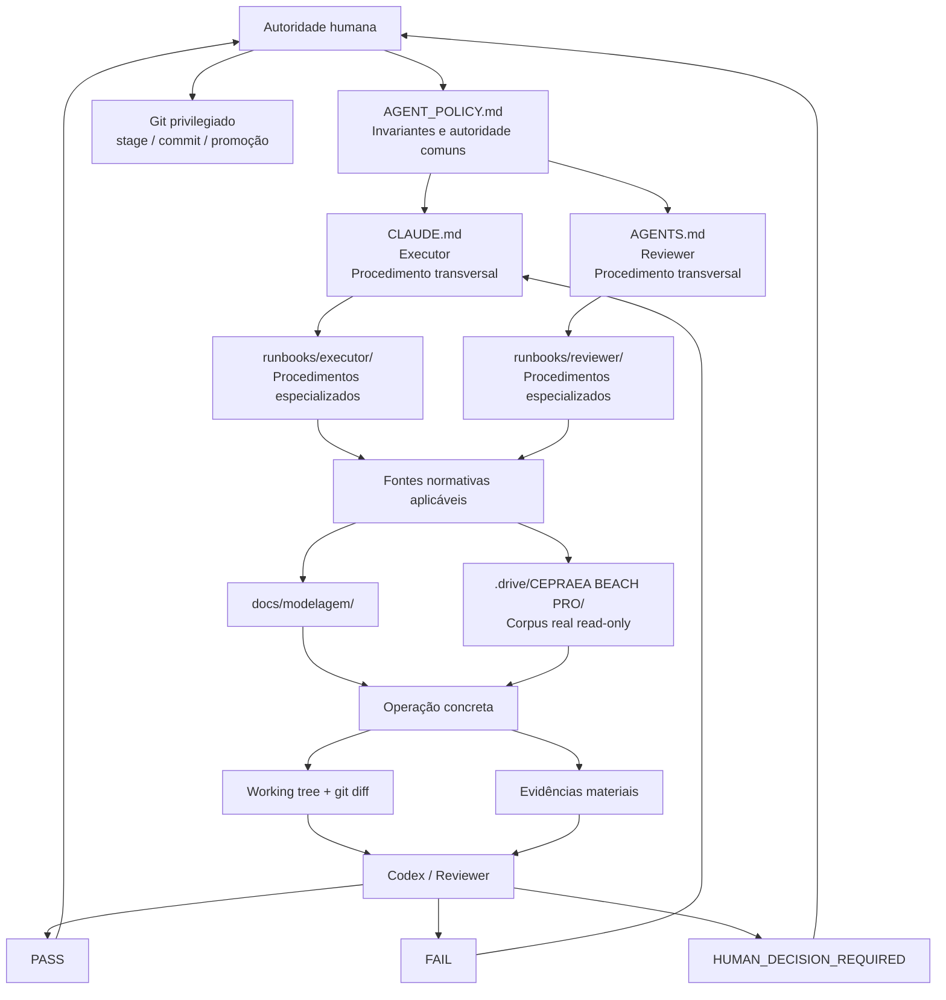
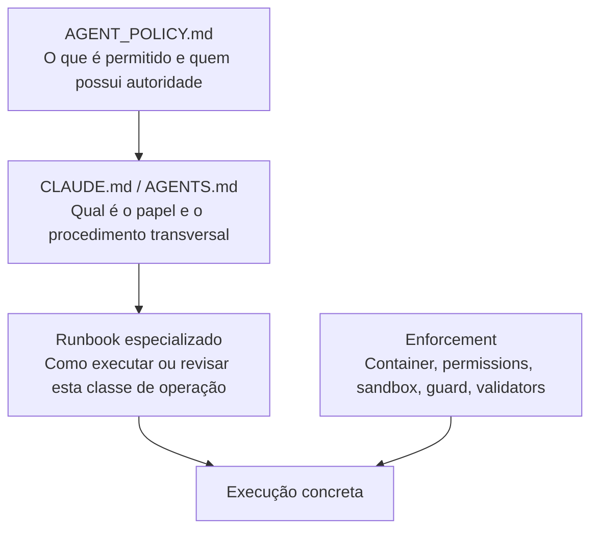
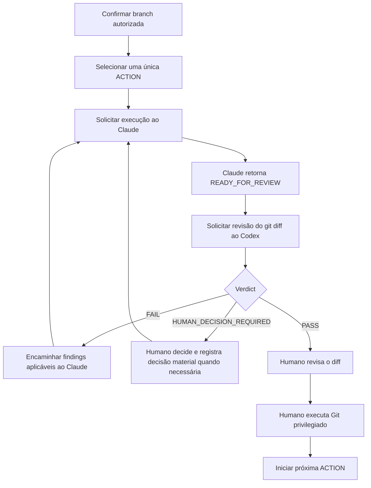
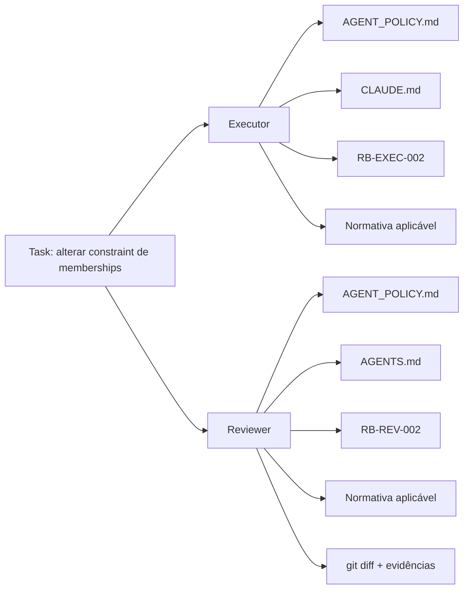
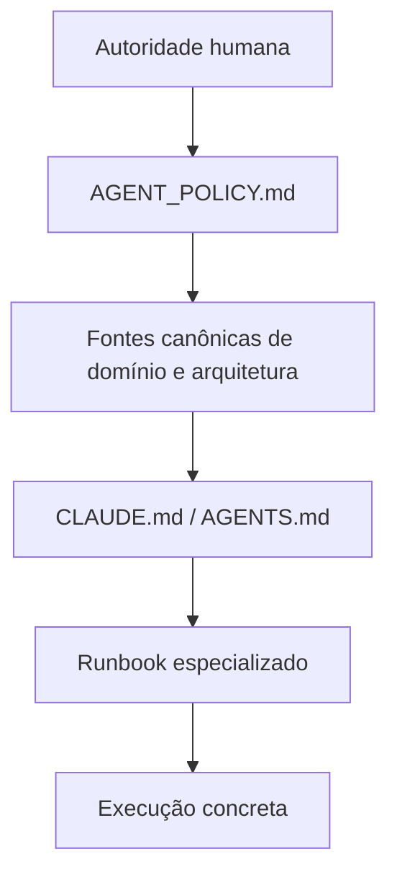
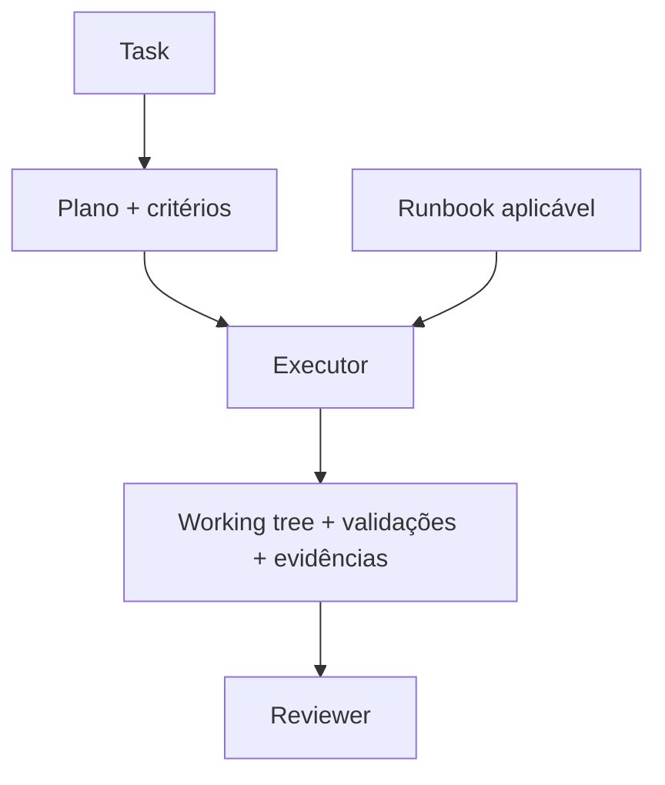
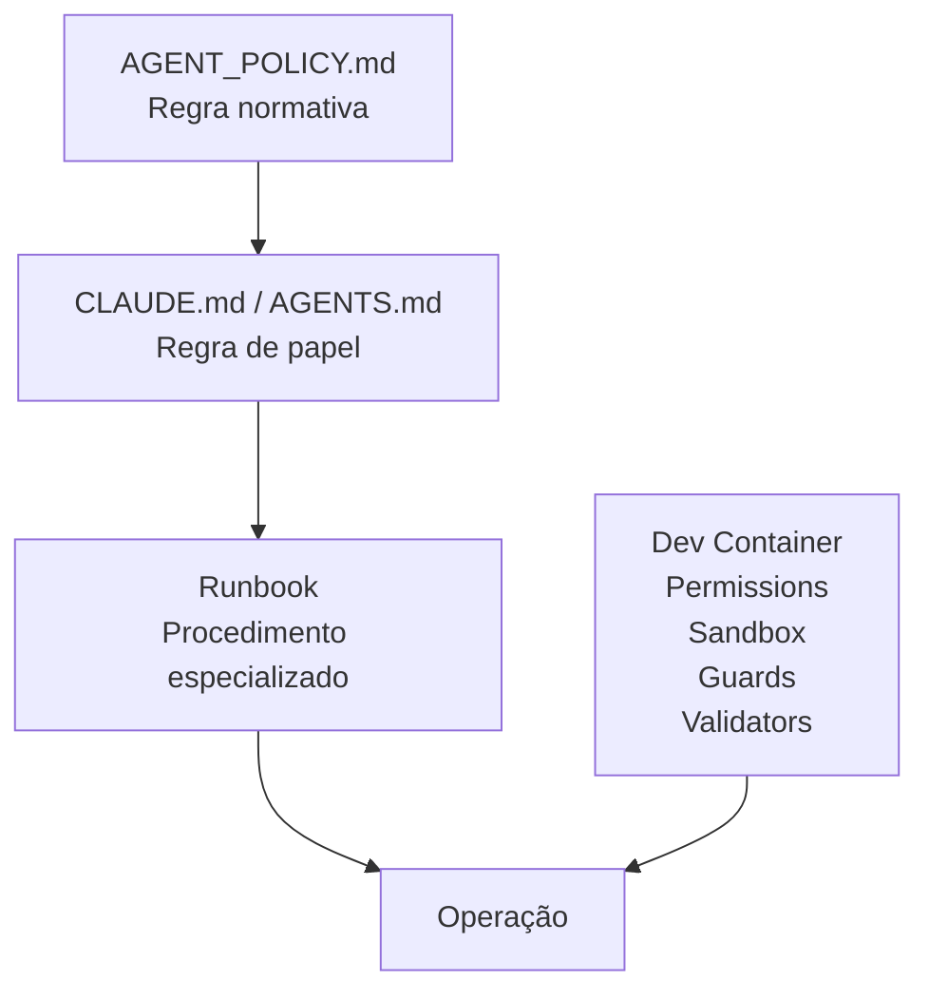
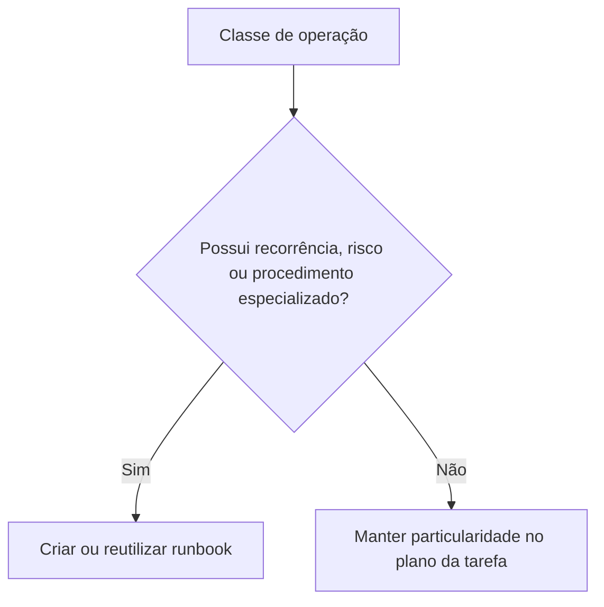
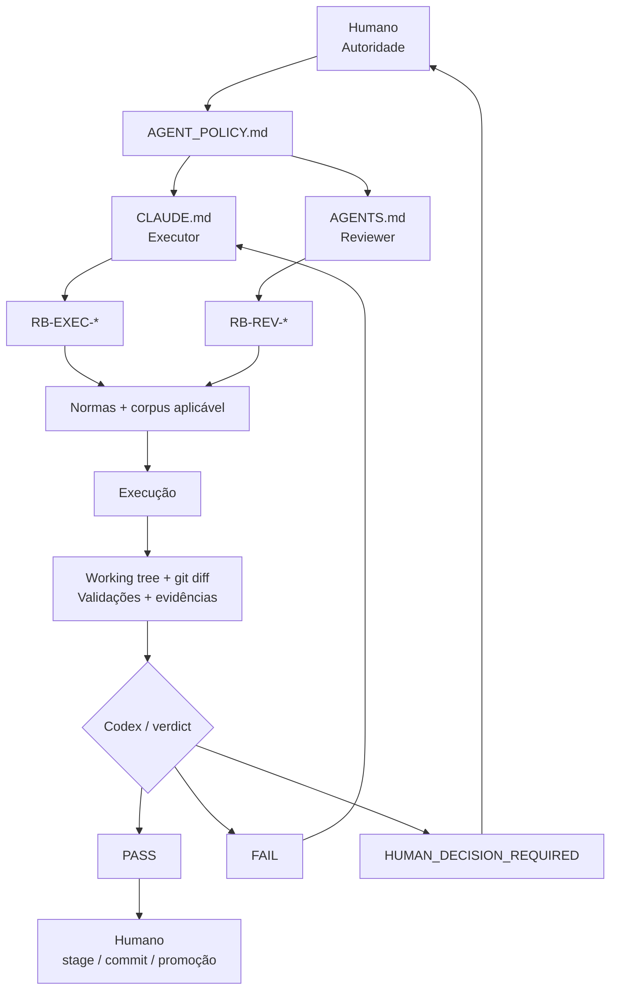

# Arquitetura de Runbooks do CEPRAEA BEACH PRO

## 1.1 Objetivo

Este documento define a arquitetura da biblioteca de runbooks utilizada no fluxo **Human-Governed Dual-Agent SDLC** do CEPRAEA BEACH PRO.

A arquitetura estabelece os seguintes princípios estruturais:

* manter um runbook operacional destinado ao operador humano;
* manter uma biblioteca especializada de runbooks;
* separar os procedimentos especializados do Executor e do Reviewer;
* compartilhar procedimentos somente quando forem efetivamente comuns aos dois papéis;
* utilizar Git como **state machine operacional**;
* manter `CLAUDE.md` e `AGENTS.md` como adaptadores permanentes dos respectivos papéis;
* utilizar runbooks para procedimentos específicos de cada classe de operação.

A biblioteca de runbooks **DEVE** aumentar a repetibilidade, a previsibilidade e a verificabilidade das operações sem introduzir uma state machine paralela ao Git.

---

## 1.2 Estado da decisão arquitetural

A adoção da **proposta B** está **DECIDIDA**.

A implantação permanece **PENDENTE DE EVIDÊNCIA** até que sejam demonstradas, por evidências verificáveis, as seguintes condições:

1. os arquivos tenham sido materializados no repositório;
2. as referências entre os arquivos tenham sido integradas;
3. Claude Code e Codex carreguem os runbooks aplicáveis;
4. o fluxo real tenha sido executado;
5. as validações pertinentes tenham produzido evidências verificáveis.

A existência da decisão arquitetural **DEVE** ser tratada separadamente da comprovação de sua implantação.

Em consequência:

* **decisão arquitetural existente** não implica **implantação comprovada**;
* **implantação declarada** não implica **implantação comprovada** sem evidência correspondente.

---

## 1.3 Princípios arquiteturais

A arquitetura **DEVE** preservar os seguintes princípios:

* autoridade humana sobre domínio, decisões materiais, operações privilegiadas de Git, promoção e release;
* separação entre produção, revisão e aprovação;
* Claude Code como **Executor**;
* Codex como **Reviewer independente**;
* princípio **deterministic first**;
* aplicação de **least privilege** por papel;
* Git como state machine e mecanismo de handoff operacional;
* persistência proporcional das evidências materiais;
* reutilização de runbooks por classe de operação;
* inexistência de infraestrutura paralela de workflow.

---

## 1.4 Visão arquitetural



O fluxo representa a distribuição de responsabilidades entre autoridade humana, política, papéis, runbooks, fontes normativas, execução, evidências, revisão e promoção.

Os mecanismos de **enforcement** permanecem externos aos runbooks e **DEVEM** materializar tecnicamente as restrições que possam ser aplicadas ou verificadas de forma determinística.

---

## 1.5 Estrutura do repositório

A biblioteca **DEVE** utilizar uma estrutura compatível com o seguinte modelo:

```text
cepraea-beach-pro/
│
├── AGENT_POLICY.md
├── CLAUDE.md
├── AGENTS.md
├── runbooks/
│   ├── README.md
│   │
│   ├── shared/
│   │   ├── RB-SHARED-001-repository-baseline.md
│   │   ├── RB-SHARED-002-evidence.md
│   │   └── RB-SHARED-003-failure-states.md
│   │
│   ├── executor/
│   │   ├── RB-EXEC-001-code-change.md
│   │   ├── RB-EXEC-002-database-change.md
│   │   ├── RB-EXEC-003-documentation-change.md
│   │   └── RB-EXEC-004-dependency-change.md
│   │
│   └── reviewer/
│       ├── RB-REV-001-code-review.md
│       ├── RB-REV-002-database-review.md
│       ├── RB-REV-003-documentation-review.md
│       └── RB-REV-004-evidence-review.md
│
├── docs/
│   ├── operacao/
│   │   └── agent-workflow.md
│   │
│   └── modelagem/
│       └── PLANO_CEPRAEA_Modelo_Canonico_FINAL.md
│
├── .codex/
│   └── config.toml
│
├── .devcontainer/
│   ├── devcontainer.json
│   ├── Dockerfile
│   ├── security/
│   │   ├── claude-managed-settings.json
│   │   └── claude-guard
│   └── scripts/
│       └── verify-agent-environment.sh
│
└── .drive/
    └── CEPRAEA BEACH PRO/
```

A estrutura representa responsabilidades lógicas. A materialização efetiva desses arquivos **DEVE** ser confirmada por evidência no repositório.

---

## 1.6 Responsabilidades das camadas

| Artefato                          | Responsabilidade                                                             |
| --------------------------------- | ---------------------------------------------------------------------------- |
| `AGENT_POLICY.md`                 | Definir invariantes comuns, autoridade e separação de funções                |
| `CLAUDE.md`                       | Definir o papel e o procedimento transversal permanente do Executor          |
| `AGENTS.md`                       | Definir o papel e o procedimento transversal permanente do Reviewer          |
| `runbooks/shared/`                | Definir procedimentos efetivamente comuns às classes de operação             |
| `runbooks/executor/`              | Especializar a execução por classe de mudança                                |
| `runbooks/reviewer/`              | Especializar a revisão independente por classe de mudança                    |
| `docs/operacao/agent-workflow.md` | Orientar o operador humano durante o ciclo completo                          |
| `docs/modelagem/`                 | Fornecer normativa aplicável à modelagem                                     |
| `.drive/CEPRAEA BEACH PRO/`       | Fornecer o corpus operacional real em modo read-only                         |
| `.codex/`                         | Aplicar limites técnicos específicos do Reviewer                             |
| `.devcontainer/`                  | Aplicar a fronteira operacional e os controles comuns                        |
| Git                               | Representar estado operacional, diff de handoff, histórico e promoção humana |

---

## 1.7 Relação entre política, papel, runbook e enforcement



Cada camada possui uma responsabilidade distinta:

* `AGENT_POLICY.md` define autoridade, invariantes e limites comuns;
* `CLAUDE.md` e `AGENTS.md` definem comportamento transversal dos respectivos papéis;
* runbooks especializados definem procedimentos específicos de classes de operação;
* mecanismos de enforcement aplicam tecnicamente restrições e verificações;
* a execução concreta ocorre dentro das restrições combinadas dessas camadas.

`AGENT_POLICY.md` **DEVE** permanecer relativamente estável.

`CLAUDE.md` e `AGENTS.md` **DEVEM** conter procedimentos transversais aplicáveis continuamente aos respectivos papéis.

Os runbooks **DEVEM** acrescentar somente o comportamento especializado necessário para a classe de operação correspondente.

O enforcement **DEVE** materializar tecnicamente propriedades que possam ser restringidas ou verificadas pelo ambiente.

---

## 1.8 `AGENT_POLICY.md`

`AGENT_POLICY.md` **DEVE** permanecer como a constituição comum do fluxo.

O arquivo define, entre outros aspectos:

* autoridade humana;
* separação de funções;
* autoridade sobre Git;
* proteção das fontes operacionais;
* proteção do control plane;
* princípio deterministic first;
* tratamento de ausência de permissão;
* política de evidência;
* regras de escalonamento.

Todos os runbooks **DEVEM** operar dentro da autoridade estabelecida por essa política.

---

## 1.9 `CLAUDE.md`

`CLAUDE.md` **DEVE** permanecer como adaptador permanente do Executor.

O procedimento transversal do Executor inclui:

1. identificar a tarefa solicitada;
2. carregar os documentos normativos necessários;
3. verificar a branch;
4. inspecionar `git status`;
5. identificar as validações exigidas;
6. produzir exclusivamente as alterações pertencentes à tarefa corrente;
7. executar os validadores determinísticos aplicáveis;
8. executar `git diff --check`;
9. inspecionar `git diff`;
10. inspecionar `git status`;
11. produzir handoff factual;
12. encerrar a execução com `READY_FOR_REVIEW` ou `BLOCKED`.

Os runbooks do Executor **DEVEM** acrescentar somente procedimentos específicos da classe de operação.

---

## 1.10 `AGENTS.md`

`AGENTS.md` **DEVE** permanecer como adaptador permanente do Reviewer.

O procedimento transversal do Reviewer inclui:

1. identificar a tarefa sob revisão;
2. inspecionar `git status`;
3. inspecionar o `git diff` completo;
4. consultar os artefatos relacionados;
5. identificar os critérios de aceite aplicáveis;
6. executar verificações independentes proporcionais ao risco;
7. procurar regressões;
8. tentar refutar conclusões materiais;
9. verificar evidências e rastreabilidade;
10. verificar se as inferências são compatíveis com as evidências disponíveis;
11. verificar a preservação das fontes protegidas;
12. verificar a preservação da autoridade humana;
13. emitir `PASS`, `FAIL` ou `HUMAN_DECISION_REQUIRED`.

Os runbooks do Reviewer **DEVEM** acrescentar somente verificações específicas da classe de alteração.

---

# 2. Biblioteca de runbooks

## 2.1 Runbooks compartilhados

### 2.1.1 `RB-SHARED-001-repository-baseline.md`

Este runbook **DEVERIA** conter verificações reutilizáveis de baseline somente quando a operação especializada depender dessas informações.

Pode incluir:

* identificação do repositório;
* identificação do `HEAD`;
* identificação da branch;
* inspeção do estado inicial;
* identificação da área afetada;
* identificação das fontes normativas necessárias.

O runbook **DEVE** ser carregado somente quando as informações que fornece forem necessárias para a tarefa corrente.

---

### 2.1.2 `RB-SHARED-002-evidence.md`

Este runbook **DEVE** definir critérios compartilhados para evidências materiais.

As evidências podem incluir:

* `git diff`;
* `git diff --check`;
* lista de arquivos modificados;
* exit codes relevantes;
* resultados de validadores;
* relatórios produzidos pela tarefa;
* evidências específicas exigidas pelos critérios de aceite.

A persistência das evidências **DEVE** ser proporcional ao seu valor probatório.

Git **DEVE** permanecer como mecanismo primário de estado, handoff e histórico.

---

### 2.1.3 `RB-SHARED-003-failure-states.md`

Este runbook **DEVE** padronizar os estados terminais utilizados pelos runbooks especializados.

Estados permitidos para o Executor:

```text
READY_FOR_REVIEW
BLOCKED
```

Estados permitidos para o Reviewer:

```text
PASS
FAIL
HUMAN_DECISION_REQUIRED
```

Cada runbook especializado **DEVE** utilizar exclusivamente os estados pertencentes ao papel correspondente.

---

## 2.2 Runbooks do Executor

### 2.2.1 `RB-EXEC-001-code-change.md`

#### Aplicabilidade

Aplica-se a:

* implementação;
* correção;
* refatoração autorizada;
* alteração de comportamento de código.

#### Procedimento especializado

O procedimento **DEVERIA**:

1. identificar os componentes afetados;
2. identificar contratos públicos relacionados;
3. localizar os testes existentes;
4. implementar exclusivamente a alteração requerida;
5. atualizar os testes necessários;
6. executar os validadores aplicáveis;
7. verificar regressões diretamente relacionadas à mudança.

---

### 2.2.2 `RB-EXEC-002-database-change.md`

#### Aplicabilidade

Aplica-se a alterações de:

* schema;
* migration;
* constraint;
* índice;
* persistência.

#### Procedimento especializado

Quando aplicável, o procedimento **DEVE**:

1. identificar a definição autoritativa;
2. identificar o estado atual das migrations;
3. identificar migrations previamente aplicadas;
4. verificar dados incompatíveis com a alteração;
5. criar exclusivamente uma nova migration quando a evolução do schema exigir nova migration;
6. implementar a alteração autorizada;
7. executar a validação da migration;
8. executar testes de integridade;
9. produzir as evidências materiais exigidas.

---

### 2.2.3 `RB-EXEC-003-documentation-change.md`

#### Aplicabilidade

Aplica-se a:

* criação de documentação Markdown;
* alteração de documentação Markdown.

#### Procedimento especializado

O procedimento **DEVE**:

1. localizar o guia canônico de documentação;
2. identificar as fontes técnicas aplicáveis;
3. preservar as decisões existentes;
4. restringir as alterações ao escopo documental autorizado;
5. aplicar as regras de autoria;
6. verificar links e referências afetados;
7. executar as validações documentais disponíveis;
8. revisar o diff documental.

---

### 2.2.4 `RB-EXEC-004-dependency-change.md`

#### Aplicabilidade

Aplica-se a:

* inclusão de dependência;
* remoção de dependência;
* atualização de versão;
* alteração de lockfile.

#### Procedimento especializado

O procedimento **DEVE**:

1. identificar a necessidade da dependência;
2. identificar os manifests afetados;
3. identificar os requisitos de compatibilidade;
4. restringir a alteração aos artefatos relacionados;
5. atualizar lockfiles utilizando a ferramenta canônica;
6. executar build, typecheck e testes aplicáveis;
7. registrar impactos materiais, quando existentes.

---

## 2.3 Runbooks do Reviewer

### 2.3.1 `RB-REV-001-code-review.md`

#### Aplicabilidade

Aplica-se à revisão de alterações normais de código.

#### Procedimento especializado

O Reviewer **DEVE**:

1. comparar o diff com o objetivo da tarefa;
2. verificar o comportamento observável;
3. procurar regressões;
4. verificar os testes afetados;
5. executar verificações independentes proporcionais ao risco;
6. verificar alterações inesperadas;
7. emitir o verdict correspondente.

---

### 2.3.2 `RB-REV-002-database-review.md`

#### Aplicabilidade

Aplica-se à revisão de alterações de schema, migration ou integridade persistente.

#### Procedimento especializado

O Reviewer **DEVE**:

1. identificar a norma aplicável;
2. inspecionar a migration;
3. verificar a semântica da alteração;
4. verificar a preservação das migrations históricas aplicáveis;
5. executar teste adversarial quando apropriado;
6. executar teste positivo quando apropriado;
7. verificar a integridade resultante;
8. confrontar as evidências do Executor com fatos observáveis;
9. emitir o verdict correspondente.

---

### 2.3.3 `RB-REV-003-documentation-review.md`

#### Aplicabilidade

Aplica-se à revisão de documentação.

#### Procedimento especializado

O Reviewer **DEVE**:

1. identificar as fontes técnicas aplicáveis;
2. verificar a preservação do significado;
3. verificar aderência ao guia de autoria;
4. identificar afirmações cuja evidência seja insuficiente;
5. verificar links e referências afetados;
6. verificar exemplos e comandos;
7. avaliar separadamente a forma documental e a correção técnica;
8. emitir o verdict correspondente.

---

### 2.3.4 `RB-REV-004-evidence-review.md`

#### Aplicabilidade

Aplica-se às operações em que a suficiência das evidências seja material para a aceitação.

#### Procedimento especializado

O Reviewer **DEVE**:

1. identificar as alegações materiais;
2. identificar as evidências correspondentes;
3. comparar cada alegação com o estado observável;
4. reproduzir verificações críticas quando proporcional;
5. classificar insuficiências materiais de evidência;
6. emitir o verdict correspondente.

---

# 3. Runbook do operador humano

O arquivo `docs/operacao/agent-workflow.md` **DEVE** permanecer como runbook do operador humano.

Seu fluxo **DEVE** ser curto e operacional.



Git **DEVE** permanecer como state machine operacional desse fluxo.

O operador humano mantém autoridade sobre:

* decisões materiais;
* avaliação final do diff;
* operações privilegiadas de Git;
* promoção;
* release.

---

# 4. Seleção de runbooks

Uma tarefa **DEVE** carregar exclusivamente os runbooks aplicáveis à sua classe de operação.

O número de agentes não determina o número de runbooks necessários.

A classe da operação determina quais procedimentos especializados devem ser carregados.

## 4.1 Exemplo de seleção

Para uma tarefa que altere uma constraint de `memberships`:

### Executor

Devem ser consideradas as seguintes fontes:

* `AGENT_POLICY.md`;
* `CLAUDE.md`;
* `runbooks/executor/RB-EXEC-002-database-change.md`;
* runbook compartilhado aplicável, quando necessário;
* normativa pertinente de `docs/modelagem/`;
* fontes necessárias de `.drive/CEPRAEA BEACH PRO/`.

### Reviewer

Devem ser consideradas as seguintes fontes:

* `AGENT_POLICY.md`;
* `AGENTS.md`;
* `runbooks/reviewer/RB-REV-002-database-review.md`;
* runbook compartilhado aplicável, quando necessário;
* normativa pertinente de `docs/modelagem/`;
* `git diff`;
* evidências materiais aplicáveis.



---

# 5. Precedência das fontes

Os runbooks **DEVEM** respeitar a autoridade das camadas superiores.



Uma instrução contida em um runbook possui validade somente dentro da autoridade concedida pelas fontes superiores.

Quando existir contradição material que impeça execução inequívoca:

* o Executor **DEVE** encerrar com `BLOCKED`;
* o Reviewer **DEVE** emitir `HUMAN_DECISION_REQUIRED`.

---

# 6. Relação entre plano da tarefa e runbook

O plano da tarefa e o runbook possuem responsabilidades distintas.

## 6.1 Plano da tarefa

O plano define:

* objetivo específico;
* escopo específico;
* entregáveis;
* sequência particular da tarefa;
* critérios de aceitação.

## 6.2 Runbook

O runbook define:

* procedimento da classe de operação;
* verificações operacionais aplicáveis;
* evidências relevantes;
* estados de saída.



O runbook **DEVE** preservar o escopo e os critérios definidos pela tarefa.

Uma particularidade exclusiva de uma tarefa não **DEVERIA** ser promovida automaticamente a runbook reutilizável.

---

# 7. Relação com o enforcement

Runbook e enforcement possuem responsabilidades diferentes.



Os runbooks especificam o procedimento esperado.

Os mecanismos técnicos **DEVEM** aplicar as restrições e verificações que possam ser materializadas deterministicamente.

O runbook não **DEVE** ser utilizado como substituto para uma restrição que possa ser aplicada diretamente pelo ambiente.

---

# 8. Relação com Git

Git **DEVE** permanecer como:

* estado operacional;
* mecanismo de handoff;
* representação concreta da alteração;
* histórico persistente;
* identidade final das mudanças por commit.


A biblioteca de runbooks **DEVE** operar sobre esse modelo.

Um registro de execução separado **PODE** existir quando uma operação possuir necessidade probatória própria.

Registros adicionais **DEVEM** ser mantidos somente quando possuírem valor material próprio.

A existência desses registros não **DEVE** estabelecer uma state machine operacional paralela ao Git.

---

# 9. Relação com o `CONTAINER_RUNBOOK`

O `CONTAINER_RUNBOOK` fornecido representa uma classe distinta de runbook.

Ele demonstra como um procedimento de infraestrutura pode reunir:

* baseline;
* estado comprovado;
* decisões;
* testes;
* evidências;
* rollback;
* histórico de mudanças.

Neste contexto, seu conteúdo **DEVE** ser utilizado exclusivamente como referência estrutural e conceitual.

A determinação do estado real da arquitetura **DEVE** utilizar:

* os documentos reais da **Human-Governed Dual-Agent SDLC Architecture**;
* o estado observável do repositório;
* as evidências específicas da implantação.

O `CONTAINER_RUNBOOK` não **DEVE**, isoladamente, ser tratado como evidência do estado atual da arquitetura.

---

# 10. Estrutura mínima de um runbook especializado

Cada runbook especializado **DEVERIA** possuir uma estrutura compatível com sua finalidade.

## 10.1 Objetivo

Definir a classe de operação governada pelo runbook.

## 10.2 Aplicabilidade

Definir condições objetivas que determinem quando o runbook deve ser utilizado.

## 10.3 Entradas

Listar somente as entradas necessárias à operação.

## 10.4 Fontes de autoridade

Identificar as fontes que governam a operação.

## 10.5 Pré-condições

Definir as condições que devem existir antes do início do procedimento.

## 10.6 Escopo operacional

Definir positivamente os caminhos, recursos e ações autorizados.

Exemplo:

> Restrinja todas as alterações exclusivamente aos caminhos e artefatos autorizados pela tarefa corrente.

## 10.7 Procedimento

Utilizar lista numerada quando a ordem das ações for obrigatória.

## 10.8 Pontos de decisão

Definir condições observáveis para cada desvio possível do fluxo.

## 10.9 Validações

Listar os checks determinísticos aplicáveis.

## 10.10 Evidências

Definir somente as evidências necessárias para demonstrar propriedades materiais da operação.

## 10.11 Handoff

Definir a saída que deverá ser fornecida ao próximo papel.

## 10.12 Estados de saída

Utilizar exclusivamente estados pertencentes ao papel correspondente.

## 10.13 Referências

Utilizar caminhos relativos para arquivos do repositório quando aplicável.

---

# 11. Critérios para criação de novos runbooks

Um novo runbook **DEVERIA** ser criado quando uma classe de operação possuir uma ou mais das seguintes características:

* recorrência;
* risco material;
* procedimento especializado;
* decisões condicionais recorrentes;
* validações específicas;
* requisitos próprios de evidência;
* necessidade observável de consistência entre execuções.

Variações específicas de uma única tarefa **DEVERIAM** permanecer no plano dessa tarefa.



A biblioteca **DEVE** favorecer a relação:

```text
um runbook
→ várias tarefas da mesma classe
```

em vez de:

```text
uma tarefa
→ um runbook exclusivo
```

---

# 12. Resultado arquitetural

Com a adoção da proposta B, a arquitetura do **Human-Governed Dual-Agent SDLC** passa a incluir uma camada procedural especializada, sem modificar a distribuição fundamental de autoridade.



A biblioteca de runbooks **DEVE** acrescentar especialização procedural sem:

* duplicar as responsabilidades permanentes de `CLAUDE.md` e `AGENTS.md`;
* redefinir as fontes normativas;
* substituir o enforcement determinístico;
* criar uma state machine operacional paralela;
* transferir autoridade material dos operadores humanos para os agentes.

Git permanece como state machine operacional.

O Executor permanece responsável pela produção das alterações.

O Reviewer permanece responsável pela assurance independente.

A autoridade final permanece humana.

---

## 2. Pontos que precisam de esclarecimento

### Público-alvo

**Informação necessária:** definir formalmente o público-alvo do documento.

Pelo conteúdo, o documento aparenta exigir conhecimento técnico avançado de arquitetura, Git, agentes de IA, revisão independente, Dev Containers e governança de SDLC. Entretanto, o público-alvo não foi explicitamente fornecido e não deve ser inferido como requisito documental.

### Definição formal da “proposta B”

**Informação necessária:** identificar a fonte normativa ou o documento em que as propostas consideradas, especialmente a **proposta B**, estão definidas.

O documento declara:

> A adoção da proposta B está **DECIDIDA**.

Sem referência à definição da proposta, um leitor que consulte este documento isoladamente não consegue reconstruir integralmente a decisão.

### Estado `PENDENTE DE EVIDÊNCIA`

**Informação necessária:** confirmar se `PENDENTE DE EVIDÊNCIA` é um estado formal da arquitetura, uma classificação documental ou apenas uma expressão descritiva.

Caso seja estado formal, recomenda-se documentar sua definição, condições de entrada e condições de saída.

### Critério de implantação comprovada

**Informação necessária:** definir quais evidências concretas são suficientes para comprovar cada uma das condições de implantação.

Por exemplo, o documento exige que:

> Claude Code e Codex carreguem os runbooks aplicáveis.

Ainda não está especificado qual artefato ou observação comprova esse carregamento.

### Significado normativo de “deterministic first”

**Informação necessária:** indicar a fonte canônica que define o princípio `deterministic first` no contexto do CEPRAEA BEACH PRO.

### Significado de “Git privilegiado”

**Informação necessária:** documentar quais operações são consideradas privilegiadas.

O documento cita:

* `stage`;
* `commit`;
* promoção.

Não está explícito se outras operações, como `push`, `merge`, criação de tag, alteração de branch ou reset, também pertencem à categoria.

### Fronteira entre `FAIL` e `HUMAN_DECISION_REQUIRED`

**Informação necessária:** estabelecer critérios objetivos, ou apontar a fonte que os estabelece, para distinguir situações que exigem `FAIL` de situações que exigem `HUMAN_DECISION_REQUIRED`.

### Evidência material

**Informação necessária:** indicar a definição canônica de **evidência material** e de **valor probatório**, caso esses conceitos já existam na arquitetura.

### Fontes normativas

**Informação necessária:** esclarecer a precedência entre `docs/modelagem/` e `.drive/CEPRAEA BEACH PRO/` quando ambas contiverem informações aplicáveis e materialmente divergentes.

O diagrama de precedência agrupa fontes canônicas de domínio e arquitetura, mas não estabelece precedência interna entre elas.

---

## 3. Problemas encontrados no texto original

### 3.1 Repetição de princípios arquiteturais

O texto original reafirma em diferentes seções que:

* Git é a state machine operacional;
* runbooks não devem criar uma state machine paralela;
* Executor produz;
* Reviewer revisa;
* autoridade final é humana;
* runbooks não substituem enforcement.

Essas repetições reforçam invariantes importantes, mas dificultam a localização da definição autoritativa de cada regra.

A versão reestruturada mantém as invariantes, concentrando suas definições principais e utilizando as demais ocorrências como aplicação contextual.

### 3.2 Uso misto de termos normativos e descritivos

Há ocorrências de `DEVE`, `DEVERIA` e `PODE` próximas a expressões menos formalizadas como:

* “quando apropriado”;
* “quando aplicável”;
* “proporcional ao risco”;
* “valor probatório”;
* “impactos materiais”.

Esses qualificadores podem ser adequados, mas parte deles exige critérios adicionais para produzir comportamento reproduzível entre diferentes execuções.

### 3.3 Critérios de seleção parcialmente subjetivos

A criação de novos runbooks depende de critérios como:

* risco material;
* necessidade observável;
* procedimento especializado.

Esses conceitos não possuem critérios verificáveis no texto apresentado.

### 3.4 Hierarquia de autoridade incompleta em caso de conflito interno

A precedência geral está definida como:

```text
Autoridade humana
→ AGENT_POLICY.md
→ fontes canônicas
→ CLAUDE.md / AGENTS.md
→ runbook
→ execução
```

Entretanto, não existe no texto apresentado regra explícita para resolver conflitos entre múltiplas fontes dentro do nível “fontes canônicas”.

### 3.5 Estado arquitetural e estado operacional utilizam terminologia distinta sem taxonomia explícita

O documento utiliza:

```text
DECIDIDA
PENDENTE DE EVIDÊNCIA
READY_FOR_REVIEW
BLOCKED
PASS
FAIL
HUMAN_DECISION_REQUIRED
```

Os estados pertencem a domínios diferentes, mas isso não está formalmente classificado.

Uma taxonomia poderia distinguir:

* estado da decisão arquitetural;
* estado da implantação;
* estado terminal do Executor;
* verdict do Reviewer.

### 3.6 Referência externa à “proposta B”

A arquitetura depende semanticamente de uma entidade denominada **proposta B**, mas a definição dessa proposta não está presente no documento fornecido.

### 3.7 Referência externa ao `CONTAINER_RUNBOOK`

O documento descreve a finalidade do `CONTAINER_RUNBOOK`, porém não fornece caminho relativo ou outra referência inequívoca para o artefato.

### 3.8 Critérios de handoff não estão completamente definidos

O texto estabelece estados de saída, mas não define um contrato mínimo completo para o conteúdo do handoff do Executor e do Reviewer.

Por exemplo, não está determinado se o handoff do Executor deve sempre conter:

* arquivos modificados;
* validações executadas;
* exit codes;
* validações não executadas;
* limitações;
* evidências produzidas.

### 3.9 “Uma única ACTION” não está definida

O runbook humano exige:

> Selecionar uma única ACTION.

Entretanto, o significado formal de `ACTION` e sua granularidade não estão definidos no conteúdo apresentado.

---

## 4. Recomendações opcionais

> **Recomendação:** criar uma seção denominada **Glossário e conceitos normativos** contendo definições para termos recorrentes como `ACTION`, `deterministic first`, `evidência material`, `Git privilegiado`, `fonte normativa`, `fonte canônica`, `handoff` e `control plane`.

> **Recomendação:** criar uma seção curta denominada **Taxonomia de estados**, separando explicitamente estados arquiteturais, estados de implantação, estados do Executor e verdicts do Reviewer.

Exemplo conceitual:

| Domínio              | Estados                                   |
| -------------------- | ----------------------------------------- |
| Decisão arquitetural | `DECIDIDA`                                |
| Implantação          | `PENDENTE DE EVIDÊNCIA`                   |
| Executor             | `READY_FOR_REVIEW`, `BLOCKED`             |
| Reviewer             | `PASS`, `FAIL`, `HUMAN_DECISION_REQUIRED` |

Essa tabela somente deve ser incorporada como normativa após confirmação de que essas categorias representam corretamente a arquitetura pretendida.

> **Recomendação:** criar um contrato de handoff explícito para Executor e Reviewer. Isso aumentaria a verificabilidade e reduziria variações entre execuções sem introduzir uma state machine adicional.

> **Recomendação:** documentar critérios objetivos para o conceito de **proporcionalidade ao risco**, especialmente porque ele determina a profundidade das verificações independentes executadas pelo Reviewer.

> **Recomendação:** vincular a declaração **“proposta B decidida”** a um ADR ou documento de decisão arquitetural específico. O documento atual descreve principalmente a arquitetura resultante, enquanto a justificativa, alternativas consideradas e trade-offs da decisão poderiam permanecer em um ADR separado.

> **Recomendação:** definir explicitamente quais evidências demonstram que a arquitetura deixou o estado **PENDENTE DE EVIDÊNCIA**. Isso permitiria transformar a declaração de implantação em um critério verificável.

> **Recomendação:** adicionar caminhos relativos para todas as fontes externas mencionadas, inclusive para o `CONTAINER_RUNBOOK`, quando esse artefato estiver materializado no repositório.

> **Recomendação:** manter este documento como **referência arquitetural e normativa** e manter procedimentos operacionais detalhados dentro dos respectivos runbooks. Isso reduz duplicação e preserva a separação entre arquitetura, política e execução.
