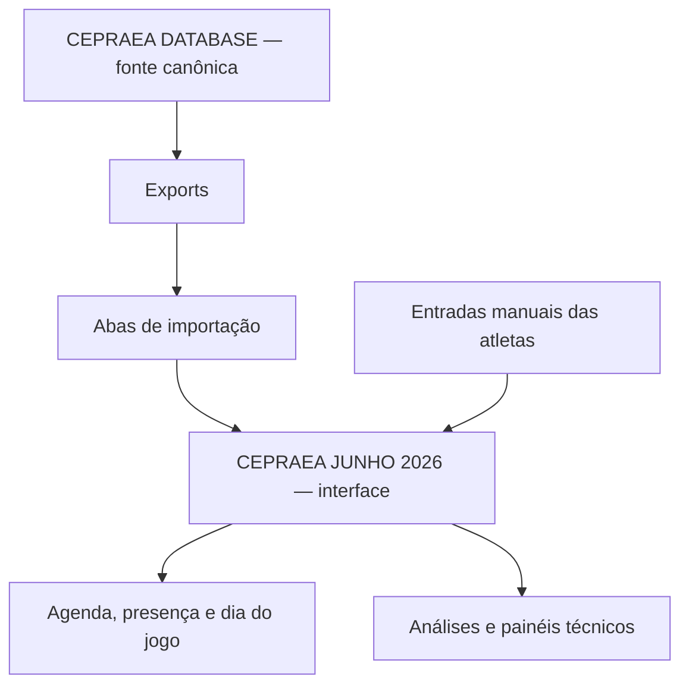
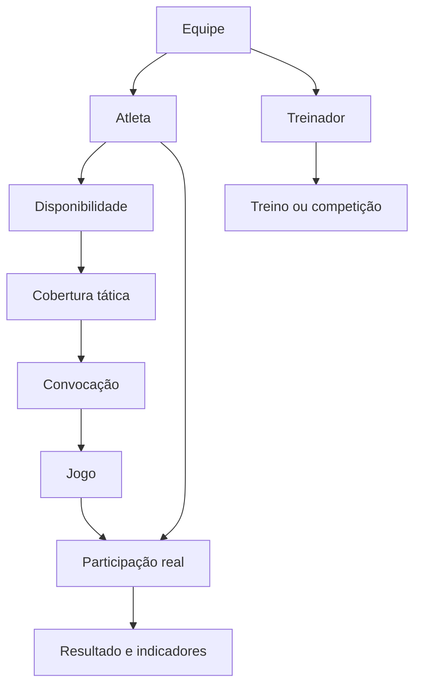

# Descrição operacional do CEPRAEA

<!-- markdownlint-disable MD033 -->
- [Descrição operacional do CEPRAEA](#descrição-operacional-do-cepraea)
  - [1. Identificação](#1-identificação)
  - [2. Definição canônica](#2-definição-canônica)
  - [3. Domínio e finalidade operacional](#3-domínio-e-finalidade-operacional)
  - [4. Pessoas e responsabilidades](#4-pessoas-e-responsabilidades)
    - [4.1 Composição humana](#41-composição-humana)
    - [4.2 Davi Sermenho](#42-davi-sermenho)
    - [4.3 Atletas](#43-atletas)
  - [5. Ambiente operacional](#5-ambiente-operacional)
  - [6. Arquitetura da informação](#6-arquitetura-da-informação)
    - [6.1 Camadas](#61-camadas)
    - [6.2 Interfaces principais](#62-interfaces-principais)
  - [7. Estado observado em 23 de julho de 2026](#7-estado-observado-em-23-de-julho-de-2026)
    - [7.1 Elenco](#71-elenco)
    - [7.2 Próximo treino registrado](#72-próximo-treino-registrado)
    - [7.3 Desempenho consolidado](#73-desempenho-consolidado)
    - [7.4 Respostas de disponibilidade](#74-respostas-de-disponibilidade)
    - [7.5 Outros dados documentados](#75-outros-dados-documentados)
  - [8. Modelo conceitual do domínio](#8-modelo-conceitual-do-domínio)
    - [8.1 Pessoas e elenco](#81-pessoas-e-elenco)
    - [8.2 Funções e posições](#82-funções-e-posições)
    - [8.3 Sistemas e cobertura](#83-sistemas-e-cobertura)
    - [8.4 Disponibilidade e presença](#84-disponibilidade-e-presença)
    - [8.5 Treino e planejamento](#85-treino-e-planejamento)
    - [8.6 Calendário](#86-calendário)
    - [8.7 Competição, convocação e jogo](#87-competição-convocação-e-jogo)
    - [8.8 Participação e resultado](#88-participação-e-resultado)
    - [8.9 Comunicação e feedback](#89-comunicação-e-feedback)
    - [8.10 Proveniência e governança](#810-proveniência-e-governança)
  - [9. Regras operacionais para manutenção por IA](#9-regras-operacionais-para-manutenção-por-ia)
    - [9.1 Matriz de permissões](#91-matriz-de-permissões)
    - [9.2 Ações `ALWAYS`](#92-ações-always)
    - [9.3 Ações `ASK`](#93-ações-ask)
    - [9.4 Ações `NEVER`](#94-ações-never)
    - [9.5 Autoridade por informação](#95-autoridade-por-informação)
  - [10. Problema operacional](#10-problema-operacional)
  - [11. Inconsistências encontradas](#11-inconsistências-encontradas)
    - [11.1 Permissões excessivas](#111-permissões-excessivas)
    - [11.2 Divergência de elenco](#112-divergência-de-elenco)
    - [11.3 Competição classificada como treino](#113-competição-classificada-como-treino)
    - [11.4 Conteúdo vencido](#114-conteúdo-vencido)
    - [11.5 Módulos quebrados ou incompletos](#115-módulos-quebrados-ou-incompletos)
    - [11.6 Piloto do scout sem validação suficiente](#116-piloto-do-scout-sem-validação-suficiente)
    - [11.7 Dados sensíveis](#117-dados-sensíveis)
    - [11.8 Dependência de uma única pessoa](#118-dependência-de-uma-única-pessoa)
  - [12. Estado desejado](#12-estado-desejado)
    - [12.1 Resultado para Davi](#121-resultado-para-davi)
    - [12.2 Resultado para as atletas](#122-resultado-para-as-atletas)
    - [12.3 Critérios de aceitação](#123-critérios-de-aceitação)
  - [13. Prioridades de correção](#13-prioridades-de-correção)
  - [14. Estrutura documental consultada](#14-estrutura-documental-consultada)
  - [15. Fontes principais](#15-fontes-principais)
  - [16. Conclusão](#16-conclusão)

<document_context>

## 1. Identificação

- **Finalidade:** descrever o CEPRAEA, seu contexto operacional e o sistema de
  informação usado na temporada de 2026.
- **Escopo incluído:** equipe, elenco, disponibilidade, treinos, competições,
  convocações, participação, resultados, planejamento e governança.
- **Escopo excluído:** natureza jurídica, expansão da sigla e capacidades
  futuras ainda não implementadas.
- **Responsável operacional:** Davi Sermenho.
- **Vigência dos dados observados:** 23 de julho de 2026.
- **Fontes principais:** `CEPRAEA DATABASE`, `CEPRAEA JUNHO 2026` e os
  documentos relacionados na seção 16.

> **Limite de interpretação:** este documento consolida uma auditoria dos
> arquivos consultados. Um fato datado descreve o estado observado naquela
> data e não deve ser apresentado como estado atual sem nova validação.

## 2. Definição canônica

O **CEPRAEA** é uma equipe competitiva adulta feminina de handebol de praia,
formada pelas atletas e conduzida pelo treinador Davi Sermenho.

O CEPRAEA não é uma planilha, um banco de dados ou um sistema de informação.
Esses artefatos representam e apoiam digitalmente a operação da equipe.

```text
CEPRAEA
├── Treinador: Davi Sermenho
└── Atletas
```

Os arquivos consultados não comprovam:

- a expansão formal da sigla `CEPRAEA`;
- natureza jurídica;
- CNPJ;
- estatuto;
- instituição mantenedora;
- data oficial de fundação;
- sede administrativa;
- propriedade ou representação legal.

Portanto, os arquivos não sustentam a classificação jurídica do CEPRAEA como
associação, clube, empresa ou projeto institucional.

## 3. Domínio e finalidade operacional

| Classificação | Definição |
| --- | --- |
| **Domínio** | Gestão e desempenho no esporte de rendimento |
| **Subdomínio** | Gestão técnico-operacional do handebol de praia |
| **Tema** | Preparação e decisão competitiva durante a temporada |

O sistema existe para transformar dados fragmentados, mutáveis e
semanticamente diferentes em uma representação operacional única. Essa
representação deve permitir que Davi forme, prepare, convoque e acompanhe a
equipe com menor risco de erro.

Os subdomínios identificados são:

| Subdomínio | Aplicação |
| --- | --- |
| Elenco | Cadastro, função, posição e estado |
| Treinos | Datas, horários, local, objetivo e conteúdo |
| Disponibilidade | Respostas `SIM`, `NAO`, `TALVEZ` ou vazias |
| Competições | Inscrições, relações, cronogramas e cenários |
| Convocações | Seleção de atletas e composição funcional |
| Análise esportiva | Jogos, resultados, sets e participação |
| Planejamento | Cobertura dos sistemas ofensivos e defensivos |
| Governança | Fonte, validação, auditoria e changelog |
| Comunicação | Informações para Davi e para as atletas |

## 4. Pessoas e responsabilidades

### 4.1 Composição humana

A composição interna informada como canônica é:

- Davi Sermenho, treinador;
- atletas do CEPRAEA.

Não existem outros integrantes na comissão técnica, coordenação, equipe
administrativa ou equipe operacional interna. Referências a `comissão`,
`coordenação` ou `staff` nos artefatos são inconsistências legadas. Elas devem
ser substituídas por `treinador` ou `Davi Sermenho` quando se referirem à
estrutura atual.

### 4.2 Davi Sermenho

Davi é o único responsável técnico e operacional do CEPRAEA. Ele acumula:

- planejamento dos treinos;
- controle do elenco;
- coleta das disponibilidades;
- convocações;
- inscrições e relações nominais;
- comunicação com as atletas;
- organização do dia do jogo;
- registro dos resultados;
- análise esportiva;
- manutenção e validação das informações.

Os arquivos também descrevem Davi como:

- ex-atleta da Seleção Brasileira de handebol de praia;
- campeão mundial;
- seis vezes campeão brasileiro;
- tricampeão pan-americano;
- treinador campeão brasileiro com o CEPRAEA;
- treinador de equipes femininas de formação do IDEC;
- auxiliar técnico do IDEC masculino;
- idealizador de soluções do ecossistema HbTrack.

Essas afirmações foram preservadas como fatos documentados no material
consultado. Elas exigem fontes externas se forem publicadas como perfil
biográfico independente.

### 4.3 Atletas

As atletas:

- declaram a própria disponibilidade;
- recebem agenda e orientações;
- podem ser convocadas para competições;
- participam de treinos e jogos;
- são titulares dos registros individuais.

A autoridade de cada atleta limita-se à declaração da própria situação. A
atleta não define calendário, convocação, resultado ou composição da equipe.

Atletas que ingressam, retornam, se afastam ou mudam de função apresentam maior
risco de dessincronização. Gilvania Balbino é o caso observado: aparece no
controle mensal de julho, mas não no cadastro canônico.

## 5. Ambiente operacional

| Dimensão | Estado documentado |
| --- | --- |
| Organização | CEPRAEA, handebol de praia adulto feminino |
| Temporada | 2026 |
| Integrantes | Davi e atletas |
| Plataforma | Google Sheets no Google Drive |
| Fuso horário | `America/Sao_Paulo` |
| Localidade | Português do Brasil, `pt_BR` |
| Local recorrente | Copacabana |
| Atualização | Manual, fórmulas e ações solicitadas à IA |
| Dados | Operacionais, esportivos, temporais e pessoais |

Os treinos regulares estão registrados nos seguintes horários:

- quintas-feiras, das 20h às 21h30;
- domingos, das 7h às 9h.

O calendário contempla competições estaduais, nacionais e internacionais.
Os locais documentados incluem Niterói e diferentes cidades brasileiras.

O ambiente depende:

- de internet e do Google Drive;
- das declarações manuais das atletas;
- das decisões de Davi;
- de tabelas, boletins e relações nominais oficiais;
- da atualização temporal dos painéis;
- da sincronização entre interface e banco.

A planilha representa o último estado registrado e validado. Ela não comprova
o que acontece em tempo real.

A IA é uma ferramenta externa de manutenção. Ela não integra o CEPRAEA, não
possui autoridade esportiva e não deve tomar decisões autonomamente.

## 6. Arquitetura da informação

O arquivo `CEPRAEA JUNHO 2026` começou como um controle mensal de presença,
mas passou a funcionar como interface operacional da temporada. O nome não
representa mais seu escopo, que inclui informações de julho e de competições
futuras.

O arquivo `CEPRAEA DATABASE` é declarado como fonte estruturada canônica.



### 6.1 Camadas

| Camada | Responsabilidade |
| --- | --- |
| `CEPRAEA DATABASE` | Fonte primária operacional |
| `DB_ATLETAS` | Cadastro canônico do elenco |
| `DB_TREINOS` | Treinos |
| `DB_CALENDARIO` | Compromissos e eventos |
| `DB_PRESENCA` | Respostas e registros de presença |
| `DB_COMPETICOES` | Competições |
| `DB_JOGOS` | Partidas e resultados |
| `DB_CONVOCACOES` | Convocações |
| `DB_PARTICIPACAO_JOGO` | Participação por atleta e jogo |
| `DB_EXPORT_FRONTEND` | Dados preparados para a interface |
| `_IMPORT_DATABASE` | Importação na interface |
| Abas visíveis | Consulta e entrada manual |

`DB_AUDITORIA_PARTICIPACAO_RESULTADO` cruza participação e resultado.
`_IMPORT_ANALISE_JOGOS` integra a análise de partidas.

### 6.2 Interfaces principais

- `AGENDA CEPRAEA`: disponibilidade para competições, prazos e risco do elenco.
- `JULHO - 2026`: agenda de treinos e confirmação manual.
- `AGENDA TÉCNICA V2`: risco, foco técnico, exercício e decisão de Davi.
- `🏖️ DIA DO JOGO`: local, horários, aquecimento, jogos e convocadas.
- `ANÁLISE JOGOS`: resultados por competição e participação.
- `📅 FEEDBACK INDIVIDUAL`: agendamento de conversas por Google Meet.
- `PAINEL DATABASE`: dados importados da base canônica.
- `📑_CHANGELOG`, `_FRONTEND_CHANGELOG` e `DB_CHANGELOG`: mudanças e
  pendências.

</document_context>

<current_state observed_at="2026-07-23">

## 7. Estado observado em 23 de julho de 2026

### 7.1 Elenco

O banco exportava:

- 18 atletas ativas;
- 2 goleiras;
- 4 defensoras;
- 12 atletas de ataque.

A aba `JULHO - 2026` continha 19 atletas. Gilvania Balbino aparecia nessa aba,
mas não em `DB_ATLETAS`.

### 7.2 Próximo treino registrado

- **Data:** 23 de julho de 2026.
- **Horário:** 20h–21h30.
- **Local:** Copacabana.

### 7.3 Desempenho consolidado

| Indicador | Valor |
| --- | ---: |
| Jogos | 19 |
| Vitórias | 12 |
| Derrotas | 7 |
| Sets vencidos | 28 |
| Sets perdidos | 17 |
| Shoot-outs | 7 |
| Aproveitamento | 63% |

Os documentos também registram:

- título da Copa Brasil adulta feminina de 2026;
- terceiro lugar na segunda etapa do Circuito Brasileiro;
- participação em etapas estaduais em Niterói.

### 7.4 Respostas de disponibilidade

O banco registrava:

| Estado | Quantidade |
| --- | ---: |
| Respostas esperadas | 306 |
| `SIM` | 121 |
| `NAO` | 48 |
| `TALVEZ` | 9 |
| `SEM_RESPOSTA` | 128 |

Esses valores representam respostas antecipadas. Eles não comprovam
comparecimento real.

### 7.5 Outros dados documentados

- A autoavaliação continha 18 respostas coletadas em abril de 2026.
- Das 18 respostas, 13 eram de participantes e 5 de não participantes.
- Os documentos técnicos mencionam ataque `3:1` e `4:0`.
- Os sistemas defensivos mencionados incluem `3:0` e `2:1`.
- Também são mencionados transição, cobertura, giro, aérea e shoot-out.

</current_state>

<domain_model>

## 8. Modelo conceitual do domínio



### 8.1 Pessoas e elenco

| Conceito | Definição |
| --- | --- |
| Equipe | Davi e as atletas do CEPRAEA |
| Treinador | Autoridade interna para decisões esportivas |
| Atleta | Pessoa associada a função, posição e estado |
| Elenco | Atletas ativas em um período da temporada |
| Temporada | Período de calendário, elenco e resultados |
| Estado da atleta | Vínculo com o elenco, não disponibilidade |
| Número da camisa | Identificador sustentado por uma fonte |

### 8.2 Funções e posições

| Conceito | Definição |
| --- | --- |
| Função principal | `GOLEIRA`, `DEFESA`, `ATAQUE` ou outra validada |
| Posição principal | Posição prioritária da atleta |
| Posição secundária | Alternativa autorizada por Davi |
| Posição ofensiva | Papel desempenhado no ataque |
| Posição defensiva | Papel desempenhado na defesa |
| Posição no jogo | Papel efetivo em uma partida |
| Flexibilidade | Capacidade validada de ocupar outras posições |

As funções registradas incluem `GOLEIRA`, `DEFESA`, `ATAQUE`, `CORINGA` e
`INDEFINIDA`.

As posições registradas incluem:

- goleira;
- central;
- central direita;
- lateral esquerda;
- lateral direita;
- pivô;
- defensora solta;
- defensora base;
- defensora de cobertura;
- defensora avançada.

### 8.3 Sistemas e cobertura

| Conceito | Definição |
| --- | --- |
| Sistema tático | Organização coletiva das posições |
| Slot tático | Lugar funcional exigido pelo sistema |
| Quantidade requerida | Mínimo de atletas para um slot |
| Cobertura | Comparação entre posições e atletas disponíveis |
| Coberto | Quantidade disponível suficiente |
| Insuficiente | Quantidade disponível abaixo do necessário |
| Risco funcional | Risco de composição inadequada |
| Criticidade | Impacto operacional da ausência |

`Criticidade` não deve expressar julgamento sobre o valor pessoal da atleta.

### 8.4 Disponibilidade e presença

| Estado | Significado |
| --- | --- |
| `SIM` | A atleta declarou disponibilidade |
| `NAO` | A atleta declarou indisponibilidade |
| `TALVEZ` | A atleta ainda não confirmou nem negou |
| `SEM_RESPOSTA` | Nenhuma declaração foi registrada |
| Falta justificada | Ausência acompanhada de justificativa |
| Comparecimento | Evidência de presença real no treino |

Disponibilidade e comparecimento são conceitos diferentes:

- `SIM` não comprova presença;
- convocação não comprova participação;
- confirmação não comprova comparecimento;
- célula vazia não comprova ausência.

### 8.5 Treino e planejamento

| Conceito | Definição |
| --- | --- |
| Treino | Sessão com data, horário, local e estado |
| Ciclo | Sessões orientadas para uma necessidade |
| Competição-alvo | Evento que orienta o ciclo |
| Objetivo | Resultado técnico ou tático pretendido |
| Atividade principal | Exercício central do treino |
| Meta coletiva | Resultado observável esperado |
| Critério de análise | Evidência observada por Davi |
| Orientação | Instrução comunicada às atletas |

O estado do treino pode ser `planejado`, `realizado`, `cancelado` ou
`pendente`.

### 8.6 Calendário

| Conceito | Definição |
| --- | --- |
| Compromisso | Atividade vinculada a data e horário |
| Prazo de inscrição | Limite para registrar a equipe |
| Relação nominal | Documento oficial com atletas |
| Próximo compromisso | Primeiro evento futuro aplicável |
| Próxima ação | Ação necessária para manter a operação |
| Estado temporal | Futuro, vigente, realizado ou cancelado |

### 8.7 Competição, convocação e jogo

| Conceito | Definição |
| --- | --- |
| Competição | Evento organizado por entidade externa |
| Etapa | Ocorrência de um circuito ou competição |
| Jogo | Partida pertencente a uma competição |
| Jogo garantido | Partida já determinada |
| Jogo condicional | Partida dependente de classificação |
| Convocação | Seleção de atletas feita por Davi |
| Escalação | Subconjunto escolhido para uma partida |

> FHERJ e CBHb aparecem como organizações externas. Os registros de jogo também
> podem identificar fase, grupo, adversário e o lado ocupado pelo CEPRAEA no
> documento oficial.

Os registros indicam:

- limite de até 12 atletas convocadas por etapa;
- limite de até 10 atletas por partida.

Uma atleta convocada para a etapa não participou necessariamente de todos os
jogos.

### 8.8 Participação e resultado

| Conceito | Definição |
| --- | --- |
| Participação | Relação factual entre atleta e partida |
| Jogou | Entrada em quadra validada |
| Não jogou | Atleta relacionada sem participação |
| Resultado | Desfecho validado de uma partida |
| Set | Unidade parcial do resultado |
| Shoot-out | Desempate após um set para cada equipe |
| Indicador | Métrica derivada de dados validados |

Somente `status_participacao = JOGOU` deve contar como jogo da atleta.
Períodos ou minutos podem quantificar a participação quando estiverem
disponíveis e validados.

### 8.9 Comunicação e feedback

| Conceito | Definição |
| --- | --- |
| Aviso | Mensagem com público, validade e fonte |
| Público | Davi ou atletas |
| Orientação | Informação necessária para agir |
| Feedback | Conversa individual conduzida por Davi |
| Horário | Intervalo reservado a uma atleta |

O estado de um horário de feedback pode ser `livre`, `reservado`, `concluído`
ou `cancelado`. O feedback pode utilizar vídeos apresentados por Davi.

### 8.10 Proveniência e governança

| Conceito | Definição |
| --- | --- |
| Fonte | Origem identificável do dado |
| Fonte autorizada | Origem aceita para um campo |
| Decisão humana | Autorização expressa de Davi |
| Validação | Conferência com fonte autorizada |
| Auditoria | Verificação entre entidades |
| Rastreabilidade | Origem, mudança e estado do dado |
| Changelog | Registro das alterações |
| Preservação | Proibição de sobrescrita sem autorização |

O estado de auditoria pode ser `OK` ou `pendente`.

Google Sheets, Google Drive, abas, células, fórmulas, `IMPORTRANGE`, IDs e
intervalos A1 pertencem à implementação, não ao domínio esportivo.

</domain_model>

<instructions>

## 9. Regras operacionais para manutenção por IA

### 9.1 Matriz de permissões

| Categoria | Consequência |
| --- | --- |
| **ALWAYS** | Preservar e validar dentro do escopo autorizado |
| **ASK** | Obter autorização antes de alterar o dado |
| **NEVER** | Não inferir, inventar ou expor informação |

### 9.2 Ações `ALWAYS`

- **Preserve** as respostas manuais das atletas.
- **Diferencie** disponibilidade, convocação, escalação e participação.
- **Registre** alterações relevantes nos changelogs.
- **Valide** resultados e placares com uma fonte autorizada.
- **Mantenha** a rastreabilidade entre dado, fonte e decisão.
- **Execute** somente transformações determinísticas.
- **Apresente** fatos datados com a respectiva data de observação.

### 9.3 Ações `ASK`

- **Solicite** autorização antes de sobrescrever uma resposta humana.
- **Confirme** com Davi a inclusão, exclusão ou mudança de estado de atleta.
- **Confirme** a participação real quando a fonte não for conclusiva.
- **Confirme** resultados sem documento oficial disponível.
- **Solicite** autorização antes de alterar a estrutura das planilhas.
- **Solicite** autorização antes de publicar ou compartilhar dados pessoais.

### 9.4 Ações `NEVER`

- **Não infira** presença ou disponibilidade.
- **Não converta** célula vazia em ausência.
- **Não converta** `TALVEZ` em `SIM` ou `NAO`.
- **Não trate** convocação como participação real.
- **Não trate** jogo previsto como jogo realizado.
- **Não atualize** placar sem fonte ou validação de Davi.
- **Não exponha** dados cadastrais ou psicológicos no frontend.
- **Não atribua** à IA autoridade técnica ou esportiva.

### 9.5 Autoridade por informação

| Informação | Autoridade |
| --- | --- |
| Disponibilidade pessoal | A própria atleta |
| Planejamento técnico | Davi |
| Convocação | Davi |
| Calendário oficial | Documento da competição |
| Resultado | Fonte oficial ou validação de Davi |
| Participação | Registro validado por Davi |
| Mudança estrutural | Autorização de Davi |

</instructions>

<audit_findings>

## 10. Problema operacional

O problema não é a falta de uma planilha. É a ausência de um estado
operacional único, atual e semanticamente consistente.

Davi precisa identificar, sem reconciliar manualmente várias fontes:

- quem pertence ao elenco;
- quem declarou disponibilidade;
- quem foi convocada;
- quem efetivamente jogou;
- quais funções e posições estão cobertas;
- qual é o próximo compromisso;
- quais resultados foram confirmados;
- qual fonte sustenta cada informação;
- quais pendências impedem uma decisão segura;
- o que mudou, quando e com qual autorização.

Sem essa consolidação, podem ocorrer:

| Falha | Consequência |
| --- | --- |
| Disponibilidade dispersa | Convocação com dados incompletos |
| Elenco desatualizado | Atleta omitida ou contada incorretamente |
| Posições sem controle | Equipe taticamente inviável |
| Prazos dispersos | Perda de inscrição ou relação nominal |
| Convocação como participação | Estatística individual incorreta |
| Resultado sem fonte | Histórico esportivo incorreto |
| Painel vencido | Comunicação errada às atletas |
| Mudança sem registro | Perda de rastreabilidade |

## 11. Inconsistências encontradas

### 11.1 Permissões excessivas

O banco, o frontend, o contrato e o piloto de scout estavam configurados para
edição por qualquer pessoa com o link.

**Consequência:** a fonte declarada como oficial pode ser alterada sem controle
adequado.

### 11.2 Divergência de elenco

- `DB_ATLETAS` continha 18 atletas.
- `JULHO - 2026` continha 19 atletas.
- Gilvania aparecia na agenda e nas presenças, mas não em `DB_ATLETAS`.
- Taís aparecia na agenda, mas não na importação de presenças de julho.
- Em 23 de julho, o frontend indicava 9 respostas `SIM`.
- Na mesma data, o banco indicava 8 respostas `SIM`.

**Consequência:** consultas diferentes produzem respostas diferentes sobre o
elenco e a disponibilidade.

### 11.3 Competição classificada como treino

O banco classificava 5 de julho como treino em Copacabana, embora a data
correspondesse à terceira etapa estadual em Icaraí. Datas da etapa brasileira
de junho também apareciam como treinos.

**Consequência:** totais de treinos, presença, cobertura por posição e
frequência individual podem estar contaminados.

### 11.4 Conteúdo vencido

Em 23 de julho:

- a etapa de 5 de julho continuava como `PREVISTA`;
- os resultados dessa etapa não estavam registrados;
- `🏖️ DIA DO JOGO` ainda apresentava o evento como próximo;
- a previsão meteorológica continuava associada ao evento passado;
- o feedback de 7 e 10 de julho permanecia `EM CONFIGURAÇÃO`;
- o texto ainda atribuía comunicação a uma coordenação inexistente.

### 11.5 Módulos quebrados ou incompletos

- `PRÓXIMO TREINO` apontava para junho e exibia erros `#N/A`.
- `AGENDA CEPRAEA` exibia erros `#REF!`.
- `AGENDA TÉCNICA V2` mantinha campos com a instrução `Preencher`.
- A separação entre área pública e área técnica permanecia pendente.
- A separação entre disponibilidade e presença real era incompleta.
- `DB_STATUS` não incluía `TALVEZ`, apesar de o estado ser utilizado.

### 11.6 Piloto do scout sem validação suficiente

O piloto estava marcado como `APROVADO COM RESTRIÇÃO`, mas apresentava:

- 12 de 29 eventos completos, ou 41,4%, contra meta de 90%;
- nenhuma decisão prática de treino, contra meta mínima de 3;
- indicador de 999 eventos e taxa de 3.444,8%;
- dúvidas sem registros correspondentes;
- possível dupla contagem entre assistência e finalização.

**Conclusão:** o piloto não deve ser tratado como sistema de scout validado.

### 11.7 Dados sensíveis

Existe uma planilha separada com dados cadastrais pessoais. O documento
`MENTE CEPRAEA` contém interpretações psicológicas individualizadas.

Esses artefatos estavam restritos ao proprietário, o que deve ser mantido.
Eles não devem ser integrados ao frontend compartilhado nem a relatórios
públicos.

### 11.8 Dependência de uma única pessoa

Uma resposta da autoavaliação relata aumento da necessidade de organização
durante uma competição sem a presença do treinador.

Essa é uma declaração individual, não uma constatação institucional. Ela
constitui evidência de percepção de risco, não prova conclusiva da causa.

</audit_findings>

<desired_state>

## 12. Estado desejado

O sistema deve produzir um estado operacional único, atual, verificável e
pronto para decisão.

| ID | Resultado esperado |
| --- | --- |
| `R-01` | Banco e interface apresentam o mesmo elenco |
| `R-02` | Respostas são preservadas sem inferência |
| `R-03` | Pendências ficam visíveis para Davi |
| `R-04` | Cobertura funcional é calculada |
| `R-05` | Existe um único próximo compromisso vigente |
| `R-06` | Convocação respeita limites e composição |
| `R-07` | Atletas recebem somente informação necessária |
| `R-08` | Convocação e participação permanecem distintas |
| `R-09` | Resultados possuem fonte e validação |
| `R-10` | O próximo treino possui plano executável |
| `R-11` | Mudanças e fontes podem ser reconstruídas |
| `R-12` | Davi não precisa reconciliar fontes manualmente |

### 12.1 Resultado para Davi

Davi deve receber:

- visão consolidada do elenco;
- pendências destacadas;
- cobertura tática;
- compromisso vigente e próxima ação;
- convocação dentro dos limites;
- separação entre planejamento e realização;
- resultados e participações auditados;
- histórico das alterações.

### 12.2 Resultado para as atletas

As atletas devem receber somente:

- compromisso vigente;
- data, horário e local;
- resposta registrada;
- convocação;
- orientação de Davi;
- atualização relevante.

Criticidade, lacunas táticas e critérios internos devem permanecer na área
reservada a Davi.

### 12.3 Critérios de aceitação

O estado desejado estará atendido quando:

1. banco e interface apresentarem exatamente o mesmo elenco;
2. cada resposta manual permanecer inalterada sem autorização;
3. disponibilidade e comparecimento forem campos distintos;
4. todos os estados de resposta possuírem definição única;
5. o painel ativo exibir somente o compromisso vigente;
6. eventos passados estiverem concluídos ou arquivados;
7. a cobertura tática utilizar dados vigentes;
8. convocação, escalação e participação estiverem separadas;
9. cada resultado possuir fonte e validação;
10. as áreas de Davi e das atletas estiverem separadas;
11. termos organizacionais refletirem a composição humana atual;
12. Davi não precisar reconciliar duas abas para decidir.

## 13. Prioridades de correção

1. **Restrinja** a edição do banco e do contrato.
2. **Decida** a situação de Gilvania e corrija a importação de Taís.
3. **Separe** treino de competição.
4. **Atualize** a terceira etapa e arquive os painéis vencidos.
5. **Corrija** os erros `#REF!` e `#N/A`.
6. **Recalcule** presenças e treinos após as correções.
7. **Substitua** termos organizacionais que não representam a equipe.
8. **Separe** cópias, pilotos e legados do conjunto canônico.

Essa ordem representa a recomendação registrada na auditoria. Ações que mudem
permissões, dados humanos ou estrutura continuam classificadas como **ASK**.

</desired_state>

<evidence>

## 14. Estrutura documental consultada

A busca registrada no documento encontrou 92 itens relacionados ao CEPRAEA:

| Tipo | Quantidade |
| --- | ---: |
| Planilhas Google | 38 |
| Documentos Google | 39 |
| Arquivos XLSX | 5 |
| PDFs | 4 |
| Arquivos Markdown | 4 |
| DOCX | 1 |
| Pastas | 1 |

Dos 92 itens:

- 69 estavam na raiz do Drive;
- 13 tinham tamanho igual ou inferior a 1 KB;
- 3 estavam vazios;
- havia cópias, arquivos experimentais e títulos duplicados.

Projetos de aplicativo, PostgreSQL, IA, RAG, scout e análise psicológica são
iniciativas de apoio. Modelos, pilotos e documentos conceituais não devem ser
apresentados como capacidades operacionais concluídas.

## 15. Fontes principais

- [CEPRAEA DATABASE][database]: banco declarado como fonte oficial.
- [CEPRAEA JUNHO 2026][frontend]: interface usada por Davi e pelas atletas.
- [CEPRAEA_CONTRACT][contract]: governança, decisões e exceções.
- [Arquitetura do Scout][scout-architecture]: modelo de análise de vídeo.
- [Piloto do Scout][scout-pilot]: teste experimental de codificação.
- [MENTE CEPRAEA][mente]: preparação mental e avaliações.
- [Autoavaliação CEPRAEA][self-assessment]: respostas individuais.
- [Modelagem Attendance][attendance]: projeto futuro de aplicação.

As fontes do Google Drive são mutáveis. Data, aba, intervalo e versão devem ser
registrados quando uma afirmação precisar ser reproduzida ou auditada.

</evidence>

## 16. Conclusão

A planilha funciona como memória operacional de uma equipe cuja gestão está
centralizada em Davi. Sua finalidade é reduzir incerteza, preservar as
declarações das atletas e sustentar decisões verificáveis.

Em 23 de julho de 2026, essa finalidade era atendida apenas parcialmente.
Divergências de elenco, permissões excessivas, eventos classificados
incorretamente, painéis vencidos e módulos incompletos impediam uma fonte
operacional plenamente confiável.

A planilha pode melhorar as condições para preparação e desempenho, mas não
garante vitórias, títulos ou evolução técnica. Esses resultados dependem do
treinamento, das atletas, dos adversários e das competições.

<!-- markdownlint-enable MD033 -->

[database]:
  https://docs.google.com/spreadsheets/d/10Dv1oBIKdodWEWsK8qUeLPyazzdg4hdRkVi4gjvVSno/edit
[frontend]:
  https://docs.google.com/spreadsheets/d/14d3vIfkvhkTvjjTxkM7CxA9Oo1etHAgC2KUzGzzEn88/edit
[contract]:
  https://docs.google.com/document/d/1EXWEC1ULPvUgtYCFKqrSJ4j4UBZi_bsHGgulie01T-s
[scout-architecture]:
  https://drive.google.com/file/d/1bidA5X4t8KtKyPAkYFV6G2JmEeVWfdvu
[scout-pilot]:
  https://docs.google.com/spreadsheets/d/1FXhp4l104X6gQ13oj1RwKA0KbtGjj-ZDdHyHVCNzeyI/edit
[mente]:
  https://docs.google.com/document/d/1gxe-gCEmCs33iG24y6KbeUStczL3lxp6S2Hy3kPTD4g
[self-assessment]:
  https://docs.google.com/spreadsheets/d/1N9ZdO7KiGqLkokrSGRodmbDaqNkGu8hNzxrRjNbcwpk/edit
[attendance]:
  https://docs.google.com/spreadsheets/d/1pRR6xrw_XUEWi65I01w27Bex7b0LFZCq8hK5AxFR83U/edit
