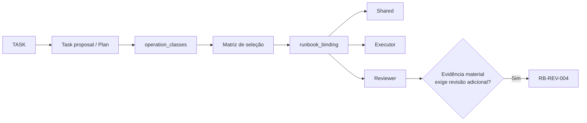
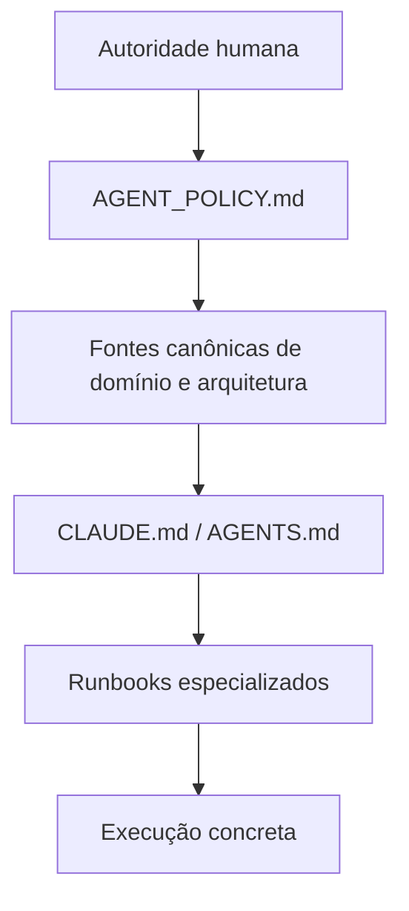
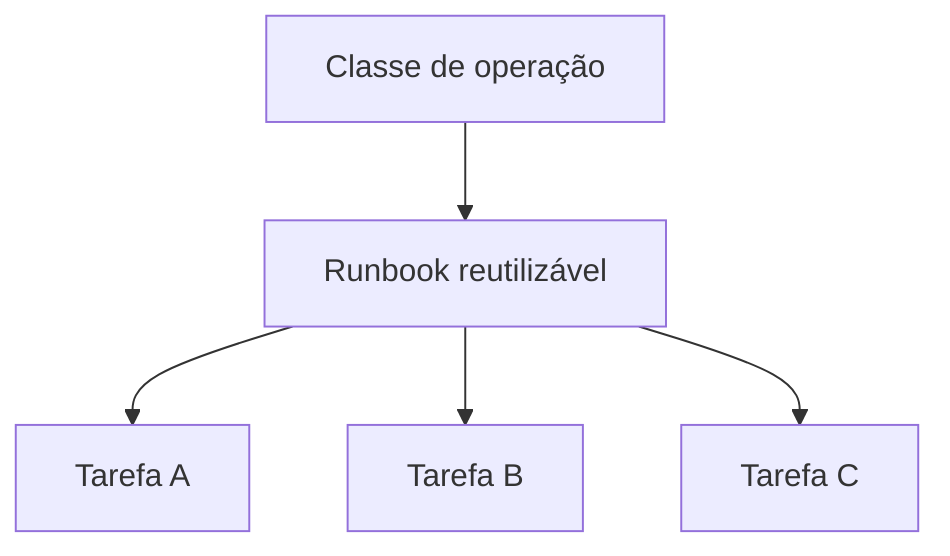

# Biblioteca de runbooks — CEPRAEA BEACH PRO

## Objetivo

Esta biblioteca define procedimentos especializados por classe de operação para o fluxo
[Human-Governed Dual-Agent SDLC do CEPRAEA BEACH PRO](../docs/arquiteturas/multi-agentes/Human-Governed%20Dual-Agent%20SDLC%20Architecture.md).

Os runbooks complementam as políticas permanentes (`AGENT_POLICY.md`, `CLAUDE.md`, `AGENTS.md`) e o enforcement técnico do Dev Container.

## Matriz de seleção

| `operation_class` | Executor | Reviewer |
| --- | --- | --- |
| `code_change` | [RB-EXEC-001](./executor/RB-EXEC-001-code-change.md) | [RB-REV-001](./reviewer/RB-REV-001-code-review.md) |
| `database_change` | [RB-EXEC-002](./executor/RB-EXEC-002-database-change.md) | [RB-REV-002](./reviewer/RB-REV-002-database-review.md) |
| `documentation_change` | [RB-EXEC-003](./executor/RB-EXEC-003-documentation-change.md) | [RB-REV-003](./reviewer/RB-REV-003-documentation-review.md) |
| `dependency_change` | [RB-EXEC-004](./executor/RB-EXEC-004-dependency-change.md) | [RB-REV-005](./reviewer/RB-REV-005-dependency-review.md) |

### Runbook complementar de revisão

`RB-REV-004-evidence-review.md` DEVE ser carregado adicionalmente quando a suficiência da evidência for material para os critérios de aceite ou para a revisão independente.

| Condição | Runbook adicional |
| --- | --- |
| Evidência material exige verificação independente adicional | [RB-REV-004](./reviewer/RB-REV-004-evidence-review.md) |

## Estrutura

```text
runbooks/
├── README.md
├── shared/
│   ├── RB-SHARED-001-repository-baseline.md
│   ├── RB-SHARED-002-evidence.md
│   └── RB-SHARED-003-failure-states.md
├── executor/
│   ├── RB-EXEC-001-code-change.md
│   ├── RB-EXEC-002-database-change.md
│   ├── RB-EXEC-003-documentation-change.md
│   └── RB-EXEC-004-dependency-change.md
└── reviewer/
    ├── RB-REV-001-code-review.md
    ├── RB-REV-002-database-review.md
    ├── RB-REV-003-documentation-review.md
    ├── RB-REV-004-evidence-review.md
    └── RB-REV-005-dependency-review.md
```

## Seleção de runbooks

Uma tarefa DEVE carregar exclusivamente os runbooks aplicáveis às classes de operação declaradas em seu `runbook_binding`.

A classe da operação determina os procedimentos especializados aplicáveis.

O `runbooks/README.md` funciona como catálogo normativo de seleção.

O `runbook_binding` da tarefa registra a seleção concreta para aquela execução.



### Exemplo

Para uma tarefa que altere uma constraint de `memberships`, a classe de operação é:

```text
database_change
```

O `runbook_binding` correspondente pode ser:

```json
{
  "runbook_binding": {
    "operation_classes": [
      "database_change"
    ],
    "applicable_runbooks": {
      "shared": [
        "runbooks/shared/RB-SHARED-002-evidence.md",
        "runbooks/shared/RB-SHARED-003-failure-states.md"
      ],
      "executor": [
        "runbooks/executor/RB-EXEC-002-database-change.md"
      ],
      "reviewer": [
        "runbooks/reviewer/RB-REV-002-database-review.md"
      ]
    }
  }
}
```

O Executor carrega:

- `AGENT_POLICY.md`;
- `CLAUDE.md`;
- os runbooks `shared` declarados no `runbook_binding`;
- os runbooks `executor` declarados no `runbook_binding`;
- a normativa pertinente de `docs/modelagem/`;
- fontes controladas designadas pela tarefa ou pela normativa aplicável.

O Reviewer carrega:

- `AGENT_POLICY.md`;
- `AGENTS.md`;
- os runbooks `shared` declarados no `runbook_binding`;
- os runbooks `reviewer` declarados no `runbook_binding`;
- a normativa pertinente;
- o `git diff`;
- as evidências materiais aplicáveis.

Quando a suficiência das evidências for material, o binding DEVE acrescentar:

```json
{
  "reviewer": [
    "runbooks/reviewer/RB-REV-002-database-review.md",
    "runbooks/reviewer/RB-REV-004-evidence-review.md"
  ]
}
```

## Precedência

Os runbooks respeitam a autoridade das camadas superiores.



Uma instrução de runbook possui validade exclusivamente dentro da autoridade concedida pelas fontes superiores.

Quando uma contradição material impedir uma execução inequívoca:

- o Executor DEVE finalizar com `BLOCKED`;
- o Reviewer DEVE emitir `HUMAN_DECISION_REQUIRED`.

## Critério para criação de novos runbooks

Um novo runbook DEVERIA ser criado quando uma classe de operação possuir uma ou mais destas características:

- recorrência;
- risco material;
- procedimento especializado;
- decisões condicionais recorrentes;
- validações específicas;
- requisitos próprios de evidência;
- necessidade observável de consistência entre execuções.

Uma classe de operação DEVERIA reutilizar o mesmo runbook em todas as tarefas semanticamente compatíveis.



## Estrutura mínima de um runbook especializado

Cada runbook DEVERIA utilizar as seguintes seções:

1. **Objetivo** — classe de operação governada.
2. **Aplicabilidade** — condições objetivas para selecionar o runbook.
3. **Entradas** — entradas necessárias exclusivamente.
4. **Fontes de autoridade** — fontes que governam a operação.
5. **Pré-condições** — estado necessário para iniciar.
6. **Escopo operacional** — caminhos, recursos e ações autorizados.
7. **Procedimento** — sequência obrigatória quando a ordem for significativa.
8. **Pontos de decisão** — condições observáveis para desvios de fluxo.
9. **Validações** — checks determinísticos aplicáveis.
10. **Evidências** — evidências necessárias para propriedades materiais.
11. **Handoff** — saída destinada ao próximo papel.
12. **Estados de saída** — exclusivamente os estados do papel correspondente.
13. **Referências** — caminhos relativos para as fontes aplicáveis.
