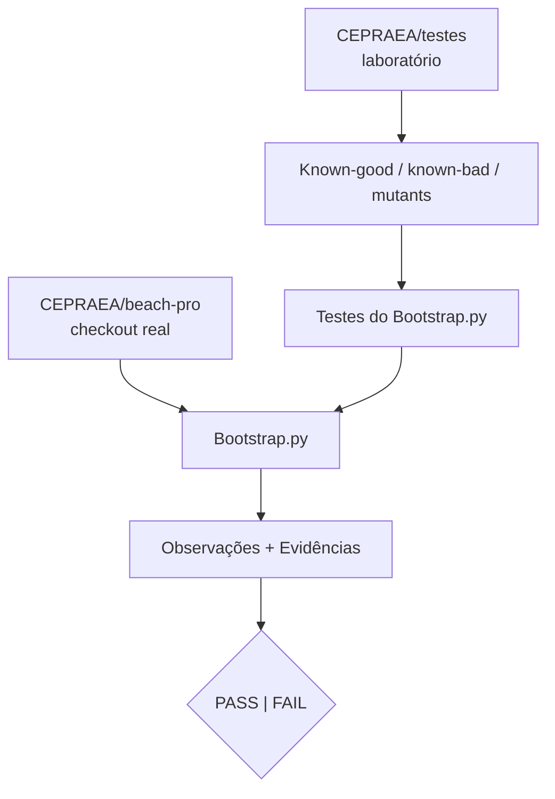
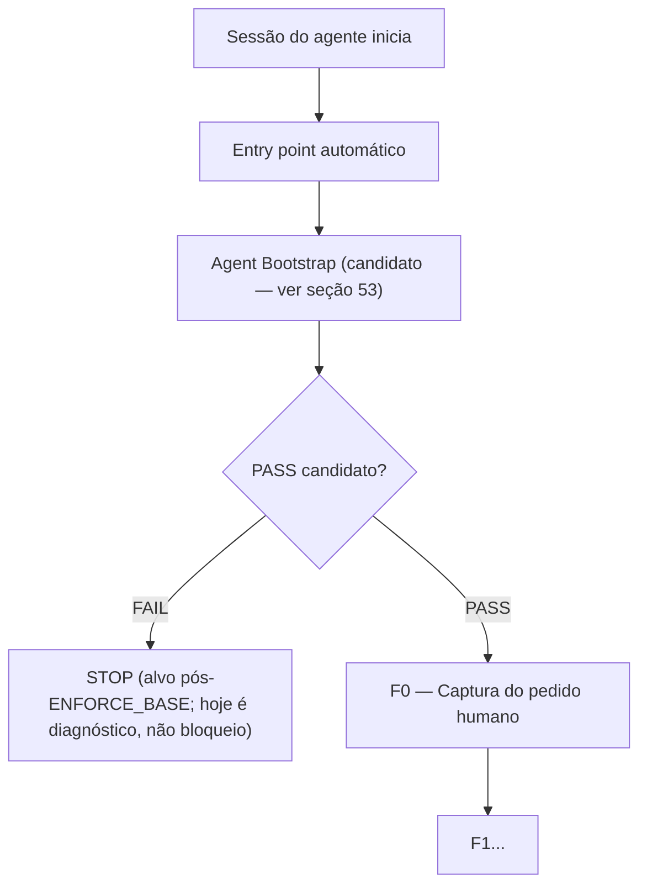
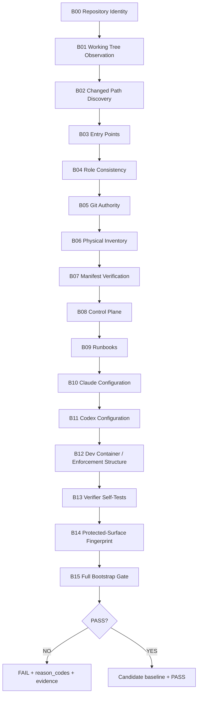
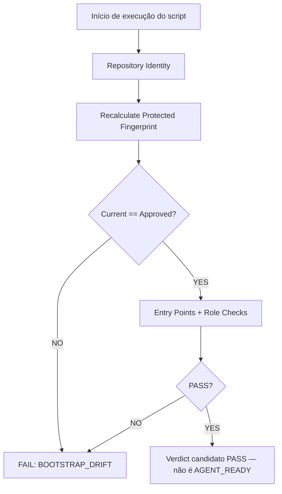
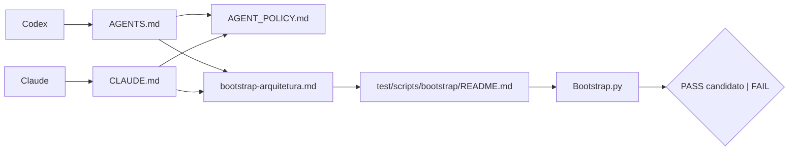
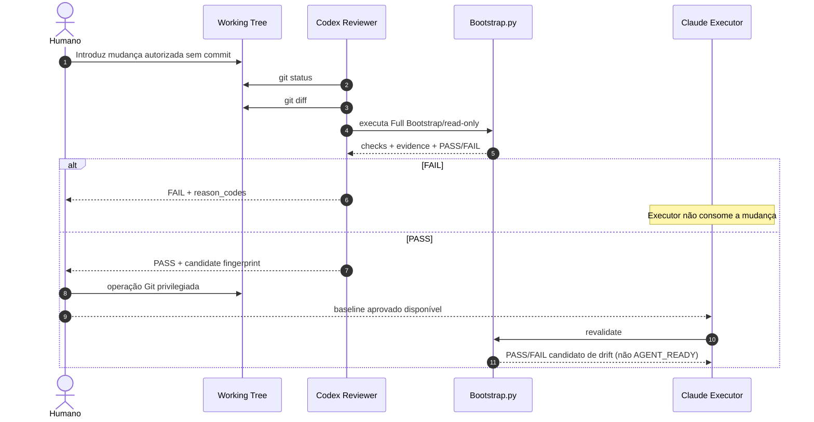
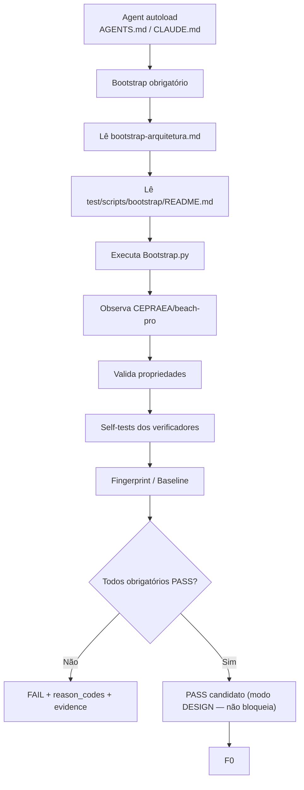

# Bootstrap dos Agentes — Especificação do `Bootstrap.py`

> Status: **CANDIDATE / NOT VERIFIED**  
> Modo operacional: **DESIGN** (não `OBSERVE` nem `ENFORCE` — a Fase 2, "Controlador
> mínimo", ainda não existe; ver [bootstrap-arquitetura.md §17](../../../docs/arquiteturas/multi-agentes/bootstrap/bootstrap-arquitetura.md) e seção 53)<br>
> Script alvo: `test/scripts/bootstrap/Bootstrap.py`  
> README canônico do script: `test/scripts/bootstrap/README.md`  
> **Fonte normativa da arquitetura de bootstrap:** [`bootstrap-arquitetura.md`](../../../docs/arquiteturas/multi-agentes/bootstrap/bootstrap-arquitetura.md) (corrigido em 2026-08-21 — este README citava `.ai/AGENT_BOOTSTRAP.md`, arquivo que nunca existiu neste repositório; ver changelog no fim deste documento)<br>
> Sistema real verificado: `CEPRAEA/beach-pro`  
> Laboratório de verificação do próprio script: `CEPRAEA/testes`  
> Regra epistemológica: **NO EVIDENCE → NO PASS**
>
> **Este script não é o controlador nem o gateway exigidos pela arquitetura normativa.**
> Ele não roda fora do controle do modelo (`DEC-BOOT-001`), não produz manifesto de sessão
> protegido (`DEC-BOOT-002`), não é mediado por gateway (`DEC-BOOT-004`) e não calcula
> capacidades (`DEC-BOOT-007`). Um `PASS` deste script é evidência candidata para um
> controlador que ainda não existe — nunca autorização por si só. Ver seção 53.

---

## 1. Objetivo

Este documento especifica como o `Bootstrap.py` deve ser implementado, executado e validado.

O objetivo do script é responder, por observação direta do checkout local:

```text
"O agente está operando no CEPRAEA BEACH PRO real,
sob a governança, o control plane, as permissões,
os validadores e o baseline esperados,
com evidência suficiente para um controlador externo considerar isto um candidato válido?"
```

Nota (2026-08-21): a formulação original desta pergunta terminava em "permitir AGENT_READY" —
este script não concede `AGENT_READY`; ver seção 53.

O `Bootstrap.py` não é um instalador, não é um migrador, não é um gerador de documentação e não é uma TASK do produto.

Ele é um **verificador determinístico, read-only e fail-closed** do estado necessário para iniciar o trabalho agêntico.

---

## 2. Regra fundamental de direção

O objeto real de validação é:

```text
CEPRAEA/beach-pro
```

O repositório `CEPRAEA/testes` não pode substituir o estado real do produto.

A relação correta é:



Formalmente:

```text
ProductionBootstrapPass
≠
TestRepositoryLooksCorrect
```

E:

```text
ProductionBootstrapPass
=
AllRequiredChecks(
  observed_directly_on_local_CEPRAEA_beach_pro
)
match
PredeclaredOracles
```

---

## 3. Por que o bootstrap deve acontecer antes de F0

**Nota (2026-08-21):** o fluxo abaixo é o **comportamento-alvo** depois que este bootstrap for
promovido a `ENFORCE_BASE` (`bootstrap-arquitetura.md §17`/`DEC-BOOT-012`). Enquanto
`operational_mode=DESIGN` (estado atual — ver cabeçalho e seção 53), `FAIL` aqui **não**
interrompe F0: é diagnóstico. Existem, separadamente, guards do devcontainer
(`.devcontainer/guards/pretool`) e políticas em `AGENT_POLICY.md`/`CLAUDE.md` que impõem
restrições próprias — mas isso é **outro mecanismo**, não o bootstrap descrito neste
documento, e este README não afirma tê-los verificado por testes de capability
(`bootstrap-arquitetura.md §6`: `CONFIG_DECLARED ≠ CONFIG_EFFECTIVE` — declaração não é
prova). Ver seção 53 antes de tratar "STOP" abaixo como comportamento em vigor.

O `Task Lifecycle` não pode começar sem que o agente prove que está no ambiente correto.



Formalmente:

```text
F0 ≠ AGENT_BOOTSTRAP
```

O bootstrap responde:

```text
"O agente pode começar uma TASK?"
```

F0 responde:

```text
"Qual foi exatamente a entrada humana da TASK?"
```

Misturar os dois produziria circularidade: o ambiente teria de confiar em uma TASK antes de provar que é seguro processar TASKs.

---

## 4. Princípios normativos

### 4.1 Observação antes de declaração

```text
OBSERVED_REPOSITORY
→ compare
→ DECLARED_MANIFEST
```

Nunca:

```text
MANIFEST
→ assume
→ REPOSITORY
```

### 4.2 Fail-closed

**Corrigido em 2026-08-21** (ver changelog): a versão anterior desta seção reduzia todo
resultado externo a `PASS`/`FAIL`, com qualquer indisponibilidade de ferramenta ou lacuna de
evidência colapsada em `FAIL` + `reason_code`. Isso perde informação que
`bootstrap-arquitetura.md §6` exige distinguir — em especial, uma ferramenta indisponível não é
o mesmo que uma configuração inválida, e tratá-las como idênticas dificulta diagnóstico e
recuperação.

Por check individual, os resultados possíveis são:

```text
PASS
FAIL
NOT_APPLICABLE
UNAVAILABLE
ERROR
```

`UNAVAILABLE` não pode ser convertido automaticamente em `PASS` — mas também não deve ser
confundido com `FAIL` quando a causa é puramente a ausência de uma ferramenta (ex.: Node.js
não encontrado), sem que exista, adicionalmente, uma configuração observável e inválida.

O `verdict` agregado do modo `full` continua binário (`PASS` somente se todos os checks
obrigatórios forem `PASS`) — este é o **veredito candidato** deste script (`candidate_verdict`,
conceitualmente; a chave no JSON de saída permanece `verdict`, ver §31). **Não é**
`session.final_state` da arquitetura — esse campo só é calculado pelo controlador, que não
existe nesta implantação (ver seção 53). Não confundir os dois: `verdict` aqui é evidência
candidata por check, `session.final_state` é a decisão final de autorização, de outra camada.

### 4.3 Ausência de prova não é sucesso

```text
NO EVIDENCE → NO PASS
```

### 4.4 O script não corrige o ambiente

```text
OBSERVE
VALIDATE
REPORT
```

Não:

```text
OBSERVE
MODIFY
RETRY
DECLARE PASS
```

### 4.5 O script não modifica o próprio oráculo

```text
O AGENTE PODE TESTAR O ORÁCULO.
O AGENTE NÃO PODE EDITAR O ORÁCULO.
```

---

## 5. Invariante de não mutação

Durante uma execução normal:

```text
Δ(CEPRAEA/beach-pro) = ∅
```

O script não pode executar operações Git mutativas, incluindo:

```text
git add
git commit
git push
git pull
git merge
git rebase
git cherry-pick
git reset
git restore
git checkout
git switch
git stash
git clean
git update-ref
```

Nem pode editar arquivos do repositório.

A execução deve comparar o estado Git antes e depois.

Propriedade:

```text
PostBootstrapGitState
=
PreBootstrapGitState
+
PreExistingUserChanges
```

Qualquer mutação introduzida pelo script:

```text
FAIL
reason_code = BOOTSTRAP_MUTATED_REPOSITORY
```

---

## 6. Repositório esperado

O script deve descobrir a raiz real através de Git.

Mecanismos candidatos:

```bash
git rev-parse --show-toplevel
git remote get-url origin
git branch --show-current
git rev-parse HEAD
git status --porcelain=v1 --untracked-files=all
```

O diretório atual (`cwd`) não é autoridade.

O script deve funcionar quando executado a partir de qualquer subdiretório pertencente ao checkout.

### 6.1 Identidade canônica

Identidade esperada:

```text
owner = cepraea
repository = beach-pro
```

Devem ser normalizadas representações válidas de remote, por exemplo:

```text
https://github.com/cepraea/beach-pro.git
git@github.com:cepraea/beach-pro.git
ssh://git@github.com/cepraea/beach-pro.git
```

para:

```text
cepraea/beach-pro
```

Se o remote resolver para `cepraea/testes` ou qualquer outro repositório:

```text
FAIL
reason_code = WRONG_REPOSITORY
```

---

## 7. Modos do script

A implementação deve prever dois modos conceituais.

### 7.1 `full`

Executa todas as verificações necessárias para estabelecer ou restabelecer um baseline confiável.

```bash
python3 test/scripts/bootstrap/Bootstrap.py full
```

### 7.2 `revalidate`

Executa o conjunto reduzido necessário antes de uma TASK quando já existe baseline aprovado.

```bash
python3 test/scripts/bootstrap/Bootstrap.py revalidate
```

A interface definitiva pode mudar, mas os dois comportamentos não podem ser confundidos.

---

## 8. Fluxo geral do Full Bootstrap



A numeração pode ser refinada posteriormente, mas a cobertura das propriedades não pode ser reduzida por renumeração.

---

## 9. B00 — Repository Identity

### 9.1 Objetivo

Provar que o script está observando o checkout correto.

### 9.2 Dados mínimos

```text
repo_root
remote_raw
remote_canonical
branch
HEAD
git_dir
working_tree
```

### 9.3 Gate

```text
RepositoryIdentityPass
⇔
remote_canonical = "cepraea/beach-pro"
AND repo_root is valid git worktree
AND HEAD is resolvable
```

### 9.4 Falhas

```text
WRONG_REPOSITORY
NOT_A_GIT_REPOSITORY
HEAD_UNRESOLVABLE
REMOTE_UNRESOLVABLE
```

---

## 10. B01 — Working Tree Observation

### 10.1 Objetivo

Registrar o estado real antes de interpretar qualquer alteração.

### 10.2 Comandos candidatos

```bash
git status --porcelain=v1 --untracked-files=all
git diff --name-status
git diff --cached --name-status
```

### 10.3 Classificações mínimas

```text
ADDED
MODIFIED
DELETED
RENAMED
UNTRACKED
STAGED
UNSTAGED
```

### 10.4 Regra

```text
DIRTY_WORKTREE
≠
AUTOMATIC_FAIL
```

O script deve preservar a informação e permitir que gates posteriores distingam:

```text
pre-existing change
task change
protected-surface change
unknown change
```

Não deve apagar, esconder nem restaurar a sujeira.

---

## 11. B02 — Changed Path Discovery

Construir:

```text
OBSERVED_CHANGED_PATHS
```

A fonte é Git/filesystem.

Não são fontes válidas:

```text
README
manifest
handoff
mensagem do agente
resumo humano
```

Cada path deve receber, no mínimo:

```text
path
git_status
tracked
staged
unstaged
untracked
```

---

## 12. B03 — Entry Points dos agentes

O CEPRAEA BEACH PRO possui como entrypoints esperados:

```text
AGENT_POLICY.md
CLAUDE.md
AGENTS.md
```

O script deve verificar:

```text
exists
is_file
readable
non_empty
```

Quando o Bootstrap Entry Contract estiver implantado, também deve verificar que:

```text
CLAUDE.md
→ declara bootstrap obrigatório
→ referencia docs/arquiteturas/multi-agentes/bootstrap/bootstrap-arquitetura.md
→ exige PASS candidato antes de F0 quando operational_mode=ENFORCE_BASE
  (hoje, em DESIGN, é diagnóstico — não bloqueio; ver seção 53)

AGENTS.md
→ declara bootstrap obrigatório
→ referencia docs/arquiteturas/multi-agentes/bootstrap/bootstrap-arquitetura.md
→ exige bootstrap antes do review/trabalho (mesma ressalva de DESIGN acima)
```

O bootstrap completo não deve ser copiado para os entrypoints.

Os entrypoints contêm apenas o contrato mínimo de inicialização.

---

## 13. B04 — Coerência de papéis

Invariantes:

```text
Role(Claude) = EXECUTOR
Role(Codex) = REVIEWER
EXECUTOR ≠ REVIEWER
Human = privileged authority
```

O script deve detectar conflitos entre:

```text
AGENT_POLICY.md
CLAUDE.md
AGENTS.md
```

Exemplos de falha:

```text
CLAUDE.md declares REVIEWER
AGENTS.md declares EXECUTOR
policy contradicts role
```

Resultado:

```text
FAIL
reason_code = ROLE_CONFLICT
```

---

## 14. B05 — Autoridade Git

### 14.1 Política declarada

O script deve verificar que a governança documenta a separação entre:

```text
READ-ONLY GIT INSPECTION
```

e:

```text
HUMAN-PRIVILEGED GIT MUTATION
```

Operações de inspeção esperadas:

```text
status
diff
log
show
rev-parse
ls-files
```

Operações privilegiadas esperadas:

```text
add
commit
push
pull
merge
rebase
cherry-pick
reset
restore
checkout
switch
worktree
stash
clean
update-ref
```

### 14.2 Enforcement efetivo

A simples presença da regra textual não produz PASS de enforcement.

```text
CONFIG_DECLARED ≠ CONFIG_EFFECTIVE
```

O comportamento real deve ser verificado por probes seguras quando disponíveis.

---

## 15. B06 — Inventário físico

O script deve construir inventário do checkout real antes de ler o manifesto como declaração de verdade.

Estrutura mínima por registro:

```json
{
  "path": "AGENT_POLICY.md",
  "kind": "file",
  "tracked": true,
  "size_bytes": 3462,
  "sha256": "..."
}
```

Diretórios podem ser registrados sem hash de conteúdo, ou por hash canônico de inventário, desde que a regra seja explícita e determinística.

A ordenação deve ser canônica.

---

## 16. B07 — Manifest Verification

Manifesto esperado:

```text
manifest.json
```

O script deve:

```text
1. validar sintaxe JSON;
2. verificar estrutura mínima;
3. obter assets declarados;
4. comparar cada asset material com inventário observado;
5. reportar divergências.
```

Checks mínimos:

```text
declared path exists
declared type matches
active asset is present
duplicate path declaration does not exist
required consumer values are recognized
critical undeclared artifact is not silently accepted when policy forbids it
```

Princípio:

```text
MANIFEST_CLAIM ≠ REPOSITORY_FACT
```

---

## 17. B08 — Control Plane

Superfície atualmente conhecida:

```text
.ai/control/task-proposal.schema.json
.ai/control/validate-task-proposal.mjs
.ai/control/verification-plan.schema.json
```

O script deve verificar:

```text
exists
readable
correct file type
syntax valid
references resolve
validator runtime available
schema version supported
```

### 17.1 Proibição

O script não pode modificar `.ai/control/**`.

Invariante:

```text
Δ(.ai/control/**) = ∅
```

---

## 18. Capacidade do Task Proposal — não a instância da TASK

O Agent Bootstrap acontece antes de F0.

Portanto ele não deve exigir uma `task_proposal` concreta da TASK atual.

Deve provar somente:

```text
TaskProposalValidationCapability = PASS
```

Isto significa:

```text
schema exists
validator exists
validator can run
known-good accepted
known-bad rejected
```

Não:

```text
CurrentTaskProposal = PASS
```

A instância concreta pertence ao Task Lifecycle.

---

## 19. B09 — Runbook Catalog

Catálogo esperado:

```text
runbooks/README.md
```

Classes atualmente previstas:

```text
code_change
database_change
documentation_change
dependency_change
```

O script deve validar:

```text
catalog exists
declared paths exist
shared runbooks resolve
executor runbooks resolve
reviewer runbooks resolve
no dangling path
no conflicting duplicate binding
```

O script não escolhe o runbook de uma TASK concreta durante o bootstrap.

Ele valida a **capacidade de resolução do catálogo**.

---

## 20. B10 — Configuração Claude Code

Superfície conhecida:

```text
.devcontainer/control-plane/claude-managed-settings.json
.devcontainer/control-plane/claude-managed-mcp.json
```

Checks estruturais mínimos:

```text
JSON valid
allowManagedHooksOnly = expected
allowManagedPermissionRulesOnly = expected
disableBypassPermissionsMode = expected
critical deny rules exist
hooks exist
hook commands resolve
MCP managed file parses
```

Exemplos de deny críticos:

```text
sudo
docker
git add
git commit
git push
git pull
git merge
git rebase
git cherry-pick
git reset
git restore
git checkout
git switch
git worktree
git clean
git stash
git update-ref
```

A lista definitiva deve vir da política aprovada, não ficar duplicada sem controle.

---

## 21. B11 — Configuração Codex Reviewer

Superfícies conhecidas:

```text
.codex/config.toml
.devcontainer/control-plane/codex-requirements.toml
```

Propriedades esperadas:

```text
Reviewer project access = read-only
temporary writable surface = only explicitly allowed temp locations
network = disabled or according to approved contract
approval policy = approved value
managed hooks requirement = approved value
remote control = disabled
```

O script deve distinguir:

```text
project-level declaration
```

de:

```text
effective managed requirement
```

Se a configuração estrutural existir, mas o enforcement efetivo não puder ser comprovado:

```text
FAIL
reason_code = ENFORCEMENT_UNVERIFIED
```

quando essa prova for obrigatória para o gate.

---

## 22. B12 — Dev Container e enforcement structure

Superfícies relevantes conhecidas:

```text
.devcontainer/Dockerfile
.devcontainer/devcontainer.json
.devcontainer/control-plane/
.devcontainer/guards/
.devcontainer/reviewer/
.devcontainer/scripts/
```

Checks:

```text
required paths exist
devcontainer JSON parses
referenced scripts exist
referenced configs exist
guard entrypoints resolve
control-plane files resolve
reviewer configuration resolves
```

O bootstrap não deve executar rebuild automaticamente.

```text
BOOTSTRAP ≠ DEVCONTAINER REBUILD
```

---

## 23. Conflitos de autoridade

O script deve detectar inconsistências entre:

```text
policy
agent entrypoints
manifest
runbooks
control-plane config
effective enforcement
```

Exemplo:

```text
Expected:
AgentWriteAuthority(".ai/control/**") = FALSE

Observed policy:
explicit-task exception allows agent mutation

Result:
FAIL
reason_code = AUTHORITY_CONFLICT
```

Nenhuma camada inferior pode ampliar silenciosamente a autoridade concedida por uma camada superior.

---

## 24. B13 — Verifier Self-Tests

Todo verificador crítico precisa ser testado com fixtures cujo resultado esperado seja previamente conhecido.

| Expected | Observed | Resultado |
| --- | --- | --- |
| ACCEPT | ACCEPT | PASS |
| REJECT | REJECT | PASS |
| ACCEPT | REJECT | FAIL |
| REJECT | ACCEPT | FAIL |

Classes mínimas:

```text
KNOWN_GOOD
KNOWN_BAD
BOUNDARY
MUTANT_CRITICAL
```

Exemplos para Task Proposal:

```text
canonical example → ACCEPT
missing required field → REJECT
invalid enum → REJECT
unknown forbidden property → REJECT
broken cross-field invariant → REJECT
```

As mutations devem ocorrer fora do produto, preferencialmente:

```text
/tmp/cepraea-bootstrap-*/
```

O script copia a entrada real, gera a fixture temporária e executa o verificador real.

---

## 25. Effective Enforcement Validation

Validação estrutural não basta.

O script deve verificar, quando seguro:

```text
allowed operation → succeeds
forbidden operation → is blocked
```

### Reviewer

```text
read repository → ACCEPT
write repository → REJECT
write /tmp → ACCEPT
```

### Executor

```text
git status → ACCEPT
git diff → ACCEPT
git commit → REJECT
git push → REJECT
sudo → REJECT
docker → REJECT
```

O script não deve realizar probe destrutiva contra o produto.

Se uma prova comportamental obrigatória não puder ser realizada de forma segura:

```text
FAIL
reason_code = ENFORCEMENT_UNVERIFIED
```

---

## 26. B14 — Protected Surface

O Bootstrap deve definir explicitamente quais arquivos determinam sua confiança.

Superfície candidata:

```text
AGENT_POLICY.md
CLAUDE.md
AGENTS.md
manifest.json
runbooks/README.md

docs/arquiteturas/multi-agentes/bootstrap/bootstrap-arquitetura.md

.ai/control/task-proposal.schema.json
.ai/control/validate-task-proposal.mjs
.ai/control/verification-plan.schema.json

.codex/config.toml

.devcontainer/devcontainer.json
.devcontainer/control-plane/claude-managed-settings.json
.devcontainer/control-plane/claude-managed-mcp.json
.devcontainer/control-plane/codex-requirements.toml
.devcontainer/control-plane/gitconfig-agent

test/scripts/bootstrap/Bootstrap.py
```

A lista final deve ser aprovada explicitamente.

Não adicionar arquivos ao fingerprint apenas porque existem.

Cada inclusão precisa responder:

```text
"Que risco material deixa de ser detectado se este artefato não estiver no fingerprint?"
```

---

## 27. Fingerprint

Para cada arquivo protegido:

```text
sha256(file_bytes)
```

Depois construir registros canônicos:

```json
{
  "path": ".ai/control/task-proposal.schema.json",
  "sha256": "...",
  "size_bytes": 17720
}
```

Ordenar por `path`.

Serializar canonicamente.

Então:

```text
BootstrapFingerprint
=
SHA256(CanonicalProtectedSurfaceRecords)
```

Requisitos:

```text
same bytes → same fingerprint
different protected bytes → different fingerprint
path identity participates
ordering is deterministic
```

O script produz:

```text
candidate_fingerprint
```

O script não possui autoridade para aprová-lo.

---

## 28. Baseline

O baseline aprovado deve representar, no mínimo:

```text
repository identity
approved HEAD/base
protected-surface fingerprint
schema versions
validator identities/hashes
manifest identity/hash
review verdict
evidence references
```

O local e o schema definitivos do baseline ainda devem ser definidos fora deste README antes da implementação final.

O script não pode inventar um armazenamento de baseline silenciosamente.

---

## 29. `revalidate`

**Corrigido em 2026-08-21** (ver changelog): a versão anterior desta seção terminava com
`AGENT_READY = PASS` como consequência direta do modo `revalidate`. Isso confundia três
responsabilidades distintas que `bootstrap-arquitetura.md §2` separa explicitamente:

1. **renovação/expiração de sessão** — pertence ao controlador (`DEC-BOOT-005`), que ainda
   não existe nesta implantação;
2. **detecção de drift do plano de controle** — é o que este script pode de fato calcular
   (fingerprint da superfície protegida contra baseline aprovado);
3. **preflight anterior a uma operação** — pertence ao gateway (`DEC-BOOT-004`, `§2` da
   arquitetura), não a este script.

`revalidate`, neste script, cobre apenas o item 2: recalcular o fingerprint candidato e
compará-lo contra o baseline aprovado. Não concede `AGENT_READY` nem qualquer autorização —
produz `PASS`/`FAIL` de drift, evidência candidata para o controlador.



Mínimo:

```text
repository identity
baseline exists
fingerprint equality
role consistency
entrypoint availability
critical validator capability
critical enforcement status when required
```

Divergência:

```text
FAIL
reason_code = BOOTSTRAP_DRIFT
```

e exige Full Bootstrap. Nota: no `Bootstrap.py` atual, `revalidate` ainda é um stub — a
comparação de fingerprint (B14) e o baseline (§28) não estão implementados; ver Definition of
Done (§49, item 18-19).

---

## 30. `FullBootstrapCandidatePass` (antes: "`AGENT_READY`")

**Corrigido em 2026-08-21** (ver changelog): esta seção antes definia uma fórmula chamada
`AGENT_READY` e tratava seu `PASS` como suficiente para liberar F0. Isso é exatamente a
discordância CRITICAL identificada contra `bootstrap-arquitetura.md`: pela arquitetura
normativa, **nenhuma ferramenta protegida é liberada porque um script afirmou PASS** — a
liberação só ocorre quando um verificador externo (controlador) valida um manifesto de sessão
ligado à sessão atual (`DEC-BOOT-001`, `DEC-BOOT-002`). Este script não é esse verificador
externo: ele roda sob o mesmo processo/controle do agente que está sendo avaliado.

O bootstrap pré-F0 não deve depender da existência de uma Task Proposal concreta — isso
continua válido e não muda.

O que este script pode legitimamente produzir é um veredito **candidato**, cujo nome foi
corrigido para deixar claro que não é autorização:

```text
FullBootstrapCandidatePass ⇔

RepositoryIdentity = PASS
AND EntryPoints = PASS
AND RoleConsistency = PASS
AND GitAuthority = PASS
AND PhysicalInventory = PASS
AND ManifestVerification = PASS
AND ControlPlaneCapability = PASS
AND RunbookCatalogCapability = PASS
AND ClaudeConfiguration = PASS
AND CodexConfiguration = PASS
AND DevContainerStructure = PASS
AND VerifierSelfTests = PASS
AND EffectiveEnforcement = PASS
AND ProtectedSurfaceIntegrity = PASS
AND BaselineMatch = PASS
AND RepositoryMutationCount = 0
```

`FullBootstrapCandidatePass = true` **não** implica `session.final_state = READY`
(`bootstrap-arquitetura.md §3`). Faltam, no mínimo: identidade forte de sessão vinculada a
processo/boot/container (`DEC-BOOT-005`), manifesto protegido root-owned (`DEC-BOOT-002`),
cálculo de capacidades pelo controlador (`DEC-BOOT-007`) e mediação por gateway
(`DEC-BOOT-004`) — nenhum desses existe nesta implantação. Ver seção 53 para o que este script
não é.

A fórmula final deve ser sincronizada com
[`bootstrap-arquitetura.md`](../../../docs/arquiteturas/multi-agentes/bootstrap/bootstrap-arquitetura.md)
(fonte normativa — `.ai/AGENT_BOOTSTRAP.md` nunca existiu neste repositório).

---

## 31. Output machine-readable

O script deve produzir saída estruturada.

Formato lógico mínimo:

```json
{
  "schema_version": "1.0",
  "mode": "full",
  "repository": {
    "root": "/workspace/cepraea-beach-pro",
    "remote": "cepraea/beach-pro",
    "branch": "task/example",
    "head": "0123456789abcdef"
  },
  "checks": [
    {
      "check_id": "B00-REPOSITORY-IDENTITY",
      "expected": "cepraea/beach-pro",
      "observed": "cepraea/beach-pro",
      "result": "PASS",
      "evidence": []
    }
  ],
  "reason_codes": [],
  "candidate_fingerprint": null,
  "repository_mutations": 0,
  "verdict": "PASS"
}
```

Requisitos:

```text
all mandatory checks represented
no silent skipped check
skipped mandatory check => FAIL
machine-readable result
human-readable summary may coexist
```

---

## 32. Exit codes

Convenção recomendada:

```text
0 = PASS
1 = FAIL
2 = invocation/configuration error that is externally still FAIL
```

Independentemente do exit code detalhado:

```text
anything other than verified PASS
→ this script's output must not be treated as authorization by any consumer
→ (this script never grants AGENT_READY — see section 53)
```

---

## 33. Reason codes

Catálogo inicial:

```text
WRONG_REPOSITORY
NOT_A_GIT_REPOSITORY
REMOTE_UNRESOLVABLE
HEAD_UNRESOLVABLE
ENTRYPOINT_MISSING
BOOTSTRAP_TRIGGER_MISSING
ROLE_CONFLICT
AUTHORITY_CONFLICT
MANIFEST_INVALID
MANIFEST_MISSING_PATH
CONTROL_PLANE_MISSING
CONTROL_PLANE_INVALID
VALIDATOR_UNAVAILABLE
VERIFIER_FALSE_NEGATIVE
VERIFIER_FALSE_POSITIVE
RUNBOOK_REFERENCE_BROKEN
CLAUDE_CONFIG_INVALID
CODEX_CONFIG_INVALID
DEVCONTAINER_CONFIG_INVALID
ENFORCEMENT_UNVERIFIED
ENFORCEMENT_BYPASS
PROTECTED_SURFACE_DRIFT
BOOTSTRAP_DRIFT
BOOTSTRAP_MUTATED_REPOSITORY
MISSING_EVIDENCE
MANDATORY_CHECK_NOT_EXECUTED
BOOTSTRAP_SPEC_CONFLICT
```

O catálogo deve ser fechado por versão quando virar contrato normativo.

---

## 34. Evidência

Cada check material deve produzir evidência suficiente para reprodução.

Exemplos:

```text
command
exit_code
stdout digest
stderr digest
file path
file sha256
parsed observation
expected value
observed value
oracle result
```

Não é necessário armazenar verbatim dados sensíveis.

Evidência deve ser proporcional à propriedade verificada.

---

## 35. Segurança e dados sensíveis

O script não deve ler:

```text
.env
.env.*
secrets/**
credenciais
SSH private keys
AWS credentials
tokens
```

para “validar” segurança.

Ele deve verificar políticas e presença/ausência somente por mecanismos autorizados.

Não persistir segredos em logs ou JSON de resultado.

---

## 36. Relação com `bootstrap-arquitetura.md`

**Corrigido em 2026-08-21** (ver changelog): esta seção citava `.ai/AGENT_BOOTSTRAP.md` como
fonte normativa. Esse arquivo nunca existiu neste repositório — a referência estava quebrada
desde a criação deste README. A fonte normativa real e existente é
[`docs/arquiteturas/multi-agentes/bootstrap/bootstrap-arquitetura.md`](../../../docs/arquiteturas/multi-agentes/bootstrap/bootstrap-arquitetura.md).

Este README explica a implementação do script.

`bootstrap-arquitetura.md` define a arquitetura normativa do Agent Bootstrap — incluindo
propriedades que este README e o `Bootstrap.py` atual **ainda não satisfazem** (controlador,
gateway, manifesto de sessão protegido, capacidades — ver seção 53).

A relação deve ser:

```text
docs/arquiteturas/multi-agentes/bootstrap/bootstrap-arquitetura.md
        ↓ define
properties / gates / authority / estágio de promoção (DESIGN | OBSERVE | WARN | ENFORCE_*)
        ↓
test/scripts/bootstrap/README.md
        ↓ traduz para contrato de implementação, hoje só o que é executável em DESIGN
        ↓
test/scripts/bootstrap/Bootstrap.py
        ↓ executa
        ↓
evidence + PASS | FAIL | NOT_APPLICABLE | UNAVAILABLE | ERROR (por check)
        ↓
verdict candidato — NÃO é autorização (ver seção 30 e 53)
```

Nenhum dos três artefatos deve divergir materialmente.

Se divergirem:

```text
FAIL
reason_code = BOOTSTRAP_SPEC_CONFLICT
```

---

## 37. Relação com `AGENTS.md`, `CLAUDE.md` e `AGENT_POLICY.md`

Os entrypoints automáticos não devem conter toda esta especificação.

Devem conter o Bootstrap Entry Contract mínimo.



Mínimo que os entrypoints precisam garantir:

```text
bootstrap obrigatório
ler especificação
executar verificador candidato
PASS candidato obrigatório antes de F0 quando operational_mode=ENFORCE_BASE
  (não substitui autorização de um controlador externo, mesmo depois de promovido)
FAIL → STOP quando operational_mode=ENFORCE_BASE; hoje (DESIGN) FAIL é diagnóstico
não modificar superfície protegida
```

**Estado atual (2026-08-21):** `operational_mode=DESIGN` — nenhum dos itens acima que dependem
de `ENFORCE_BASE` está em vigor. Ver seção 53.

---

## 38. Relação com o Reviewer-first

Alterações do próprio bootstrap/control plane seguem fluxo especial.



---

## 39. O que pertence ao `CEPRAEA/testes`

`CEPRAEA/testes` é o laboratório do verificador.

Ele deve conter cenários como:

```text
wrong repo
missing AGENTS.md
missing CLAUDE.md
role conflict
broken manifest
missing control-plane file
invalid JSON
known-bad task proposal accepted
broken runbook reference
invalid Claude managed settings
invalid Codex requirements
fingerprint drift
repository mutation by verifier
```

Esses cenários comprovam sensibilidade do script.

Eles não substituem execução real no Beach Pro.

---

## 40. Testes obrigatórios do próprio `Bootstrap.py`

A quantidade final deve ser derivada das invariantes e classes de equivalência.

Conjunto mínimo inicial:

```text
BOOT-UT-001 correct repository → PASS identity
BOOT-UT-002 wrong repository → FAIL
BOOT-UT-003 non-git directory → FAIL
BOOT-UT-004 missing AGENTS.md → FAIL
BOOT-UT-005 missing CLAUDE.md → FAIL
BOOT-UT-006 missing AGENT_POLICY.md → FAIL
BOOT-UT-007 role conflict → FAIL
BOOT-UT-008 valid manifest → PASS
BOOT-UT-009 malformed manifest → FAIL
BOOT-UT-010 manifest active missing path → FAIL
BOOT-UT-011 control-plane complete → PASS
BOOT-UT-012 control-plane missing validator → FAIL
BOOT-UT-013 known-good validator fixture → ACCEPT
BOOT-UT-014 known-bad validator fixture → REJECT
BOOT-UT-015 known-bad accepted → FAIL verifier
BOOT-UT-016 runbook references resolve → PASS
BOOT-UT-017 dangling runbook path → FAIL
BOOT-UT-018 valid Claude settings → PASS
BOOT-UT-019 critical Claude deny missing → FAIL
BOOT-UT-020 valid Codex requirements → PASS
BOOT-UT-021 Codex writable workspace → FAIL
BOOT-UT-022 protected fingerprint stable → PASS
BOOT-UT-023 protected fingerprint drift → FAIL
BOOT-UT-024 bootstrap execution does not mutate repo → PASS
BOOT-UT-025 bootstrap mutates repo → FAIL
BOOT-UT-026 mandatory check skipped → FAIL
BOOT-UT-027 same protected state twice → same fingerprint
BOOT-UT-028 protected byte changed → different fingerprint
```

Esta lista é inicial, não teto.

---

## 41. Testes inválidos

Não considerar suficiente:

```text
"script executou sem exception"
"JSON conseguiu ser aberto"
"arquivo existe"
"agente disse que está read-only"
"manifesto diz que path existe"
"config possui palavra deny"
```

Esses testes não demonstram as propriedades completas.

---

## 42. Oracle requirements

Cada teste deve declarar:

```text
TEST_ID
TARGET_PROPERTY
FIXTURE
ACTION
EXPECTED_RESULT
ORACLE
OBSERVED_RESULT
PASS_CONDITION
FAIL_CONDITION
EVIDENCE
```

Sem `EXPECTED_RESULT + ORACLE`, o teste não está pronto.

---

## 43. Determinismo

A mesma entrada observável deve produzir:

```text
same check classifications
same canonical records
same fingerprint
same verdict
```

desconsiderando exclusivamente campos explicitamente não determinísticos e fora do gate, como timestamp informativo.

Não incluir timestamps dentro do fingerprint.

Não incluir paths absolutos dependentes de máquina dentro do fingerprint, salvo se deliberadamente parte da identidade.

---

## 44. Dependências

Preferir Python standard library para o bootstrap quando tecnicamente suficiente:

```text
argparse
dataclasses
hashlib
json
os
pathlib
subprocess
tempfile
tomllib
typing
```

Dependências externas só devem ser introduzidas quando houver propriedade impossível ou materialmente pior de verificar com standard library.

---

## 45. Arquitetura Python recomendada

Uma implementação clara pode separar:

```text
BootstrapRunner
RepositoryObserver
GitObserver
InventoryBuilder
ManifestVerifier
EntrypointVerifier
AuthorityVerifier
ControlPlaneVerifier
RunbookVerifier
ClaudeConfigVerifier
CodexConfigVerifier
DevcontainerVerifier
VerifierSelfTester
EnforcementVerifier
FingerprintBuilder
BaselineVerifier
ResultAggregator
```

Não é obrigatório usar classes.

O requisito é separação de responsabilidades e testabilidade.

---

## 46. Função pura onde possível

Preferir verificadores com assinatura conceitual:

```python
def verify_manifest(observed_inventory, manifest) -> CheckResult:
    ...
```

em vez de funções que leem globais, modificam arquivos, imprimem, executam Git e corrigem o próprio erro no mesmo bloco.

A observação do ambiente e a avaliação devem ser separadas sempre que possível.

---

## 47. Modelo de `CheckResult`

Estrutura recomendada:

```python
@dataclass(frozen=True)
class CheckResult:
    check_id: str
    expected: object
    observed: object
    result: Literal["PASS", "FAIL"]
    reason_codes: tuple[str, ...]
    evidence: tuple[EvidenceRef, ...]
```

O resultado final é composição de checks.

---

## 48. Gate final

O Full Bootstrap somente retorna `PASS` quando todos os checks obrigatórios passaram.

```text
FULL_BOOTSTRAP_PASS ⇔
∀ mandatory_check:
mandatory_check.result = PASS
```

E:

```text
MandatoryChecksExecuted = 100%
MandatoryEvidenceCoverage = 100%
RepositoryMutations = 0
KnownBadDetection = 100%
KnownGoodAcceptance = 100%
```

Não usar score médio.

Exemplo proibido:

```text
23/25 checks passed
→ 92%
→ PASS
```

Correto:

```text
23/25
→ mandatory failure exists
→ FAIL
```

---

## 49. Definition of Done do script

O `Bootstrap.py` somente pode ser considerado implementado quando:

```text
1. verifica exclusivamente o checkout local do CEPRAEA/beach-pro;
2. não usa CEPRAEA/testes como fonte de verdade do produto;
3. resolve repo root pelo Git;
4. identifica remote canônico;
5. observa working tree;
6. valida entrypoints;
7. valida papéis;
8. valida autoridade Git;
9. constrói inventário físico;
10. confronta manifest.json;
11. valida control plane;
12. valida catálogo de runbooks;
13. valida configurações Claude;
14. valida configurações Codex;
15. valida estrutura relevante do Dev Container;
16. testa verificadores críticos com known-good/known-bad;
17. executa probes de enforcement seguras quando obrigatórias;
18. calcula fingerprint determinístico;
19. suporta revalidation contra baseline aprovado;
20. produz saída machine-readable;
21. produz PASS | FAIL fail-closed;
22. não modifica o repositório;
23. sua própria suíte detecta todos os known-bad críticos;
24. same input → same deterministic output;
25. documentação, especificação e implementação não possuem conflito material.
```

---

## 50. Critério para um agente implementar o script a partir deste README

Um agente que receber apenas:

```text
docs/arquiteturas/multi-agentes/bootstrap/bootstrap-arquitetura.md
test/scripts/bootstrap/README.md
estado real do CEPRAEA/beach-pro
```

deve conseguir:

```text
1. descobrir o repo real;
2. entender as propriedades a verificar;
3. identificar o que é proibido;
4. implementar cada verificador isoladamente;
5. escrever testes antes/de junto da implementação;
6. criar known-good e known-bad sem modificar o produto;
7. produzir JSON de resultado;
8. implementar o gate fail-closed;
9. implementar fingerprint determinístico;
10. distinguir full de revalidate.
```

Se o agente precisar inferir uma decisão material que não está nestes contratos:

```text
STOP
→ registrar lacuna
→ HUMAN_DECISION_REQUIRED / FAIL
```

Ele não deve inventar a regra.

---

## 51. Resumo operacional

**Corrigido em 2026-08-21** (ver changelog): a versão anterior deste fluxo lia
`.ai/AGENT_BOOTSTRAP.md` (arquivo inexistente) e terminava em `PASS / AGENT_READY`, tratando
este script como autoridade de liberação. Nenhuma das duas coisas está correta — ver seção 53.



Enquanto o modo operacional for `DESIGN` (estado atual — ver cabeçalho deste documento),
`FAIL` aqui é diagnóstico, não bloqueio automático de `F0`. Existem, à parte deste bootstrap,
guards do devcontainer (`.devcontainer/guards/pretool`) e políticas em
`AGENT_POLICY.md`/`CLAUDE.md` que impõem suas próprias restrições — mas isso é um mecanismo
diferente, não uma promoção deste fluxo, e este documento não afirma tê-lo verificado por
testes de capability (`bootstrap-arquitetura.md §6`). Promover este fluxo para `ENFORCE_BASE`
exige os critérios da seção 12 de `bootstrap-arquitetura.md`, nenhum dos quais está satisfeito
nesta implantação — incluindo a Fase 2 ("Controlador mínimo"), que sequer existe ainda.

---

## 53. O que este script não é (adicionado em 2026-08-21 — ver changelog)

Esta seção consolida lacunas que a versão anterior deste README não declarava, identificadas
por comparação com `bootstrap-arquitetura.md`. Nenhuma delas é implementada por
`Bootstrap.py`; todas pertencem ao controlador/gateway ainda não construídos.

### Não é o controlador nem o gateway

`bootstrap-arquitetura.md §1` e `§11` exigem um controlador root-owned, externo ao modelo, e
um gateway que medeia toda chamada de ferramenta — nenhum dos dois existe nesta implantação.
Este script roda como processo do próprio agente, sob o mesmo controle que está sendo avaliado
(`DEC-BOOT-001`). Um `PASS` aqui não impede o agente de chamar qualquer ferramenta por uma rota
que não consulte este script.

### Não produz manifesto de sessão protegido

O manifesto exigido por `bootstrap-arquitetura.md §8-9` é `root`-owned, vinculado a
`session_id`/`nonce`/`boot_id`, escrito atomicamente em `/run/cepraea-bootstrap/`, protegido
contra substituição. A saída deste script é um JSON impresso em `stdout`, sem identidade de
sessão, sem proteção contra reuso, sem expiração. **Não confundir esta saída com o manifesto de
sessão da arquitetura** — são artefatos diferentes com o mesmo formato superficial (JSON).

### Não calcula nem concede capacidades

`bootstrap-arquitetura.md §12/DEC-BOOT-007` exige que capacidades (`workspace.read`,
`git.mutate.denied`, etc.) sejam calculadas pelo controlador a partir de papel + perfil +
sessão. `Bootstrap.py` reporta `"capabilities": null` deliberadamente — ver seção correspondente
no próprio script.

### Terminologia de manifesto — dois artefatos distintos, mesmo nome de arquivo

`manifest.json` (verificado por `B07`, `ManifestVerifier` no `Bootstrap.py`) é o
**repository-asset-manifest**: inventário declarativo de artefatos do repositório, versionado
no Git. O **session-bootstrap-manifest** da arquitetura (`§8`) é outro artefato — runtime,
protegido, específico da sessão. Os dois não devem ser confundidos por compartilharem a palavra
"manifest"; este README, a partir desta revisão, sempre qualifica qual dos dois está sendo
citado.

### Estágio de promoção atual

```text
DESIGN → OBSERVE → WARN → ENFORCE_BASE → ENFORCE_HARDENED
```

**Corrigido em 2026-08-21 (segunda rodada):** a versão anterior desta seção afirmava que este
script e este README estavam em `OBSERVE`. Isso também estava incorreto — `OBSERVE` só é
alcançável depois da Fase 2 ("Controlador mínimo": controlador, identidade de sessão,
diretório runtime protegido, escrita atômica, validação por schema — ver "Plano de
implementação necessário" em `bootstrap-arquitetura.md`). Nenhum desses itens existe. Este
script e este README estão em `DESIGN`. Nenhum critério de `ENFORCE_BASE`
(`bootstrap-arquitetura.md §17`/`DEC-BOOT-012`) foi satisfeito: não há controlador, não há
gateway, não há testes de bypass, não há decisão humana de promoção registrada. Qualquer
afirmação anterior neste README que implicasse enforcement ativo, ou estágio além de `DESIGN`,
estava incorreta e foi corrigida.

## 54. Regra final

O `Bootstrap.py` existe para impedir que o agente confie em pressupostos sobre o ambiente.

Ele deve transformar:

```text
"acho que estou no repo certo"
"acho que as permissões estão corretas"
"acho que o control plane funciona"
```

em:

```text
EXPECTED
vs
OBSERVED
vs
ORACLE
vs
EVIDENCE
→ PASS | FAIL
```

O bootstrap está correto somente quando consegue **refutar um ambiente conhecido como incorreto** e **aceitar um ambiente conhecido como correto**, sem modificar o sistema que está verificando.

---

## Changelog documental

| Data | Mudança |
|---|---|
| 2026-08-21 | Reconciliação com `docs/arquiteturas/multi-agentes/bootstrap/bootstrap-arquitetura.md` (fonte normativa ACCEPTED, `DEC-BOOT-001..012`), motivada por análise que identificou 6 discordâncias materiais (CRITICAL/HIGH/MEDIUM): (1) este README tratava `Bootstrap.py` como autoridade de `AGENT_READY` — corrigido em toda a extensão do documento para "PASS candidato", sem autoridade de liberação (§30, §51, §3, §32, §38, §12); (2) toda referência a `.ai/AGENT_BOOTSTRAP.md` (arquivo que nunca existiu neste repositório) substituída por `bootstrap-arquitetura.md` (§36, §37, §50, §26, §12, cabeçalho); (3) nova seção 53 declara explicitamente o que este script não é (controlador, gateway, manifesto de sessão protegido, cálculo de capacidades) e distingue `manifest.json` (repository-asset-manifest) do session-bootstrap-manifest da arquitetura; (4) §29 `revalidate` reescrita separando renovação de sessão (controlador), drift de fingerprint (este script) e preflight (gateway); (5) §4.2 resultado de check expandido de `PASS/FAIL` para `PASS/FAIL/NOT_APPLICABLE/UNAVAILABLE/ERROR`; (6) estágios de promoção `DESIGN → OBSERVE → WARN → ENFORCE_BASE → ENFORCE_HARDENED` declarados. `Bootstrap.py` corrigido no mesmo commit: bug de código duplicado/órfão removido, contrato de saída atualizado (`implementation_status`, `operational_mode`, `enforcement`, `capabilities: null`), resultado `UNAVAILABLE` introduzido para `ControlPlaneVerifier`. Fora de escopo desta revisão, registrado como pendência: construção real do controlador/gateway (`DEC-BOOT-001..012`); instalação de `python3` no `Dockerfile`, sem a qual `Bootstrap.py` não executava neste ambiente (proposta de diff entregue a Davi fora deste documento). |
| 2026-08-21 | Davi instalou `python3` no `Dockerfile` e reconstruiu o devcontainer. Validação runtime executada e registrada: `ast.parse` OK, `--help`/`full`/`revalidate`/argumento inválido com exit codes 0/1/1/2 conforme §32, JSON de saída válido com os campos novos. Correções pós-revisão: propagação de `UNAVAILABLE` corrigida em `VerifierSelfTester` (não tenta mais invocar `node` quando a dependência já está `UNAVAILABLE`, testado com 3 cenários); referência residual a `.ai/AGENT_BOOTSTRAP.md` removida de `CRITICAL_UNDECLARED_PATHS` em `Bootstrap.py`; contradição entre "`OBSERVE` não bloqueia" e "`PASS` obrigatório antes de F0"/"`FAIL` → `STOP`" corrigida em §3/§12/§37. |
| 2026-08-21 | Segunda rodada de revisão (FAIL): `operational_mode` estava declarado como `OBSERVE` em todo o documento e no `Bootstrap.py`, mas a arquitetura só permite `OBSERVE` após a Fase 2 ("Controlador mínimo") existir — nenhum de seus itens (controlador, identidade de sessão, diretório runtime protegido, escrita atômica, validação por schema) está implementado. Corrigido para `operational_mode=DESIGN` em todo o documento e no script (cabeçalho, §3, §12, §37, §51, §53). A alegação de que os guards do devcontainer são uma "fronteira fail-closed efetivamente em vigor" foi removida/suavizada — é um mecanismo separado, não verificado por testes de capability, não o bootstrap descrito aqui (§3, §51). §4.2 corrigida: o `verdict` do script não é `session.final_state` da arquitetura (era uma equação incorreta introduzida na rodada anterior); campo permanece `verdict` no JSON, mas o texto agora deixa explícito que é veredito candidato, não decisão de sessão. `.gitignore` (que havia sido alterado fora do escopo aprovado, para ignorar `__pycache__/`) foi revertido — validações futuras devem usar `python3 -B` ou `PYTHONDONTWRITEBYTECODE=1` em vez de alterar `.gitignore`. |
